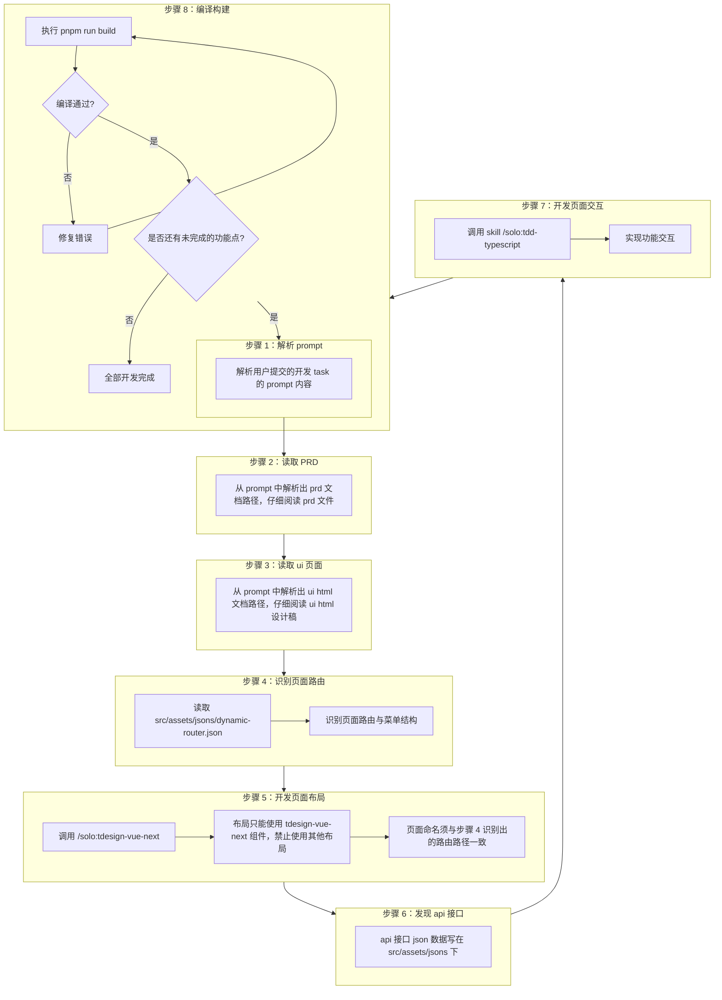

## 概述

本 Skill 提供使用 Vue3 + TypeScript 构建管理后台应用的完整开发工作流，
从读取 PRD 和 UI 设计稿开始，通过调用专业 skill 完成布局、API 定义、交互开发，
最终以编译构建通过作为完成标准。

## 核心规则速查

以下规则在开发过程中必须遵守，违反任何一条都会导致页面无法正确渲染或路由失效：

| # | 规则 | 说明 |
|---|------|------|
| 1 | **页面文件创建** | 必须调用 `uv run python scripts/vue-route.py --route=<路由路径>` 脚本创建页面文件，禁止手动创建。脚本会自动处理命名规则（路由 `/user/today` → `src/views/user/today.vue`，唯一例外：路由路径本身以 `/index` 结尾时使用 `index.vue`） |
| 2 | **禁止修改路由注册文件** | 不得修改 `src/assets/jsons/dynamic-router.json`，该文件是路由注册的源头 |
| 3 | **组件库限制** | 布局只能使用 tdesign-vue-next 组件，禁止使用其他布局库 |
| 4 | **API 调用规范** | 禁止在组件中直接调用 API，必须通过 `request/` 封装 + `api/` 接口 + stores 调用 |
| 5 | **Mock 数据先行** | 先创建静态 JSON mock 再开发交互逻辑，禁止跳过 mock 直接写交互 |

## 全局约束

以下约束适用于整个开发流程，所有步骤和调用的子 skill 都必须遵守：

| # | 约束 | 原因 |
|---|------|------|
| 1 | 禁止修改 `src/assets/jsons/dynamic-router.json` | 该文件是路由注册的源头，修改会导致路由错乱 |
| 2 | 布局只能使用 tdesign-vue-next 组件 | 统一技术栈，避免组件库混用 |
| 3 | 页面命名须与路由路径一致 | 保证路由与页面文件一一对应 |

## Vue 开发工作流



### 循环迭代策略

完成一个功能点的开发后，回到步骤 1 继续下一个功能点，逐个开发直至需求全部完成。
每次循环只聚焦一个功能点，按完整 8 步流程走完后再进入下一个。

### 详细步骤

#### 步骤 1：解析 prompt

- 解析用户提交的开发 task 的 prompt 内容
- 提取关键信息：开发需求、PRD 路径、UI 设计稿路径、其他相关要求
- 禁止在<当前工作目录>中备份 prompt 文档

#### 步骤 2：读取 PRD

- 从 prompt 中解析出 prd 文档路径，仔细阅读 prd 文件
- 理解业务需求和功能目标
- 识别页面结构和组件划分
- 禁止在<当前工作目录>中备份 prd 文档

#### 步骤 3：读取 ui 页面

- 从 prompt 中解析出 ui html 文档路径，仔细阅读 ui html 设计稿
- 理解页面布局和视觉层次
- 识别组件类型和交互元素
- 禁止在<当前工作目录>中备份 ui html 设计稿

#### 步骤 4：识别页面路由

1. **读取动态路由代码**：阅读 `<当前工作目录>/src/routers/modules/dynamicRouter.ts`文件中`loadDynamicRouters`函数，理解动态路由的定义逻辑（路由如何注册、vue页面应该怎么命名，放在些文件夹下）。
2. **读取路由 JSON 配置**：阅读 `<当前工作目录>/src/assets/jsons/dynamic-router.json` 文件（**只读**），了解已注册的路由列表
3. **识别需求页面路由**：根据 PRD 中的页面描述，在动态路由代码和 JSON 配置中查找对应的路由路径
4. **确认菜单层级**：结合 `dynamic-router.json` 确认新页面所属的菜单位置和层级关系。

**路由管理**

|   类型  |                TypeScript 文件                      | JSON 数据文件 |
|--------|----------------------------------------------------|------------------------------------------------------|
| 静态路由 | `<当前工作目录>/src/routers/modules/staticRouter.ts` | `<当前工作目录>/src/assets/jsons/static-router.json` |
| 动态路由 | `<当前工作目录>/src/routers/modules/dynamicRouter.ts` | `<当前工作目录>/src/assets/jsons/dynamic-router.json` |

#### 步骤 5：创建页面文件并开发布局

根据步骤 4 识别出的路由路径，调用脚本自动创建 Vue 页面文件：

```shell
uv run python scripts/vue-route.py --route=<路由路径>
```

示例：

| 路由路径 | 执行命令 | 生成的文件 |
|----------|---------|-----------|
| `/user/today` | `uv run python scripts/vue-route.py --route=/user/today` | `src/views/user/today.vue` |
| `/user/list` | `uv run python scripts/vue-route.py --route=/user/list` | `src/views/user/list.vue` |
| `/system/config/index` | `uv run python scripts/vue-route.py --route=/system/config/index` | `src/views/system/config/index.vue` |

页面文件创建完成后，调用 `/solo:tdesign-vue-next` skill 实现页面布局：
- **约束**：布局只能使用 tdesign-vue-next 组件，禁止使用其他布局
- **约束**：路由对应 vue 页面文件必须由脚本生成，禁止手动创建。其他页面可以

#### 步骤 6：发现 api 接口

以下步骤不能`skip`，所有api文件必须按照如下步骤开发实现。如果发现已有的代码的没有按照如下规则存放文件，就直接改写。

- 根据 PRD 识别需要的 API 接口。
- api 接口 json 数据写在 `src/assets/jsons` 下，在 jsons 目录下创建对应的 mock 数据文件。
- 在`src/api/modules/<模块名>.ts` 文件中定义本次功能需求需要的数据结构，不同`业务概念`,可以写在不同的`src/api/modules/<模块名>.ts` 文件中，禁止在其他文件夹中下写对应的代码功能。示例如下：
```ts
/* 菜单 */
export declare namespace Menu {
  interface xxx {
    ……
  }
  interface yyy {
    ……
  }
}
```
- 在`src/api/<模块名>.ts` 文件中定义获取 api 接口返回值的函数，函数中使用上述`src/api/modules/<模块名>.ts`中数据结构，禁止在其他文件中下写对应的代码功能。示例如下：
```ts
import { ResultData } from '@/request/modules.ts';
import { Menu } from '@/api/modules/auth.ts';
import authMenuList from '@/assets/jsons/dynamic-routers.json';

// 获取我的应用列表
export const getAppMenusApi = (): Promise<ResultData<Menu.MenuOptions[]>> => {
  return Promise.resolve(authMenuList as unknown as ResultData<Menu.MenuOptions[]>);
};
```
- 在`src/views/<模块名>/<页面名>.vue` 的 vue 页面中引用上述函数。其中`src/views/<模块名>/<页面名>.vue`满足上述约定的路由路径名称。
```ts
import { getAppMenusApi } from '@/api/menu.ts';
import { Menu } from '@/api/modules/auth.ts';

const renderMenus = async () => {
  const { data } = await getAppMenusApi();
  if (data && data.length > 0) {
    menus.value = data;
  }
};
```
#### 步骤 7：开发页面交互

- 调用 skill `/solo:tdd-typescript` 实现功能交互
- 使用 TDD 方式编写测试用例
- 实现组件交互逻辑和数据绑定

#### 步骤 8：编译构建

- 执行 `pnpm run build` 编译开发结果
- 如果编译失败，修复错误后重新编译
- 确保构建通过后，检查 PRD 中是否还有未完成的功能点
- 如有未完成功能点，回到步骤 1 继续下一个功能点
- 逐个功能点循环开发，直至需求全部完成
- 禁止执行命令`pnpm run serve`。

### 循环迭代规则

- **每次循环只聚焦一个功能点**：不要试图一次性开发所有功能
- **完整走完 8 步**：每个功能点都要经历解析 prompt → 读取 PRD/UI → 路由 → 布局 → API → 交互 → 编译
- **编译通过是完成标准**：只有 `pnpm run build` 通过才算该功能点开发完成
- **按优先级顺序开发**：优先开发核心功能，再开发辅助功能

## 开发规范

### 1. 项目结构

```
src/
├── api/                  # API 接口（login / menu / auth / modules/*）
├── assets/               # 图片 / 全局样式
├── components/           # 通用组件（ErrorMessage 400/403/404/500 等）
├── layouts/              # 布局框架（classic / vertical）
├── pages/                # 页面级组件（login / main）
├── request/              # Axios 封装 + 拦截器
├── routers/              # 路由配置 + 动态路由
├── stores/               # Pinia 状态（user / auth / page / keepAlive）
├── styles/               # 全局 SCSS 变量（var.scss）
├── typings/              # TypeScript 类型声明
├── utils/                # 工具函数（errorHandler）
├── views/                # 业务视图（home / app / menus / error）
├── App.vue
└── main.ts               # 入口文件
```

### 2. 组件规范

- 使用 `<script setup lang="ts">` 语法
- 组件名使用 PascalCase
- Props 使用 `defineProps` + TypeScript 接口
- Emits 使用 `defineEmits` + 类型签名
- 优先使用组合式 API，避免 Options API

```vue
<script setup lang="ts">
interface Props {
  title: string
  count?: number
}

const props = withDefaults(defineProps<Props>(), {
  count: 0
})

const emit = defineEmits<{
  update: [value: string]
  delete: []
}>()
</script>
```

### 3. TypeScript 规范

- 所有 `.vue` 文件必须使用 `lang="ts"`
- 使用箭头函数（Arrow Function）声明函数
- 禁止使用 `any`，使用 `unknown` 或具体类型
- 为 API 响应、事件 payload 定义明确的接口
- 使用 `as const` 定义常量对象
- 利用 `ComputedRef`、`Ref` 等 Vue 内置类型

### 4. 状态管理规范（Pinia）

- 每个业务模块一个 store 文件
- State 使用函数返回初始值
- Getters 可访问 `this` 或其他 getters
- Actions 支持 async/await

```ts
import { defineStore } from 'pinia'

export const useUserStore = defineStore('user', () => {
  const user = ref<User | null>(null)
  const isLoggedIn = computed(() => !!user.value)

  const login = async (credentials: LoginPayload) => {
    const res = await api.auth.login(credentials)  // 开发阶段返回 src/assets/jsons/ 中的静态 JSON
    user.value = res.data
  }

  return { user, isLoggedIn, login }
})
```

### 5. 路由规范

- 路由文件放在 `src/routers/`
- 页面组件使用懒加载：`() => import('@/views/Home.vue')`
- 路由守卫处理认证逻辑
- 路由参数使用类型安全的定义

### 6. API 集成规范

- Axios 封装放在 `src/request/`，包含请求/响应拦截器
- 请求拦截器附加 token，响应拦截器处理 401/403/500
- API 接口定义放在 `src/api/`，按模块拆分（login / menu / auth / modules/*）
- 所有请求/响应数据都有 TypeScript 类型
- **开发阶段使用静态 mock 数据**：接口定义后，先在 `src/assets/jsons/` 下创建 JSON 文件
- 所有 API 响应统一使用 `{ code, displayMsg, data, uniqCode, msg }` 返回结构
- API 文件通过 import JSON 返回 mock 数据，标注 todo 待替换为 HTTP 请求：


- 后端接口就绪后，将 import 改为真实的 HTTP 请求调用

### 7. 命名约定

| 类型 | 约定 | 示例 |
|------|------|------|
| 组件文件 | PascalCase.vue | `UserCard.vue` |
| 布局文件 | PascalCase.vue | `ClassicLayout.vue` |
| Store 文件 | camelCase.ts | `useUserStore.ts` |
| API 文件 | camelCase.ts | `user.ts` |
| 类型文件 | camelCase.ts | `user.ts` |
| 工具函数 | camelCase.ts | `errorHandler.ts` |

### 8. 反模式与注意事项

- **页面文件必须通过脚本创建**：调用 `uv run python scripts/vue-route.py --route=<路由路径>` 自动处理命名规则。默认路由路径映射为 `src/views/` 下的同名 `.vue` 文件（如 `/user/today` → `src/views/user/today.vue`），禁止使用 `index.vue` 子目录模式（唯一例外：路由路径本身以 `/index` 结尾）
- **不要在组件中直接调用 API**：通过 `request/` 封装 + `api/` 接口 + stores 调用
- **不要跳过 mock 直接写交互**：先创建静态 JSON mock 再开发交互逻辑
- **不要手写 mock 返回结构**：统一使用 `{ code, displayMsg, data, uniqCode, msg }` 标准结构
- **避免过度拆分组件**：单个组件不超过 200 行为合理
- **不要滥用 provide/inject**：优先使用 Pinia 管理跨组件状态
- **不要在模板中使用复杂表达式**：提取为 computed 或方法
- **避免在 watch 中执行副作用**：使用 `watchEffect` 或明确清理

## 参考文档

- `references/component-patterns.md` — 组件模式与最佳实践
- `references/state-management.md` — Pinia 状态管理详解
- `references/api-integration.md` — API 请求层设计
- `references/testing-guide.md` — 测试策略与示例
