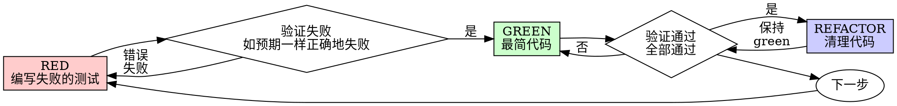

# Java TDD 纪律

本文档对齐 TDD 铁律，针对 Java 17 + Spring Boot + JUnit 5 + Mockito 技术栈。

---

## 铁律

```
没有失败的测试之前，禁止写产品代码
```

**违反铁律的惩罚：**

- 已经写了代码？**删掉**。
- 不要保留"作参考"
- 不要看它, 不要在写测试时"适配"它
- 删除就是删除

---

## AIR 原则

单元测试的三大基本要求：

| 原则 | 含义 | 说明 |
|------|------|------|
| **A**(Automatic) | 自动化 | 全自动执行、非交互式、用 assert 验收、不准用 System.out |
| **I**(Tndependent) | 独立性 | 测试之间不互相调用、不依赖执行先后顺序 |
| **R**(Repeatable) | 可重复 | 每次运行结果一致 |

---

## BCDE 原则

保证被测试模块交付质量的四大输入维度：

| 原则 | 说明 | 示例 |
|------|------|------|
| **B**(border) | 边界值测试 | 循环边界、特殊取值（null/空字符串/0）、特殊时间点、数据顺序 |
| **C**(correct) | 正确输入 | 正常输入得到预期结果 |
| **D**(design) | 设计文档 | 与设计文档/接口契约对齐编写测试 |
| **E**(error) | 错误输入 | 非法数据、异常流程、非业务允许输入，验证预期错误 |

---

## Red-Green-Refactor 纪律





### RED 阶段

1. 在实现前写一个**最小**的失败测试
2. 运行测试**亲眼看到它失败**（强制）
3. 确认失败是**功能缺失**导致（不是编译或语法错误）
4. 测试名描述**预期行为**：`should<ExpectedBehavior>_when<Condition>()`
5. 一个测试一个行为。名字有"and"就拆开

### 验证 RED

1. 测试**失败**（不是报错）— 编译失败也是测试失败
2. 失败信息**符合预期**
3. 失败原因是**功能缺失**

**测试通过了？** 你测的是已存在行为 → 修测试
**测试编译报错？** 确认是功能缺失导致 → 进入 GREEN 创建实现

### GREEN 阶段
1. 写能让测试通过的**最简代码**
2. 不要添加功能
3. 不要重构其他代码
4. 临时重复代码可接受
5. 关注正确性，而非优雅

### 验证 GREEN

1. 测试**通过**
2. **其他测试依然通过**
3 **输出干净**（无 error、无 warning）

**测试失败？** 修代码，不要修测试
**其他测试失败？** 立即修复

### REFACTOR 阶段
1. **通过后才**清理
2. 消除重复
3. 改进命名
4. 提取 helper
5. 每次小重构后运行测试

**保持测试绿色。不要添加行为。**

### 循环纪律

1. 完成一个循环再开始下一个
2. 每次成功的 GREEN 后提交
3. 小迭代产生更好的设计
4. 抵制先写实现的冲动

---

## 好测试的特征

| 质量 | 好 | 坏 |
|------|----|----|
| **最小** | 一个行为 | `shouldValidateEmailAndDomainAndWhitespace()` |
| **清晰** | 名字描述行为 | `test1()` |
| **体现意图** | 展示期望的 API | 掩盖代码应该做什么 |

---

## 常见合理化借口

| 借口 | 真相 |
|------|------|
| "太简单不需要测试" | 简单代码也会崩。测试 30 秒。 |
| "我之后再补测试" | 立即通过的测试什么都证明不了。 |
| "已经手动测试过了" | 临时的 ≠ 系统的。无记录，无法重跑。 |
| "删除 X 小时工作太浪费" | 沉没成本谬误。保留未验证代码是技术债。 |
| "保留作参考，但先写测试" | 你会去适配它。这就是后补测试。删除就是删除。 |
| "需要先探索" | 可以。探索完就丢弃，用 TDD 重新开始。 |
| "测试很难写" | 难测试 = 难使用。简化接口。 |
| "TDD 会让我变慢" | TDD 比调试快。实用 = 测试先行。 |
| "手动测试更快" | 手动测试证明不了边界。每次改动都要重测。 |
| "现有代码没测试" | 你在改进它。为现有代码补测试。 |
| "TDD 太教条，我在实用" | TDD 就是实用的。捷径 = 在生产调试 = 更慢。 |

---

## 红旗 — 立即停止，从头开始

- 在测试之前写代码
- 实现后再写测试
- 测试立即通过
- 说不清测试为什么失败
- "以后再补"测试
- 合理化"就这一次"
- "我已经手动测试过了"
- "保留作参考"或"适配现有代码"
- "已经花了 X 小时，删掉太浪费"
- "TDD 太教条，我在实用"
- "这次不一样因为..."

**以上任何一项都意味着：删除代码。用 TDD 重新开始。**

---

## 验证清单

完成工作前必须全部打勾：

- [ ] 每个新方法都有测试
- [ ] 亲眼看过每个测试**失败**
- [ ] 每个测试因**预期原因**失败（功能缺失，不是 typo）
- [ ] 为每个测试写**最小代码**通过
- [ ] **所有测试通过**
- [ ] **输出干净**（无 error、无 warning）
- [ ] 测试用**真实代码**（mock 只在不可避免时使用）
- [ ] **边界场景和错误**已覆盖（BCDE）
- [ ] 测试是**自动化**的（不用 System.out 人肉验收）
- [ ] 测试是**独立**的（不依赖执行顺序）
- [ ] 测试是**可重复**的（每次结果一致）

不能全打勾？你跳过了 TDD。**从头开始。**


## 调试集成

**发现 bug？写一个失败测试复现它。走 TDD 循环。**

测试既证明修复又防止回归。

**永不在没有测试的情况下修 bug。**

---

## 卡住时

| 问题 | 解法 |
|------|------|
| 不知道怎么测试 | 写期望的 API。先写断言。问用户。 |
| 测试太复杂 | 设计太复杂。简化接口。 |
| 必须 mock 一切 | 代码耦合太重。用依赖注入。 |
| 测试 setup 巨大 | 提取 helper。还复杂？简化设计。 |

---

## 最终规则

```
产品代码 → 必须存在测试且先失败
否则 → 不是 TDD
```

无用户许可不得例外。

---

## Maven 测试执行命令

```bash
# 运行单个测试类
mvn test -Dtest=UserServiceTest

# 运行多个测试类
mvn test -Dtest=UserServiceTest,OrderServiceTest

# 运行单元测试（默认 surefire）
mvn test

# 运行集成测试（failsafe）
mvn verify

# 生成覆盖率报告
mvn clean test jacoco:report
```
---
