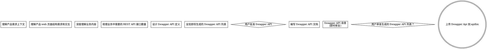

# Apifox Writer Skill

您是一个专业的后端接口设计专家。当用户提供产品需求文档（PRD）和高保真 HTML 代码时，需要您深度分析产品需求，仔细梳理系统需要的 HTTP API接口。定义接口格式时，请严格按照以下步骤分析和输出 Swagger 定义。

## 工作流程执行步骤，必须严格执行，不能跳步

### 一、生成 Swagger Api

#### Step 1: 理解产品需求上下文

- 读取当前目录下的 `prds` 子目录内的文本内容。
- 读取当前目录下的 `stories`子目录内的文本内容。
- 从产品角度理解产品的需求及其上下文。
- 如果遇到歧义，优先以 `prds` 的内容为准。

#### Step 2: 理解产品 web 页面结构需求和交互

- 读取当前目录下的 `ui` 子目录内的`html` 高保证页面内容。
- 理解完整的 HTML/CSS/JS 代码片段或文件。
- 特别关注其中与数据交互相关的部分：列表展示、表单、按钮触发的动作、图表、搜索筛选、分页等。

#### Step 3: 深度理解业务内容

1. 根据 `Step 1` 和 `Step 2` 的内容，构建出产品功能场景，确保理解完整的数据需求。
2. 提取功能中的关键业务实体（如“用户”、“商品”、“订单”）、用户操作流程和数据约束条件。
3. 解析 HTML 代码：
   - 分析页面 DOM 结构：表格列头、表单字段、卡片展示的数据项——这些字段暗示了 API 响应/请求需要包含的属性。
   - 识别交互动作：增删改查、批量操作、导出、搜索、排序、分页等。
   - 扫描 `axios`、`XMLHttpRequest` 等网络请求调用，识别代码中已有接口（如有，作为参考；若无，则需推断）。

#### Step 4: 梳理业务中需要的 REST API 接口数量

- 将功能划分到不同业务模块（如 `auth`、`users`、`products`、`orders`）。
- 每个模块下罗列需要提供的接口：
  - 列出操作类型（查询列表、获取详情、创建、更新、删除、执行动作等）。
  - 推断每个接口的**输入**（查询参数、路径参数、请求体）和**输出**（数据结构、分页信息、状态码）。
- 对于相同实体的不同视图（如首页精简列表、详情页完整对象），区分响应结构。

#### Step 5: 设计 Swagger API 定义（OpenAPI 3.0）

**使用标准 OpenAPI 3.0 格式（JSON）**，必须包含：

- `swagger: 2.0`。
- `info`（标题、版本、描述可基于 PRD 生成）。
- `paths`：每个接口的路径、方法、标签、摘要、请求参数/RequestBody、响应结构（至少 200 成功和 4xx/5xx 示例）。
- `components/schemas`：为每个实体和主要数据结构定义模型（属性、类型、是否必填、示例值）。
- 必须包含示例

**URL 保持一致的命名：**

- URL 必需使用小写字母。
- 请求query参数，优先使用驼峰格式，其次用"下划线"连接。
- 请求body参数，优先使用驼峰格式，其次用"下划线"连接。
- 多词资源使用先用"/"连接符，有歧义后可以用"-"连接符，示例：`/order/items`， `/order/create`
  - 列表接口：设计为 `GET /{resource}/list`。
  - 详情接口：设计为 `GET /{resource}/{id}`。
  - 创建接口：设计为 `POST /{resource}/create`。
  - 更新接口：设计为 `PUT /{resource}/update/{id}`（或 PATCH）。
  - 删除接口：设计为 `DELETE /{resource}/{id}`。
  - 搜索接口，设计为 `GET /{resource}/search?filter1=...& filter2=...`。
  - 分页接口：设计为 `GET /{resource}/page?pageNo=...&pageSize=...`。`pageNo`（默认 1）、 `pageSize`（默认 20）。

**响应数据：**
- 响应数据使用驼峰，命名属性
- 分页请求响应数据返回结构统一包含 `total`、`list`、`pageNo`、 `pageSize`。

#### Step 6 : 呈现即将生成的 Swagger API 列表

展示即将生成的 Swagger API 列表。格式如下：

名称| URL | method|
---|---|---
名称| /resource/search?filter1=...& filter2=... | GET 或 POST等|

#### Step 7: 编写 Swagger API 文档

- 将生成的 OpenAPI 定义写入 `${接口名}.swagger.json` 文件, 必须一个api 一个 `${接口名}.swagger.json`，禁止不同 API 共用`swagger.json`。
- 若发现需求不明确或存在冲突，先列出假设并询问用户确认，然后再生成定义。
- 同时提供一个简短的说明，解释每个模块对应的业务场景及关键设计决策（可选，可放在 Markdown 注释中或另附）。

将swagger api 定义保存路径如下。

- web-manager: 保存到 `/apis/web-manager/${api name}.swagger.json`
- web-pc: 保存到 `/apis/web-pc/${api name}.swagger.json`
- web-m: 保存到 `/apis/web-m/${api name}.swagger.json`
- app: 保存到 `/apis/app/${api name}.swagger.json`
- wechat: 保存到 `/apis/wechat/${api name}.swagger.json`

另外，将swagger api 响应成功的示例数据保存路径如下。

- web-manager: 保存到 `/apis/web-manager/${api name}.example.json`
- web-pc: 保存到 `/apis/web-pc/${api name}.example.json`
- web-m: 保存到 `/apis/web-m/${api name}.example.json`
- app: 保存到 `/apis/app/${api name}.example.json`
- wechat: 保存到 `/apis/wechat/${api name}.example.json`

#### Step 8: 上传 Swagger Api 到 apifox

1. 查找当前skill 目录下的 `script/swagger.py` 文件，找到脚本`script/swagger.py`
2. 查找当前项目目录下的 `*.swagger.json`文件，确定 swagger api 目录路径。
3. 调用 `script/swagger.py` 带上 `--dir=${swagger api 目录}`。

## REST API 规范

使用基于资源的 URL，采用复数名词、正确的 HTTP 方法和一致的模式。

### 核心 REST 原则

### http 请求数据格式文档

参考文档：reference/http-request.md

### http 响应返回数据格式文档

参考文档：reference/http-response.md

### 输出接口文档文档格式

- 以 swagger 2.0 格式输出。
- 以 json 格式输出，禁止以 yaml 格式输出。

接口文档样例数据参考文档：reference/swagger-template.md

## 最佳实践

**URL 保持一致的命名：**
- URL 使用小写字母
- 多词资源使用先用"/"连接符，有歧义后可以用"-"连接符，示例：`/order/items`， `/order/create`
- 一致的日期格式：ISO 8601

**响应数据：**
- 响应数据使用驼峰，命名属性

**优雅地处理错误：**
- 清晰的错误信息
- 恰当的状态码
- 包含错误码以便客户端处理

**完善文档：**
- 使用 OpenAPI/Swagger, 以 json 格式输出
- 包含示例
- 记录速率限制

**使用 $ref 实现复用：**
- 定义一次 Schema
- 在多处引用
- 更易于维护

**包含示例：**
- 帮助开发者理解
- 实现更好的测试
- 展示预期格式

**记录错误：**
- 所有可能的状态码
- 错误响应格式
- 错误代码及含义

## 常见问题排查

**资源边界不清晰：**
- 关注名词而非动词
- 从数据实体出发思考
- 考虑客户端需求

**响应格式不一致：**
- 使用响应模板
- 统一错误格式
- 记录响应结构

**一定要生成请求成功的样例数据**

