# Coder for Vue 

## 概述

本 skill 提供 Vue 3 + TypeScript 项目的完整开发工作流：从 PRD 解析 → tdesign 页面布局 → echarts 图表开发（可选） → mock 数据 → 交互开发 → 编译构建。最终以 `pnpm run build` 编译通过作为完成标准。

## 编码四原则

### 1. 先思考再编码

**不假设，不隐藏困惑，暴露取舍。**

- 明确陈述假设，不确定时直接提问。
- 存在多种解释时全部列出，不默默选择其一。
- 有更简单的方法直接说明，必要时提出反对。
- 遇到不清楚的地方停下来，指出困惑点并提问。

### 2. 简洁优先

**用最少代码解决问题，不做推测性工作。**

- 不添加被要求之外的功能。
- 不为只使用一次的代码创建抽象。
- 不添加未被要求的"灵活性"或"可配置性"。
- 不为不可能发生的场景编写错误处理。
- 如果写了 200 行但本可以 50 行完成，请重写。

**检验标准：** 资深工程师会说这太复杂吗？如果是，请简化。

### 3. 精准修改

**只触碰必须的代码，只清理自己造成的混乱。**

- 不"改进"相邻的代码、注释或格式。
- 不重构没有问题的部分。
- 匹配现有风格，即使你有不同的做法。
- 注意到无关的死代码时指出来，不删除它。
- 移除因**你的修改**而变得未使用的导入、变量或函数。
- 不删除已存在的死代码，除非被要求。

**检验标准：** 每一行修改都应直接追溯到用户的要求。

### 4. 目标驱动

**定义成功标准，循环直到验证。**

| 与其说... | 不如说... |
|---|---|
| "添加验证" | "为无效输入编写测试，然后让它们通过" |
| "修复 bug" | "编写复现测试，然后修复它" |
| "重构 X" | "确保重构前后测试都通过" |

对于多步骤任务，简述计划：

```
1. [步骤] → 验证：[检查项]
2. [步骤] → 验证：[检查项]
3. [步骤] → 验证：[检查项]
```

## TypeScript 开发规范

- 所有 `.vue` 文件的 `<script>` 标签上必须加上 `lang="ts"`属性，以启用完整的类型检查。
- 禁止使用 `any`，除非兼容无类型声明的第三方库，否则必须使用具体类型、unknown 或泛型；若使用 any 需加注释说明原因。
- interface 与 type 区分：定义对象/类的结构优先使用 interface（支持扩展）；定义联合类型、交叉类型或简单别名使用 type。
- 为 API 响应、事件 payload 定义明确的接口。
- 使用 `as const` 定义常量对象。
- 利用 `ComputedRef`、`Ref` 等 Vue 内置类型。
- 统一命名约定：变量/函数使用 camelCase，常量使用 UPPER_SNAKE_CASE，类/接口/枚举/类型使用 PascalCase。
- 布尔值命名：布尔类型的变量或状态，应使用 is、has、can、should 等前缀，使语义更清晰（如 isLoading）
- 使用箭头函数（Arrow Function）声明函数。API 函数以 `Api` 结尾（如 `createUserApi`）；业务处理函数以 `handle` 开头（如 `handleDialogOpen`）；工具函数直接命名（如 `formatDate`）。
- Props 类型化：必须使用泛型接口为 defineProps 声明类型，禁止混用运行时声明和类型声明。
- Emits 类型化：必须使用泛型为 defineEmits 声明事件名和参数类型，确保触发事件时参数匹配。
- 响应式状态类型：简单类型利用 ref 自动推导；复杂对象推荐使用 `reactive<Interface> `或 `ref<Interface>` 手动指定类型。
- 组合式 API 返回值：自定义 Hook（Composables）必须明确声明返回值类型，方便调用处进行类型推断。
- 组件实例类型：获取 UI 组件（如 Tdesign 的 Form 表单）实例时，使用 `InstanceType<typeof Component>` 获取准确的类型提示。
- 模板内类型检查：开启 lang="ts" 后，模板内的表达式也会享受严格的类型检查和自动补全，需注意模板中的类型安全。

## 核心规则速查

| # | 规则 | 说明 |
|---|------|------|
| 1 | **页面布局** | 布局只能使用 tdesign-vue-next 组件，禁止使用其他布局库 |
| 2 | **图表开发** | 图表只能使用 `echarts`和`vue-echarts`组件，禁止使用其他图表组件 |
| 3 | **mock 数据** | 先创建静态 JSON mock 再开发交互逻辑，禁止跳过 mock 直接写交互 |
| 4 | **交互开发** | 用 typescript 编写对应的 `api 数据函数`和`业务逻辑函数` |
| 5 | **开发验证** | 用 `pnpm run build` 确保构建通过 |

## 开发步骤工作流

```mermaid
flowchart TD
    %% 样式定义
    classDef input fill:#f3e5f5,stroke:#7b1fa2,stroke-width:2px;
    classDef step fill:#e3f2fd,stroke:#1565c0,stroke-width:2px;
    classDef output fill:#e8f5e9,stroke:#2e7d32,stroke-width:1px,stroke-dasharray: 5 5;
    classDef decision fill:#fff9c4,stroke:#fbc02d,stroke-width:1px;

    %% 开发流程
    Input[prompt 输入]:::input --> Step_View_Developer

    Step_View_Developer[开发 Vue 页面]:::step --> Step_Code_Format

    Step_Code_Format[代码格式]:::step --> Step_Code_Build

    Step_Code_Build[代码构建]:::step --> Build_Check{build success?}:::decision

    Build_Check -- yes --> Step_Build_Verify

    Build_Check -- no --> Step_View_Developer

    Step_Build_Verify[构建验证]:::step --> Complete_Check{所有功能完成?}:::decision

    Complete_Check -- yes --> End(["✅ 结束"])

    Complete_Check -- no --> Input

    subgraph Step_View_Developer
        direction TB
        Step_View_Layout[画静态 Vue 页面]:::step --> Step_Define_API_Model

        Step_Define_API_Model[定义 API 数据模型]:::step --> Out_Data_Model
        Out_Data_Model[📦 产出: 数据模型]:::output --> Step_API_Data_Mocker

        Step_API_Data_Mocker[数据 Mock]:::step --> Out_Mock
        Out_Mock[📦 产出: mock 数据]:::output --> Step_API_Wrapper

        Step_API_Wrapper[业务逻辑封装 API]:::step --> Out_API
        Out_API[📦 产出: API 调用函数]:::output --> Step_Define_View_Model

        Step_Define_View_Model[定义 view 数据模型]:::step --> Out_View_Model
        Out_View_Model[📦 产出: view 数据模型]:::output --> Step_Business_Logic

        Step_Business_Logic[Vue 组件业务逻辑封装]:::step --> Out_Business_Logic
        Out_Business_Logic[📦 产出: 业务函数]:::output --> Step_Extract_Components

        Step_Extract_Components[封装通用组件]:::step --> Out_Components
        Out_Components[📦 产出: 通用组件]:::output --> Step_Page_Assembly

        Step_Page_Assembly[页面组装与事件绑定]:::step --> Out_Page[📦 产出: Vue 页面组件]:::output
    end
```



### 步骤 1：解析输入

- 解析用户提交的开发 prompt 内容
- 从 prompt 中解析出 PRD 文档路径和 UI HTML 设计稿路径
- 仔细阅读 PRD 理解业务需求，阅读 UI 设计稿理解页面布局
- 禁止在项目中备份 prompt/PRD/UI 文档

### 步骤 2：开发 Vue 页面[Step_View_Developer]

##### 2.1 画静态 Vue 页面[Step_View_Layout]（必选）

页面文件创建后，调用 TDesign 组件实现页面布局。如果页面中存在图表需求，则使用`echarts` 组件实现图表功能。

**vue 结构**：先写`template`，`script`和`style`。这个顺序不能变，只能用这个顺序。禁止用其他顺序。
**布局约束**：只能使用`tdesign-vue-next`组件，详细规则见下文中`TDesign 高级参考（按需阅读）`。在此步骤引入tdesign-vue-next 组件，`import XXX,YYY from 'tdesign-vue-next'`。
**开发图表**（可选）: 只能使用`echarts`和`vue-echarts`组件，详细规则见下文中`ECharts 图表详细参考（按需阅读）`。在此步骤引入 echarts 组件 和 vue-echarts 组件，`import XXX,YYY from 'echarts/charts'` 和 `import XXX,YYY from 'vue-echarts'`
**引入组件**: 尽可能在 vue 页面 import `tdesign-vue-next`组件和`echarts`等视图相关组件。

##### 2.2 定义 API 数据模型[Step_Define_API_Model]（必选）

根据 PRD 需求，在`src/api/models/<business name>.ts`中使用`declare namespace`定义数据结构。

完整示例见 [vue-typescript-example](references/vue-typescript-example.md#定义数据模型)。

**📦 产出：数据模型** — 类型定义文件。

**推荐规则**

1. 一个`declare namespace`一个 ts 文件。
2. 尽量复用已存在的`declare namespace`。
3. `declare namespace`业务概念能合并的尽量合并。

**禁止规则**

1. 禁止在此步骤 import `tdesign-vue-next`组件和`echarts`中任何组件。
2. 禁止在此文件编写 typescript`function`和`箭头函数`。

##### 2.3 数据 Mock[Step_API_Data_Mocker]（必选）

根据步骤 `2.2` 定义的模型创建mock 数据 JSON 文件`src/assets/mocks/<module name>-<business name>.json`，业务调用函数通过 import 此步骤返回 mock 数据。

**📦 产出：mock 数据** — JSON mock文件`src/assets/mocks/xxx-yyy.json`。

json mock完整示例见 [api-mock-data](references/api-mock-data.md)。

##### 2.4 业务逻辑封装与数据调用[Step_API_Wrapper]（必选）

根据 PRD 需求，在`src/api/<business name>-api.ts`中使用箭头函数声明业务逻辑函数，通过 import 步骤 `2.3` 的 mock json 数据。

完整示例见 [vue-typescript-example](references/vue-typescript-example.md#业务逻辑封装与数据调用)。

**📦 产出：API 调用函数** — 函数文件`src/api/xxxx-api.ts`。

**推荐规则**

1. 使用箭头函数（Arrow Function）声明函数。
2. 方法名必须用动词开头，以`get`/`list`/`page`/`create`/`update`/`delete`/`count`/`stat`等常用动作词开头，中间含`业务名词`，以`Api`结尾，如`createXxxYyyApi`。
3. 参考下文步骤`TypeScript 规范`。

**禁止规则**

1. 禁止在此步骤 import `tdesign-vue-next`组件和`echarts`组件。
2. 禁止在此文件定义 typescript`declare namespace`，`type`和`interface`。

##### 2.5 定义 view 数据模型[Step_Define_View_Model]（可选）

根据 PRD 需求，在`src/views/<module name>/components/types/models.ts`中使用`declare namespace`定义页面展示需要数据结构。

完整示例见 [vue-typescript-example](references/vue-typescript-example.md#定义数据模型)。

**📦 产出：数据模型** — 类型定义文件。

**推荐规则**

1. 尽量复用`步骤2.2`已经定义好的数据模型。

**禁止规则**

1. 禁止在此步骤 import `tdesign-vue-next`组件和`echarts`等视图组件。
2. 禁止在此文件编写 typescript 的 `function`和`箭头函数`。

##### 2.6 Vue 组件业务逻辑封装[Step_Business_Logic]（必选）

根据 PRD 需求，在`src/views/<module name>/components/types/use<business name>.ts`中使用箭头函数声明业务逻辑函数，通过 import 步骤 `2.3` 的 mock json 数据。

完整示例见 [vue-typescript-example](references/vue-typescript-example.md#业务逻辑封装与数据调用)。

**📦 产出：业务函数** — 函数文件`src/views/<module name>/components/types/useXxx.ts`。

**推荐规则**

1. 使用箭头函数（Arrow Function）声明函数。方法名必须用动词开头，以`handle`开头，以`业务名词`结尾，如`handleXxx`。
2. 尽量复用`步骤2.2`已经定义好的数据模型。
3. 参考下文步骤`TypeScript 规范`。

**禁止规则**

1. 禁止在此步骤 import `tdesign-vue-next`组件和`echarts`等视图组件。
2. 禁止在此文件定义 typescript`declare namespace`，`type`和`interface`。

##### 2.7 封装通用组件[Step_Extract_Components]（可选）

根据 PRD 需求，读取`src/views/<module name>/*.vue`，抽离公共组件放在`src/views/<module name>/components/<component>.vue`下。

**推荐规则**

1. 页面弹层。
2. 通用数据显示组件。
3. import `tdesign-vue-next`组件和`echarts`页面布局和显示相关组件。


##### 2.8 页面组装与事件绑定[Step_Page_Assembly]（必选）

根据 PRD 需求，在步骤 `2.1` 的 Vue 文件中引入步骤 `2.2` 定义的数据模型和步骤 `2.4` 封装的业务逻辑函数，完成页面组件的组装与事件绑定。

完整示例见 [vue-assembly-example](references/vue-assembly-example.md)。

**关键要点**：
- 数据类型从 `components/types/models.ts` 导入，保持类型安全。
- 业务逻辑函数从 `components/types/useXxx.ts` 导入，不在组件内直接写 API 调用。
- 事件处理函数统一使用 `handle` 前缀命名。

**📦 产出：可交互的 Vue 页面组件** — 完整的 `.vue` 文件。

### 步骤 3：代码格式

1. 清理本次交互中没有被使用的`变量`，`函数`，`declare namespace`，`interface`和`type`。
2. 执行代码格式化命令：

```shell
pnpm run format
```

### 步骤 4：代码构建

执行代码 build 命令：

```shell
pnpm run build
```

- 编译失败 → 修复错误 → 回到步骤 3 重新开发 Vue 页面，并修复 build 运行的错误。
- 编译通过 → 进入步骤 6 构建验证
- **禁止启动** 禁止执行`pnpm run serve`

### 步骤 5：构建验证

- 检查是否还有 PRD 中未完成的功能点
- 如有未完成功能点 → 回到步骤 1，聚焦下一个功能点
- 如全部完成 → ✅ 结束

## 全局约束

| # | 约束 | 原因 |
|---|------|------|
| 1 | 布局只能使用 tdesign-vue-next | 统一技术栈，避免组件库混用 |
| 2 | 使用 `<script setup lang="ts">` | 统一 Composition API 语法 |
| 3 | 禁止使用 `any`，使用 `unknown` 或具体类型 | TypeScript 类型安全 |
| 4 | API 响应统一结构 `{ code, displayMsg, data, uniqCode, msg }` | 前后端接口规范 |

## 项目结构

```
src/
├── api/                  # API 接口（按模块拆分：modules/ 数据结构 + 调用函数）
├── assets/               # 图片 / 全局样式 / JSON mock 数据
├── components/           # 通用业务组件
├── layouts/              # 布局框架
├── request/              # Axios 封装 + 拦截器
├── stores/               # Pinia 状态管理（modules/ 按业务拆分）
├── styles/               # 全局 SCSS 变量
├── typings/              # TypeScript 类型声明
├── utils/                # 工具函数
├── views/                # 业务视图（按路由路径组织）
├── App.vue
└── main.ts               # 入口文件
```

## 开发规范

### 组件规范
- 组件名使用 PascalCase，文件名 PascalCase.vue
- Props 使用 `defineProps` + TypeScript 接口，复杂 props 定义独立 interface
- Emits 使用具名元组语法：`defineEmits<{ update: [value: string] }>()`
- 单个组件不超过 200 行
- Props/Emits 代码示例见 [vue-component-patterns](references/vue-component-patterns.md)

### 命名约定

| 类型 | 约定 | 示例 |
|------|------|------|
| 组件文件 | PascalCase.vue | `UserCard.vue` |
| Store 文件 | camelCase.ts | `useUserStore.ts` |
| API 文件 | camelCase.ts | `user.ts` |
| 工具函数 | camelCase.ts | `errorHandler.ts` |

### 反模式
- 不要在组件中直接调用 API
- 不要跳过 mock 直接写交互
- 不要滥用 provide/inject，优先使用 Pinia
- 不要在模板中使用复杂表达式，提取为 computed
- 避免过度拆分组件

## 参考文档

### 1. 核心参考

| 参考文档 | 内容 | 何时阅读 |
|----------|------|----------|
| [vue-component-patterns](references/vue-component-patterns.md) | 组件模式、Props/事件设计、性能优化 | 开发业务组件时 |
| [echart-component-chart-guide](references/echart-component-chart-guide.md) | ECharts 图表决策树、按需引入、优化 | 开发图表时 |
| [api-mock-data](references/api-mock-data.md) | API 定义、Mock 数据|
| [api-integration](references/api-integration.md) | RequestHttp 类、拦截器、错误处理 | 需要深入理解请求层时 |
| [vue-state-management](references/vue-state-management.md) | Pinia store、Options Store、持久化 | 状态管理时 |

### 2. TDesign 高级参考（按需阅读）

#### TDesign 组件层次识别

```
用户需求
  ├── 基础展示 → Button / Link / Icon / Typography
  ├── 布局结构 → Layout / Grid / Space / Divider 
  ├── 导航交互 → Affix / Anchor/ BackTop/ Breadcrumb / Dropdown / Menu / Pagination / Steps / StickyTool / Tabs 
  ├── 数据输入 → AutoComplete / Cascader / Checkbox / ColorPicker / DatePicker / Form / Input / InputAdornment / InputNumber / TagInput / Radio / RangeInput / Select / SelectInput / Slider / Switch / Textarea / Transfer / TimePicker / TreeSelect / Upload
  ├── 数据展示 → Avatar / Badge / Calendar / Card / Collapse / Comment / Descriptions / Empty / Image / ImageViewer / List / Loading / Progress / QRCode / Rate / Skeleton / Statistic / Swiper / Table / Tag / Timeline / Tooltip / Tree / Watermark
  ├── 反馈 → Alert / Dialog / Drawer / Guide / Message / Notification / Popconfirm / Popup
  └── 高级场景 → Chat（AI 对话）
```


| 组件 | 参考文档 | 触发场景 |
|------|----------|----------|
| Affix | [tdesign-component-affix](references/tdesign-component-affix.md) | 固定定位、吸顶导航 |
| Anchor | [tdesign-component-anchor](references/tdesign-component-anchor.md) | 锚点导航、目录跳转 |
| AutoComplete | [tdesign-component-autocomplete](references/tdesign-component-autocomplete.md) | 输入补全建议 |
| Avatar | [tdesign-component-avatar](references/tdesign-component-avatar.md) | 用户头像展示 |
| BackTop | [tdesign-component-backtop](references/tdesign-component-backtop.md) | 回到顶部按钮 |
| Badge | [tdesign-component-badge](references/tdesign-component-badge.md) | 未读消息数、状态提示 |
| Breadcrumb | [tdesign-component-breadcrumb](references/tdesign-component-breadcrumb.md) | 面包屑导航路径 |
| Button | [tdesign-component-button](references/tdesign-component-button.md) | 按钮操作、提交、取消 |
| Calendar | [tdesign-component-calendar](references/tdesign-component-calendar.md) | 日期和日程展示 |
| Card | [tdesign-component-card](references/tdesign-component-card.md) | 相关内容卡片容器 |
| Cascader | [tdesign-component-cascader](references/tdesign-component-cascader.md) | 多级联动选择 |
| Chat | [tdesign-component-chat](references/tdesign-component-chat.md) | AI对话交互界面 |
| Checkbox | [tdesign-component-checkbox](references/tdesign-component-checkbox.md) | 多选框、分组全选 |
| Collapse | [tdesign-component-collapse](references/tdesign-component-collapse.md) | 折叠面板展开收起 |
| ColorPicker | [tdesign-component-colorpicker](references/tdesign-component-colorpicker.md) | 颜色值选择 |
| Comment | [tdesign-component-comment](references/tdesign-component-comment.md) | 评论反馈内容展示 |
| DatePicker | [tdesign-component-datepicker](references/tdesign-component-datepicker.md) | 日期范围选择 |
| Descriptions | [tdesign-component-descriptions](references/tdesign-component-descriptions.md) | 信息键值对展示 |
| Dialog | [tdesign-component-dialog](references/tdesign-component-dialog.md) | 模态对话框交互 |
| Divider | [tdesign-component-divider](references/tdesign-component-divider.md) | 内容区域分割线 |
| Drawer | [tdesign-component-drawer](references/tdesign-component-drawer.md) | 侧边滑出面板 |
| Dropdown | [tdesign-component-dropdown](references/tdesign-component-dropdown.md) | 下拉菜单选项 |
| Empty | [tdesign-component-empty](references/tdesign-component-empty.md) | 无数据空状态展示 |
| Form | [tdesign-component-form](references/tdesign-component-form.md) | 表单数据收集和校验 |
| Grid | [tdesign-component-grid](references/tdesign-component-grid.md) | 24列栅格布局 |
| Icon | [tdesign-component-icon](references/tdesign-component-icon.md) | 图标展示旋转动画 |
| Image | [tdesign-component-image](references/tdesign-component-image.md) | 图片懒加载展示 |
| ImageViewer | [tdesign-component-imageviewer](references/tdesign-component-imageviewer.md) | 图片预览缩放旋转 |
| Input | [tdesign-component-input](references/tdesign-component-input.md) | 单行文本输入 |
| InputAdornment | [tdesign-component-inputadornment](references/tdesign-component-inputadornment.md) | 输入框前后缀装饰 |
| InputNumber | [tdesign-component-inputnumber](references/tdesign-component-inputnumber.md) | 数字输入增减按钮 |
| Layout | [tdesign-component-layout](references/tdesign-component-layout.md) | 页面布局框架结构 |
| Link | [tdesign-component-link](references/tdesign-component-link.md) | 文本超链接 |
| List | [tdesign-component-list](references/tdesign-component-list.md) | 数据集合列表展示 |
| Loading | [tdesign-component-loading](references/tdesign-component-loading.md) | 加载状态展示 |
| Menu | [tdesign-component-menu](references/tdesign-component-menu.md) | 导航菜单选项 |
| Message | [tdesign-component-message](references/tdesign-component-message.md) | 轻量级操作反馈 |
| Notification | [tdesign-component-notification](references/tdesign-component-notification.md) | 系统通知重要信息 |
| Pagination | [tdesign-component-pagination](references/tdesign-component-pagination.md) | 分页控件 |
| Popconfirm | [tdesign-component-popconfirm](references/tdesign-component-popconfirm.md) | 气泡确认框 |
| Popup | [tdesign-component-popup](references/tdesign-component-popup.md) | 弹出层基础组件 |
| Progress | [tdesign-component-progress](references/tdesign-component-progress.md) | 操作进度展示 |
| QRCode | [tdesign-component-qrcode](references/tdesign-component-qrcode.md) | 二维码生成 |
| Radio | [tdesign-component-radio](references/tdesign-component-radio.md) | 单选框分组按钮 |
| RangeInput | [tdesign-component-rangeinput](references/tdesign-component-rangeinput.md) | 数值范围输入 |
| Rate | [tdesign-component-rate](references/tdesign-component-rate.md) | 打分评价 |
| Select | [tdesign-component-select](references/tdesign-component-select.md) | 下拉单选多选 |
| SelectInput | [tdesign-component-selectinput](references/tdesign-component-selectinput.md) | 带下拉输入框 |
| Skeleton | [tdesign-component-skeleton](references/tdesign-component-skeleton.md) | 加载占位骨架屏 |
| Slider | [tdesign-component-slider](references/tdesign-component-slider.md) | 数值范围滑块 |
| Space | [tdesign-component-space](references/tdesign-component-space.md) | 组件间距设置 |
| Statistic | [tdesign-component-statistic](references/tdesign-component-statistic.md) | 关键指标展示 |
| Steps | [tdesign-component-steps](references/tdesign-component-steps.md) | 步骤流程指示 |
| StickyTool | [tdesign-component-stickytool](references/tdesign-component-stickytool.md) | 吸附工具栏 |
| Swiper | [tdesign-component-swiper](references/tdesign-component-swiper.md) | 循环轮播展示 |
| Switch | [tdesign-component-switch](references/tdesign-component-switch.md) | 双状态开关切换 |
| Table | [tdesign-component-table](references/tdesign-component-table.md) | 数据表格排序筛选 |
| Tabs | [tdesign-component-tabs](references/tdesign-component-tabs.md) | Tab页签切换 |
| Tag | [tdesign-component-tag](references/tdesign-component-tag.md) | 标记分类状态 |
| TagInput | [tdesign-component-taginput](references/tdesign-component-taginput.md) | 标签创建删除编辑 |
| Textarea | [tdesign-component-textarea](references/tdesign-component-textarea.md) | 多行文本输入 |
| Timeline | [tdesign-component-timeline](references/tdesign-component-timeline.md) | 事件时间轴展示 |
| TimePicker | [tdesign-component-timepicker](references/tdesign-component-timepicker.md) | 时间选择 |
| Tooltip | [tdesign-component-tooltip](references/tdesign-component-tooltip.md) | 悬停说明文字 |
| Transfer | [tdesign-component-transfer](references/tdesign-component-transfer.md) | 双向面板穿梭 |
| Tree | [tdesign-component-tree](references/tdesign-component-tree.md) | 层级树形数据 |
| TreeSelect | [tdesign-component-treeselect](references/tdesign-component-treeselect.md) | 树形下拉选择器 |
| Typography | [tdesign-component-typography](references/tdesign-component-typography.md) | 统一文本样式排版 |
| Upload | [tdesign-component-upload](references/tdesign-component-upload.md) | 文件拖拽批量上传 |
| Watermark | [tdesign-component-watermark](references/tdesign-component-watermark.md) | 页面水印标记 |
| Alert | [tdesign-component-alert](references/tdesign-component-alert.md) | 提示信息提醒 |

### 3. ECharts 图表详细参考（按需阅读）

| 图表类型 | 参考文档 |
|---------|---------|
| 折线图/面积图 | [LineChart](references/echart-component-linechart.md) |
| 柱状图 | [BarChart](references/echart-component-barchart.md) |
| 饼图/环形图 | [PieChart](references/echart-component-piechart.md) |
| 散点图/气泡图 | [ScatterChart](references/echart-component-scatterchart.md) |
| 雷达图 | [RadarChart](references/echart-component-radarchart.md) |
| 仪表盘 | [GaugeChart](references/echart-component-gaugechart.md) |
| 热力图 | [HeatmapChart](references/echart-component-heatmapchart.md) |
| 漏斗图 | [FunnelChart](references/echart-component-funnelchart.md) |
| 树形图 | [TreemapChart](references/echart-component-treemapchart.md) |
| 桑基图 | [SankeyChart](references/echart-component-sankeychart.md) |
| K线图 | [CandlestickChart](references/echart-component-candlestickchart.md) |


