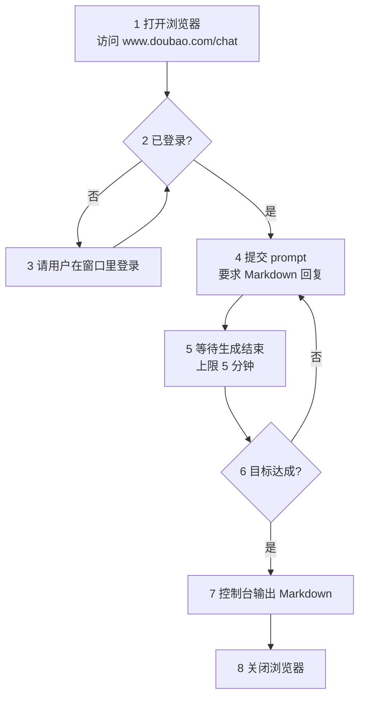

# doubao-picker

## 概述

把问题打进豆包网页版，把回答捞回来，在控制台以 Markdown 展示。

三条红线，任何步骤都不越过：

- **不写文件**——结果只输出到控制台，留档由用户自己复制
- **不代用户登录**——不代填密码，不尝试绕过登录
- **不触碰凭证**——不读取、不转存 cookie 与 token

前置条件：`playwright-cli` 技能可用（`/wubu:playwright-cli`）。

## 上下文层级

本技能横跨三层，各层归各层管：

- **本文（`SKILL.md`）**——参数、步骤、成功判据。只有本技能特有的知识放这里
- **`playwright-cli` 技能（`/wubu:playwright-cli`）**——全部浏览器命令的语法出处。本文只写"调哪个动作"，不抄它的手册
- **`scripts/extract_markdown.py`**——HTML → Markdown 转换。直接执行，不用读源码

跨层共用三个词，全篇不换同义词：

- **会话**——命名浏览器实例，本技能固定为 `-s=chat.doubao`
- **snapshot**——读取页面状态与元素 ref 的命令，名就叫 `snapshot`，不译作「快照」
- **ref**——snapshot 给每个元素分配的编号（形如 `e307`），点击和填写都以它为靶子

## 使用时机

- 用户给出一个问题，要求「问豆包」「让豆包回答」
- 用户要求抓取 www.doubao.com 上的对话内容
- 用户要求把豆包的回答取出来（含连续追问的多轮问答）

不适用：用户问的是「豆包是什么」这类知识问题——直接回答即可，不用开浏览器。

## 流程



两条回环都有上限：单轮等待最多 5 分钟（步骤 5），追问最多 5 轮（步骤 6）。到点不再重试，直接输出已有结果。

### 步骤 1 · 打开浏览器

分三步走：**先开浏览器，再把窗口最小化，最后才导航**。这样窗口不会在你工作时跳出来挡视线。

```bash
playwright-cli -s=chat.doubao open --persistent --headed
```

窗口一开就最小化：

```bash
playwright-cli -s=chat.doubao run-code "async page => { const cdp = await page.context().newCDPSession(page); const r = await cdp.send('Browser.getWindowForTarget'); await cdp.send('Browser.setWindowBounds', { windowId: r.windowId, bounds: { windowState: 'minimized' } }); return 'minimized'; }"
```

再导航到豆包：

```bash
playwright-cli -s=chat.doubao goto https://www.doubao.com/chat
```

- `--headed`：显示窗口——登录、验证码要肉眼确认。窗口登录时会恢复出来，见步骤 3
- `--persistent`：持久化 profile——默认是内存模式，不持久化关掉就丢登录态
- `-s=chat.doubao`：固定会话名——**后续每条命令都要带上**
- 最小化用 `run-code` 发 CDP 指令：playwright-cli 没有 minimize 命令，只有 `resize`，改不了窗口状态
- 窗口最小化不影响后续任何命令——snapshot、eval、取值照常

### 步骤 2 · 判断登录状态

```bash
playwright-cli -s=chat.doubao snapshot
```

只看一件事：快照里有没有 `button "登录"`。

- 有 → 未登录，进步骤 3
- 没有 → 已登录，直接进步骤 4

**别拿输入框当判据**——豆包未登录时输入框照样渲染，占位文案也是「发消息或创建任务...」，跟登录后长得一样。只有「登录」按钮的有无是可靠信号（实测：未登录时页面上恰好 1 个，登录后为 0 个）。

侧栏出现账号名（形如 `youmeng`）是已登录的旁证，但账号名因人而异，不作为判据。

### 步骤 3 · 让用户登录

**先把窗口恢复出来**——步骤 1 把它最小化了，用户看不到登录页：

```bash
playwright-cli -s=chat.doubao run-code "async page => { const cdp = await page.context().newCDPSession(page); const r = await cdp.send('Browser.getWindowForTarget'); await cdp.send('Browser.setWindowBounds', { windowId: r.windowId, bounds: { windowState: 'normal' } }); return 'restored'; }"
```

再把已经打开的那个窗口交给用户，让他自己走完豆包的登录流程（扫码、手机号都行），登完说一声再继续。

- **不要关掉浏览器重开**——登录态是在这个窗口里建立的
- **不要代填密码，也不要尝试绕过登录**

登完存一份登录态，profile 万一被清掉可以恢复，不用麻烦用户重登：

```bash
playwright-cli -s=chat.doubao state-save ~/.doubao-picker-state.json
```

路径落在用户主目录，**别落在项目里**——那文件含 token。恢复时用 `state-load ~/.doubao-picker-state.json`。

**登录成功后界面会变样，这是正常的**：页面标题从「豆包 - 字节跳动旗下 AI 智能助手」变成「豆包**工作** - 字节跳动旗下 AI 智能助手」，侧栏多出「新工作任务」「自动任务」「插件 · 技能 · 伙伴」「云盘」「项目」。这是豆包登录后的主界面（实测账号进入的就是它），不是走错了，继续往下。

登完回步骤 2 复核，确认「登录」按钮消失再往下走。

### 步骤 4 · 提交 prompt

先取 snapshot 定位输入框：

```bash
playwright-cli -s=chat.doubao snapshot
```

输入框是 ProseMirror 富文本（`[contenteditable='true']`，全页恰好 1 个），可直接用选择器定位，不必依赖 ref。快照里认占位文案：

```text
paragraph [ref=e322]: 发消息或创建任务... / 使用技能 @ 添加资料
```

**快照 role 会变**：首次加载显示为 `textbox [active]`，页面重渲染后才变成 `paragraph`。别写死认某一种，认占位文案即可。

填入并提交，两步：

```bash
playwright-cli -s=chat.doubao fill "[contenteditable='true']" "<prompt>。请用 Markdown 格式回答。"
playwright-cli -s=chat.doubao press Enter
```

- **回车即发送**——豆包输入框是 ProseMirror 富文本（contenteditable div），`fill` 能写进去，`Enter` 直接发出，不用找发送按钮
- prompt 末尾加一句要求豆包用 Markdown 格式回答——网页端默认就输出 Markdown，显式要求是为了锁死格式，免得被压成纯文本
- **每条浏览器命令前重新 snapshot**。ref 会在两次 snapshot 之间失效；输入框用上面的选择器定位，不受 ref 失效影响
- **`fill` 不回显填入的文本**（只回显 Playwright 执行代码），别拿它当校验。要确认文字真进了输入框，读回一次再回车：

  ```bash
  playwright-cli -s=chat.doubao --raw eval '(() => { const ce = document.querySelector(".ProseMirror"); return JSON.stringify({text: ce ? ce.innerText : null}); })()'
  ```

  读到 `text` 是刚填入的 prompt 才算成功；清空输入框用 `fill "[contenteditable='true']" ""`

想要本次问答落在干净的会话里，可选地先点快照里 `button "新对话"` 那一项再提交。不加这一步也没问题——取值按整页已有轮次返回，历史轮次会一并带出。

提交后**先确认真的落地**再进步骤 5——这一步不能省，理由见「危险信号」：

- 输入框已清空（提交前它装着 prompt）
- 首次提问时 URL 从 `/chat/` 变成 `/chat/<会话ID>`；已在会话里追问时 URL 不变，看输入框清空即可

### 步骤 5 · 等待并取值

豆包是流式输出，提交完立刻读只拿到半截。等待走本技能的脚本，**一次只等一段**：

```bash
uv run --project <插件根目录> python <本技能目录>/scripts/wait_round.py
```

- 退出码 `0` = 这一轮收尾了，可以取值
- 退出码 `1` = 这一段（默认 60 秒）没等到。**先向用户报一句进度**（例如「仍在生成，已等 60 秒」），再跑一段
- 退出码 `2` = 命令出错，照报错信息处理

**等待必须分段做，单段别超过 60 秒**。理由：shell 命令要跑完才把输出交出来，一次轮询跑满 5 分钟，用户那边就是 5 分钟毫无反应，看起来像卡死。分段跑、段间报进度，用户才知道技能还活着——这条是实测被用户当场叫停过的坑，别图省事合并成一个长循环。

**累计 5 分钟是上限**（约 5 段）。到点还没结束就停下，把已拿到的部分标成「未生成完」交给用户，不要继续干等。

脚本内部的判据为什么长这样——三条都是实测踩出来的，改脚本时别丢：

- **只看最后一条 assistant 消息**。全局抓 `.md-box-root` 会回退到上一轮的容器，读到它已完成的状态，把新轮次误判成结束
- **主判据是开场白计时器的折叠属性，不是 `data-streaming`**。豆包的节奏是：先出开场白 → 执行工具 → 最后才写正文。**工具执行期间正文容器根本不存在**（实测一轮跑了 2 分多钟），`data-streaming` 给不出任何"还在跑"的信号，单看它会取到半截回答。计时器 `[data-testid="preamble-elapsed"]` 的 `data-message-content-collapsed` 属性才是全程有效的：`"false"` 处理中 / `"true"` 已收尾
- **一轮可能挂着多个 `.md-box-root`**（开场白、工具说明、正文各一个，实测一轮 4 个）。别假设只有一个，也别按容器数量数轮次

取值走本技能的脚本：

```bash
uv run --project <插件根目录> python <本技能目录>/scripts/extract_markdown.py
```

- `--project` 指向插件根目录，也就是 `pyproject.toml` 所在那一层；带上它，不管当前在哪个目录都能跑
- 输出 JSON 数组，按对话顺序每轮一个元素，下标即轮次

为什么不能直接读页面文本：页面上看到的是 HTML 渲染结果，`**加粗**` 的星号、代码围栏、公式的定界符在渲染时就被吃掉了；步骤 7 要求原样保留 Markdown，得沿 DOM 反推回语法。浏览器由 `playwright-cli` 托管（管道通信，没开调试端口，外部进程连不进去），所以脚本内部先让它把回答区 HTML 取回来，再由 Python 做转换。

### 步骤 6 · 判断是否继续追问

每轮回答到手后判断一次：用户的原始目标达成了吗？

- 没达成，或回答里有需要澄清的点 → 带新问题回步骤 4，再来一轮
- 达成了 → 进步骤 7

判断要保守：用户没要求的多轮追问别自己加。拿不准就用 `AskUserQuestion` 问一句。

**追问上限 5 轮**（首轮提问不计入）。到第 5 轮仍未达成目标就收手，把已有的各轮结果一并输出，并说明哪部分没答完。再往下加轮多半只是烧时间——每轮都要等一次流式输出，还可能撞上 5 分钟上限。用户明确要求继续，才可以接着问。

### 步骤 7 · 控制台输出

不写文件，把整段对话以 Markdown 直接输出到控制台：

```markdown
## 第 1 轮

**问**：<问题>

**答**：<回答>
```

- 回答原样保留 Markdown——豆包的回答本身就是 Markdown，抹平格式会丢代码块和公式
- 需要留档时让用户自己从控制台复制，本技能不主动写文件

### 步骤 8 · 关闭浏览器

输出完就收工，把浏览器关掉：

```bash
playwright-cli -s=chat.doubao close
```

- **登录态不会丢**——步骤 1 用了 `--persistent`，profile 落在磁盘上，下次 `open` 还在
- 这跟步骤 3 那句「不要关掉浏览器重开」不冲突：那条说的是**登录过程中**别关，这里是**全程走完**再关

## 验证清单

每个关键动作做完，对照一遍：

- **登录**：快照里没有 `button "登录"`
- **提交**：输入框已清空，页面上看得到刚提交的提问
- **ref**：本条命令用的 ref 来自最近一次 snapshot；输入框用 `[contenteditable='true']` 定位，不受 ref 失效影响
- **生成结束**：`wait_round.py` 退出码 `0`
- **敏感素材**：素材含密钥、客户数据、内部文档时，已向用户确认再发

## 危险信号

出现下面任一情况，停下来核对，别往下走：

- **命令报成功，页面却没反应**——大概率是 ref 失效，fill 打在了已被替换的元素上。重新 snapshot 再试；输入框直接改用 `[contenteditable='true']` 更省事
- **提交后页面毫无变化**——提交可能静默失败了。只等不查的话，会一路耗到 5 分钟上限，最后拿到空结果
- **把 `.md-box-root` 直接当回答容器**——用户提问也带这个类名，不限定 `[data-message-role=assistant]` 会把提问一起捞出来，输出里凭空多出用户自己的话
- **拿 `data-streaming` 单独判结束**——工具执行期间正文容器还没出生，读到的可能是开场白容器的已完成状态，把"还在跑"误判成"跑完了"，取回半截回答
- **想直接读页面文本当 Markdown**——渲染已经吃掉了加粗星号、代码围栏和公式定界符
- **快照里既没有「登录」按钮也没有输入框**——界面结构可能变了（换账号、改版），报告用户，不要盲试选择器
- **想帮用户省事，替他填密码或读 cookie**——触碰红线，立刻停手

## 理由辩解

这些念头冒出来时，都是错的：

- 「页面看起来正常，不用再确认落地了」——提交静默失败时页面看不出任何异常，这正是要确认的理由
- 「回答差不多了，先取了吧」——流式输出没有「差不多」，`data-streaming` 还是 `"true"` 就说明没完
- 「再等 30 秒可能就出来了」——5 分钟是上限，到点就把已拿到的部分标成「未生成完」
- 「用户没说要追问」——那就别追问。判断要保守，拿不准用 `AskUserQuestion` 问一句
- 「就差一步，帮他填个密码就好了」——登录永远由用户自己完成
- 「存成文件方便用户复制」——不写文件，让用户从控制台复制
- 「登录后这个界面看着不对，先切回对话模式」——登录后就是「豆包工作」界面，页面上没有模式切换入口，别乱点

## 验证

输出之前，逐项确认：

- 所有轮次的问答都在，按「## 第 N 轮」顺序排列，没有漏轮
- 回答原样保留 Markdown——代码块、加粗、公式定界符没有被抹平
- 遇上限中断的部分，明确标了「未生成完」，并说明哪部分没答完
- 没有产生任何文件

全部输出完，再确认收尾：浏览器已按步骤 8 关闭。

## 参考资料

### scripts/wait_round.py

轮询等待这一轮回答收尾，单段最长 60 秒。

```bash
uv run --project <插件根目录> python <本技能目录>/scripts/wait_round.py
uv run --project <插件根目录> python <本技能目录>/scripts/wait_round.py --segment 120 --interval 5
```

退出码 `0` = 已收尾；`1` = 这一段没等到，可以再来一段；`2` = 出错。判据写在脚本里，改动前先读脚本头部注释。

### scripts/extract_markdown.py

从回答区取 HTML 并转成 Markdown，输出按轮次排列的 JSON 数组。

```bash
uv run --project <插件根目录> python <本技能目录>/scripts/extract_markdown.py
```

`--project` 指向插件根目录（`pyproject.toml` 所在那一层），带上它，不管当前在哪个目录都能跑。选择器写死在脚本里：按 `[data-message-role="assistant"]` 分组，组内取 `.md-box-root` 并拼接——一轮可能挂多个正文容器，不分组会让一轮变成好几轮，下标全错位。

### playwright-cli 技能

`/wubu:playwright-cli`——全部浏览器命令的语法出处。

### 豆包页面选择器速查（2026-10 实测）

- 轮次容器：`[data-message-role="assistant"]`（用户提问是 `user`，两者都带 `.md-box-root`，只用类名会把提问一起捞进来）
- 正文容器：轮次容器内的 `.md-box-root`，**一轮可能挂多个**（开场白 / 工具说明 / 正文），实测一轮 4 个
- 流式状态：正文容器上的 `data-streaming`，`"true"` 生成中 / `"false"` 已完成。**只在正文容器存在时可信**——开场白与工具执行阶段它给不出"还在跑"的信号
- 收尾判据：`[data-testid="preamble-elapsed"]` 的 `data-message-content-collapsed`，`"false"` 处理中 / `"true"` 已收尾
- 输入框：ProseMirror 富文本（`[contenteditable='true']`，全页 1 个），占位文案「发消息或创建任务... / 使用技能 @ 添加资料」；快照 role 不稳定，首次是 `textbox`、重渲染后是 `paragraph`
- 提交：`fill` + `press Enter`，无需找发送按钮
- 登录判据：快照里有 `button "登录"` 即未登录

稳定性说明：豆包内部类名多为带哈希的 CSS Modules 名（如 `container-fBOrXO`），**会随版本变化**；上表一律用 `data-*` 属性与标签语义定位，不用哈希类名。

### 转换器要绕开的界面文字

实测踩过，脚本里已处理，改脚本时别丢：

- 代码块头部的「python / 运行 / 复制 / 预览」——在 `[data-copy-ignore="true"]` 容器里
- 表格工具栏的「表格」二字加按钮——在 `class*="table-header"` 容器里

不拦下来，这些界面文字会混进正文。

### 模型与推理强度

输入框左下角的 `button "自动 高"` 是模型 + 推理强度选择器：菜单里是「自动 / 豆包 2.1 Lite / 豆包 2.1 Pro / 豆包 2.1 Turbo」和「推理强度：高」。默认就是「自动 + 高」，够用，**本流程不切换它**。用户明确点名要某个模型时再动。

### 会话与登录态

- `skills/playwright-cli/references/session-management.md`——命名会话、`--persistent` 持久化、`--headed` 显示模式
- `skills/playwright-cli/references/storage-state.md`——`state-save` / `state-load` 用法与安全注意
