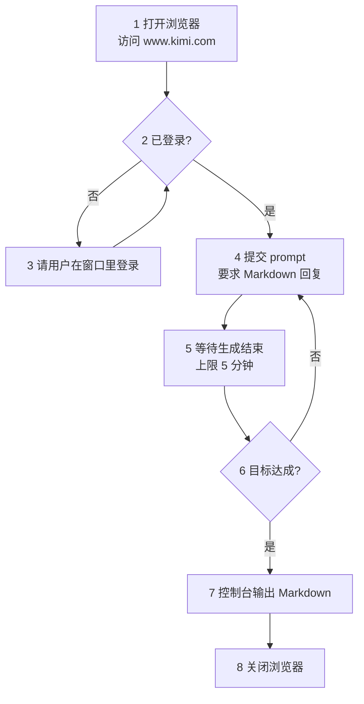

# kimi-picker

## 概述

把问题打进 Kimi 网页版，把回答捞回来，在控制台以 Markdown 展示。

三条红线，任何步骤都不越过：

- **不写文件**——结果只输出到控制台，留档由用户自己复制
- **不代用户登录**——不代填密码，不尝试绕过登录
- **不触碰凭证**——不读取、不转存 cookie 与 token

前置条件：`playwright-cli` 技能可用（`/wubu:playwright-cli`）。

## 上下文层级

本技能横跨三层，各层归各层管：

- **本文（`SKILL.md`）**——参数、步骤、成功判据。只有本技能特有的知识放这里
- **`playwright-cli` 技能（`/wubu:playwright-cli`）**——全部浏览器命令的语法出处。本文只写"调哪个动作"，不抄它的手册
- **`scripts/extract_markdown.py`**——HTML → Markdown 转换。直接执行，不用读源码

跨层共用三个词，全篇不换同义词：

- **会话**——命名浏览器实例，本技能固定为 `-s=chat.kimi`
- **snapshot**——读取页面状态与元素 ref 的命令，名就叫 `snapshot`，不译作「快照」
- **ref**——snapshot 给每个元素分配的编号（形如 `e15`），点击和填写都以它为靶子

另有两个本技能特有的词：

- **思考过程**——Kimi 在正文之前输出的推理文字，落在 `.toolcall-content-text` 容器里。**不是回答的一部分**，取值时必须排除
- **正文**——用户要看的那部分回答，落在 `.markdown-container` 里且不带 `.toolcall-content-text`

## 使用时机

- 用户给出一个问题，要求「问 Kimi」「让 Kimi 回答」
- 用户要求抓取 www.kimi.com 上的对话内容
- 用户要求把 Kimi 的回答取出来（含连续追问的多轮问答）

不适用：用户问的是「Kimi 是什么」这类知识问题——直接回答即可，不用开浏览器。

## 流程



两条回环都有上限：单轮等待最多 5 分钟（步骤 5），追问最多 5 轮（步骤 6）。到点不再重试，直接输出已有结果。

### 步骤 1 · 打开浏览器

分三步走：**先开浏览器，再把窗口最小化，最后才导航**。这样窗口不会在你工作时跳出来挡视线。

```bash
playwright-cli -s=chat.kimi open --persistent --headed
```

窗口一开就最小化：

```bash
playwright-cli -s=chat.kimi run-code "async page => { const cdp = await page.context().newCDPSession(page); const r = await cdp.send('Browser.getWindowForTarget'); await cdp.send('Browser.setWindowBounds', { windowId: r.windowId, bounds: { windowState: 'minimized' } }); return 'minimized'; }"
```

再导航到 Kimi：

```bash
playwright-cli -s=chat.kimi goto https://www.kimi.com/
```

- `--headed`：显示窗口——登录、验证码要肉眼确认。窗口登录时会恢复出来，见步骤 3
- `--persistent`：持久化 profile——默认是内存模式，不持久化关掉就丢登录态
- `-s=chat.kimi`：固定会话名——**后续每条命令都要带上**
- 最小化用 `run-code` 发 CDP 指令：playwright-cli 没有 minimize 命令，只有 `resize`，改不了窗口状态
- 窗口最小化不影响后续任何命令——snapshot、eval、取值照常

**入口就是 `https://www.kimi.com/`，不要改写成 `/chat`**：Kimi 首页本身就是对话页，输入框就在首页上。提交首轮问题后 URL 才变成 `https://www.kimi.com/chat/<会话ID>`。

### 步骤 2 · 判断登录状态

```bash
playwright-cli -s=chat.kimi --raw eval 'JSON.stringify({login:document.querySelectorAll(".login-button").length,user:document.querySelectorAll("[data-testid=sidebar-user-menu-trigger]").length})'
```

- `login=1` → 未登录，进步骤 3
- `login=0` 且 `user=1` → 已登录，直接进步骤 4

**页面刚加载完可能还是未登录的渲染结果**，稍等一两秒再读一次，两次结果一致再采信。Kimi 首屏先吐一份未登录形态的 HTML，前端接管后才换成登录态的界面；只读一次会把已登录误判成未登录，白白把用户拉去登录一遍。

侧栏出现账号名（形如 `youmeng`）是已登录的旁证，但账号名因人而异，不作为判据。

### 步骤 3 · 让用户登录

**先把窗口恢复出来**——步骤 1 把它最小化了，用户看不到登录页：

```bash
playwright-cli -s=chat.kimi run-code "async page => { const cdp = await page.context().newCDPSession(page); const r = await cdp.send('Browser.getWindowForTarget'); await cdp.send('Browser.setWindowBounds', { windowId: r.windowId, bounds: { windowState: 'normal' } }); return 'restored'; }"
```

再把已经打开的那个窗口交给用户，让他自己走完 Kimi 的登录流程（手机号、扫码都行），登完说一声再继续。

- **不要关掉浏览器重开**——登录态是在这个窗口里建立的
- **不要代填密码，也不要尝试绕过登录**

登完存一份登录态，profile 万一被清掉可以恢复，不用麻烦用户重登：

```bash
playwright-cli -s=chat.kimi state-save ~/.kimi-picker-state.json
```

路径落在用户主目录，**别落在项目里**——那文件含 token。恢复时用 `state-load ~/.kimi-picker-state.json`。

登完回步骤 2 复核，确认 `login=0` 再往下走。

### 步骤 4 · 提交 prompt

先取 snapshot 定位输入框，再填入：

```bash
playwright-cli -s=chat.kimi snapshot
playwright-cli -s=chat.kimi fill <输入框 ref> "<prompt>。请用 Markdown 格式回答。"
```

输入框是 Lexical 富文本（`[data-lexical-editor]`），在快照里显示为 `textbox`。`fill` 写得进去，也可以直接用属性选择器定位：

```bash
playwright-cli -s=chat.kimi fill "[data-lexical-editor]" "<prompt>。请用 Markdown 格式回答。"
```

填入后**先确认文字真的进了输入框，再回车**——发送按钮的 `disabled` 类会随内容消失，可以拿它当旁证：

```bash
playwright-cli -s=chat.kimi --raw eval 'JSON.stringify({text:document.querySelector("[data-lexical-editor]").textContent,send:String(document.querySelector(".send-button-container").getAttribute("class"))})'
```

- 回车即发送：

  ```bash
  playwright-cli -s=chat.kimi press Enter
  ```

- prompt 末尾加一句要求 Kimi 用 Markdown 格式回答——网页端默认就输出 Markdown，显式要求是为了锁死格式，免得被压成纯文本
- **每条浏览器命令前重新 snapshot**。ref 会在两次 snapshot 之间失效
- 输入框为空时 `.send-button-container` 带 `disabled` 类；填入内容后该类消失。读到 `send` 里**不含** `disabled` 才算填成功

提交后**先确认真的落地**再进步骤 5——这一步不能省，理由见「危险信号」：

- 输入框已清空（提交前它装着 prompt）
- 首轮提问时 URL 从 `https://www.kimi.com/` 变成 `https://www.kimi.com/chat/<会话ID>`；已在会话里追问时 URL 不变，看输入框清空即可

想要本次问答落在干净的会话里，可选地先点快照里 `button "新建会话"` 那一项再提交。不加这一步也没问题——取值按整页已有轮次返回，历史轮次会一并带出。

### 步骤 5 · 等待并取值

Kimi 是流式输出，提交完立刻读只拿到半截。**生成是否结束用一条命令判定**：

```bash
playwright-cli -s=chat.kimi --raw eval 'JSON.stringify({items:document.querySelectorAll(".chat-content-item-assistant").length,actions:document.querySelectorAll(".segment-assistant-actions").length,streaming:!!document.querySelector(".markdown-container.toolcall-text-in")})'
```

- `streaming=true`，或 `items > actions` → **还在生成**，隔几秒再读
- `streaming=false` **且** `items === actions` → 生成结束，可以取值

两个判据要一起看：Kimi 先想再答，思考阶段正文容器还不存在，只看 `streaming` 会把思考中途误判成已结束；`actions` 是每轮回答生成完才出现的操作按钮（复制、刷新、点赞），轮次数对齐才说明这一轮真的收尾了。

**5 分钟是等待上限**。到点还没结束就停下，把已拿到的部分标成「未生成完」交给用户，不要继续干等。

取值走本技能的脚本：

```bash
uv run --project <插件根目录> python <本技能目录>/scripts/extract_markdown.py
```

- `--project` 指向插件根目录，也就是 `pyproject.toml` 所在那一层；带上它，不管当前在哪个目录都能跑
- 输出 JSON 数组，按对话顺序每轮一个元素，下标即轮次
- 脚本只取正文，**自动排除思考过程**——不用再手工剔除

为什么不能直接读页面文本：页面上看到的是 HTML 渲染结果，`**加粗**` 的星号、代码围栏、公式的定界符在渲染时就被吃掉了；步骤 7 要求原样保留 Markdown，得沿 DOM 反推回语法。浏览器由 `playwright-cli` 托管（管道通信，没开调试端口，外部进程连不进去），所以脚本内部先让它把回答区 HTML 取回来，再由 Python 做转换。

### 步骤 6 · 判断是否继续追问

每轮回答到手后判断一次：用户的原始目标达成了吗？

- 没达成，或回答里有需要澄清的点 → 带新问题回步骤 4，再来一轮
- 达成了 → 进步骤 7

判断要保守：用户没要求的多轮追问别自己加。拿不准就用 `AskUserQuestion` 问一句。

**追问上限 5 轮**（首轮提问不计入）。到第 5 轮仍未达成目标就收手，把已有的各轮结果一并输出，并说明哪部分没答完。再往下加轮多半只是烧时间——每轮都要等一次流式输出，还可能撞上 5 分钟上限。用户明确要求继续，才可以接着问。

### 步骤 7 · 控制台输出

不写文件，把整段对话以 Markdown 直接输出到控制台：

```markdown
## 第 1 轮

**问**：<问题>

**答**：<回答>
```

- 回答原样保留 Markdown——Kimi 的输出本身就是 Markdown，抹平格式会丢代码块和公式
- **不要输出思考过程**。脚本已经排除掉了；如果手工取值，务必只取正文
- 需要留档时让用户自己从控制台复制，本技能不主动写文件

### 步骤 8 · 关闭浏览器

输出完就收工，把浏览器关掉：

```bash
playwright-cli -s=chat.kimi close
```

- **登录态不会丢**——步骤 1 用了 `--persistent`，profile 落在磁盘上，下次 `open` 还在
- 这跟步骤 3 那句「不要关掉浏览器重开」不冲突：那条说的是**登录过程中**别关，这里是**全程走完**再关

## 验证清单

每个关键动作做完，对照一遍：

- **登录**：`login=0` 且 `user=1`，且连续两次读数一致
- **填入**：`.send-button-container` 的 class 里不含 `disabled`
- **提交**：输入框已清空，页面上看得到刚提交的提问
- **ref**：本条命令用的 ref 来自最近一次 snapshot
- **生成结束**：`streaming=false` 且 `items === actions`
- **正文纯净**：输出里没有「用户想要…」「我需要…」这类内心独白——出现即说明思考过程混进来了
- **敏感素材**：素材含密钥、客户数据、内部文档时，已向用户确认再发

## 危险信号

出现下面任一情况，停下来核对，别往下走：

- **把整个 `.chat-content-item-assistant` 的文本当回答**——思考过程就挂在这个容器里，会连「用户要求用一句话介绍自己…」一起捞出来
- **只取第一个 `.markdown-container`**——同一轮里思考过程排在正文前面，取第一个拿到的多半是思考过程
- **拿 `streaming=false` 单独判结束**——思考阶段正文容器还没出现，会把想了一半误判成答完了
- **命令报成功，页面却没反应**——大概率是 ref 失效，fill 打在了已被替换的元素上。重新 snapshot 再试
- **提交后页面毫无变化**——提交可能静默失败了。只等不查的话，会一路耗到 5 分钟上限，最后拿到空结果
- **把 `.segment-code-header` 的文字当成代码**——复制按钮、语言标签都在里面，得整块拦下
- **以为公式能原样还原**——Kimi 只渲染 KaTeX 的 HTML 版，LaTeX 原文不在 DOM 里，脚本只能给近似文本，见「参考资料」
- **想帮用户省事，替他填密码或读 cookie**——触碰红线，立刻停手

## 理由辩解

这些念头冒出来时，都是错的：

- 「页面看着是登录页，让他登一下」——首屏可能是未登录形态的残留，先复核一次再喊人
- 「思考和正文都是这个模型说的，一起输出算了」——用户要的是答案，思考过程是过程稿，混进去等于让用户自己挑
- 「回答差不多了，先取了吧」——流式输出没有「差不多」，`streaming=true` 就说明没完
- 「再等 30 秒可能就出来了」——5 分钟是上限，到点就把已拿到的部分标成「未生成完」
- 「用户没说要追问」——那就别追问。判断要保守，拿不准用 `AskUserQuestion` 问一句
- 「就差一步，帮他填个密码就好了」——登录永远由用户自己完成
- 「存成文件方便用户复制」——不写文件，让用户从控制台复制

## 验证

输出之前，逐项确认：

- 所有轮次的问答都在，按「## 第 N 轮」顺序排列，没有漏轮
- 回答原样保留 Markdown——代码块、加粗没有被抹平
- 输出里没有思考过程的痕迹
- 遇上限中断的部分，明确标了「未生成完」，并说明哪部分没答完
- 没有产生任何文件

全部输出完，再确认收尾：浏览器已按步骤 8 关闭。

## 参考资料

### scripts/extract_markdown.py

从回答区取 HTML 并转成 Markdown，输出按轮次排列的 JSON 数组。

```bash
uv run --project <插件根目录> python <本技能目录>/scripts/extract_markdown.py
```

`--project` 指向插件根目录（`pyproject.toml` 所在那一层），带上它，不管当前在哪个目录都能跑。正文选择器写死在脚本里：`.chat-content-item-assistant .markdown-container:not(.toolcall-content-text)`。

### playwright-cli 技能

`/wubu:playwright-cli`——全部浏览器命令的语法出处。

### Kimi 页面选择器速查（2026-10-10 实测）

- 入口：`https://www.kimi.com/`，首页即对话页；提交首轮后 URL 转 `/chat/<会话ID>`
- 输入框：`div.chat-input-editor[data-lexical-editor]`，Lexical 富文本，占位文案「尽管问，或做个 Agent 任务...」
- 提交：`fill` + `press Enter`，无需找发送按钮
- 发送按钮：`.send-button-container`，空输入时带 `disabled` 类
- 登录判据：`.login-button` 存在即未登录；`[data-testid="sidebar-user-menu-trigger"]` 存在即已登录
- 轮次容器：`.chat-content-item-user`（提问）/ `.chat-content-item-assistant`（回答）
- 正文：`.chat-content-item-assistant .markdown-container`（**必须**排除 `.toolcall-content-text`）
- 思考过程：`.slot-container > .markdown-container.toolcall-content-text`
- 流式判据：`.segment-assistant-actions` 数量对齐 `.chat-content-item-assistant` 数量；正文容器带 `.toolcall-text-in` 类表示生成中

实测样本（一次两轮问答）：生成中 `{items:2, actions:1, streaming:true}`，完成后 `{items:2, actions:2, streaming:false}`。

稳定性说明：Kimi 用 Vue scoped CSS（`data-v-*` 属性会随构建变化），上表一律用语义化的类名与 `data-*` 属性定位，不用 `data-v-*`。

### 模型与推理强度

输入框区域有 `div.model-name`，里面 `span.name` 是模型（如「快速」）、`span.current-effort` 是推理强度（如「进阶」）。默认就是「快速 + 进阶」，够用，**本流程不切换它**。用户明确点名要某个模型时再动。

### 公式还原的限制

Kimi 只输出 KaTeX 的 HTML 渲染版（`.katex-html`），**没有 MathML 孪生结构，也没有 LaTeX 原文**（无 `annotation`、无 `copy-text` 之类属性）。实测确认：`.katex-wrapper` / `.katex-container` 上只有 `class` 和 `data-v-*`，`querySelector("annotation")` 与 `.katex-mathml` 均为空。

后果：脚本只能取到渲染后的字符序列（如 `E=mc2`），**上标、分式、根号的结构会丢失，还原不出 `$E=mc^2$` 这样的原始写法**。这是页面本身的限制，不是脚本缺陷。

遇到含公式的回答，输出时按近似文本给出，并在末尾说明公式已降级。需要精确公式时，请用户从 Kimi 页面手工复制。

### 会话与登录态

- `skills/playwright-cli/references/session-management.md`——命名会话、`--persistent` 持久化、`--headed` 显示模式
- `skills/playwright-cli/references/storage-state.md`——`state-save` / `state-load` 用法与安全注意
