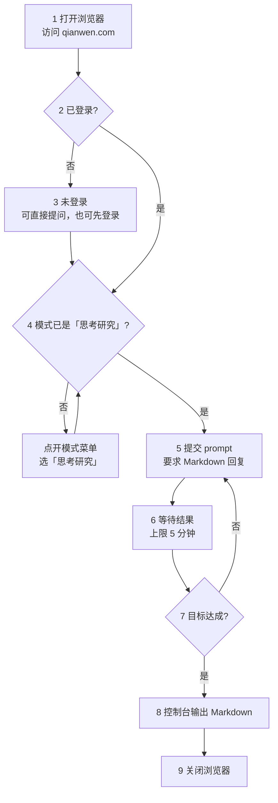

# qwen-picker

## 概述

把问题打进千问网页版，把回答捞回来，在控制台以 Markdown 展示。

三条红线，任何步骤都不越过：

- **不写文件**——结果只输出到控制台，留档由用户自己复制
- **不代用户登录**——不代填密码，不尝试绕过登录
- **不触碰凭证**——不读取、不转存 cookie 与 token

前置条件：`playwright-cli` 技能可用（`/wubu:playwright-cli`）。

## 上下文层级

本技能横跨三层，各层归各层管：

- **本文（`SKILL.md`）**——参数、步骤、成功判据。只有本技能特有的知识放这里
- **`playwright-cli` 技能（`/wubu:playwright-cli`）**——全部浏览器命令的语法出处。本文只写"调哪个动作"，不抄它的手册
- **取值脚本**——HTML → Markdown 转换，站点选择器已实测（见「参考资料」）

跨层共用三个词，全篇不换同义词：

- **会话**——命名浏览器实例，本技能固定为 `-s=qianwen`
- **snapshot**——读取页面状态与元素 ref 的命令，名就叫 `snapshot`，不译作「快照」
- **ref**——snapshot 给每个元素分配的编号（形如 `e15`），点击和填写都以它为靶子

## 使用时机

- 用户给出一个问题，要求「问千问」「让千问回答」
- 用户要求抓取 qianwen.com 上的对话内容
- 用户要求把千问的回答取出来（含连续追问的多轮问答）

不适用：用户问的是「千问是什么」这类知识问题——直接回答即可，不用开浏览器。

## 流程



两条回环都有上限：单轮等待最多 5 分钟（步骤 6），追问最多 5 轮（步骤 7）。到点不再重试，直接输出已有结果。

### 步骤 1 · 打开浏览器

分三步走：**先开浏览器，再把窗口最小化，最后才导航**。这样窗口不会在你工作时跳出来挡视线。

```bash
playwright-cli -s=qianwen open --persistent --headed
```

窗口一开就最小化：

```bash
playwright-cli -s=qianwen run-code "async page => { const cdp = await page.context().newCDPSession(page); const r = await cdp.send('Browser.getWindowForTarget'); await cdp.send('Browser.setWindowBounds', { windowId: r.windowId, bounds: { windowState: 'minimized' } }); return 'minimized'; }"
```

再导航到千问：

```bash
playwright-cli -s=qianwen goto https://qianwen.com/
```

- `--headed`：显示窗口——登录、验证码要肉眼确认
- `--persistent`：持久化 profile——默认是内存模式，不持久化关掉就丢登录态
- `-s=qianwen`：固定会话名——**后续每条命令都要带上**
- 最小化用 `run-code` 发 CDP 指令：playwright-cli 没有 minimize 命令，只有 `resize`，改不了窗口状态
- 窗口最小化不影响后续任何命令——snapshot、eval、取值照常

### 步骤 2 · 判断登录状态

```bash
playwright-cli -s=qianwen snapshot
```

- 没有「登录」按钮，显示头像或用户名 → 已登录，直接进步骤 4
- 出现「登录」按钮 → 未登录

**「能看到输入框」不能当已登录的判据**——未登录时输入框照样在，旁边还多个「登录」按钮。
而且千问**允许未登录提问**，所以未登录也不必卡住：可以直接进步骤 4，也可以先走步骤 3 登录。

### 步骤 3 · 让用户登录（可选）

未登录也能提问，这一步只在需要保留历史对话、或撞到未登录的次数限制时才做。

**先把窗口恢复出来**——最小化状态下用户根本看不到登录页：

```bash
playwright-cli -s=qianwen run-code "async page => { const cdp = await page.context().newCDPSession(page); const r = await cdp.send('Browser.getWindowForTarget'); await cdp.send('Browser.setWindowBounds', { windowId: r.windowId, bounds: { windowState: 'normal' } }); return 'restored'; }"
```

再把已经打开的那个窗口交给用户，让他自己走完千问的登录流程，登完说一声再继续。

- **不要关掉浏览器重开**——登录态是在这个窗口里建立的
- **不要代填密码，也不要尝试绕过登录**

登完存一份登录态，profile 万一被清掉可以恢复，不用麻烦用户重登：

```bash
playwright-cli -s=qianwen state-save ~/.qwen-picker-state.json
```

路径落在用户主目录，**别落在项目里**——那文件含 token。恢复时用 `state-load ~/.qwen-picker-state.json`。

登完回步骤 2 复核，确认进了聊天界面再往下走。

### 步骤 4 · 选中「思考研究」模式

千问默认走「快速」模式，不做深度搜索、深度研究。提交前必须确认切到「思考研究」。

**模式是按对话存的**——同一账号下，历史对话各自保持它当时用的模式。所以上次选了不等于这次是，**每次都现查**：

```bash
playwright-cli -s=qianwen --raw eval "[...document.querySelectorAll('button[aria-haspopup=menu][aria-pressed]')].map(b => b.textContent.trim() + ':' + b.getAttribute('aria-pressed'))[0]"
```

读出 `思考研究:true` → 已选中，直接进步骤 5。读出 `快速:false` → 未选中，接着切换。

切换分两步：先点开模式下拉，再点菜单项。

```bash
playwright-cli -s=qianwen snapshot
playwright-cli -s=qianwen click <模式按钮的 ref>
playwright-cli -s=qianwen snapshot
playwright-cli -s=qianwen click <菜单里「思考研究」那一项的 ref>
```

- 模式按钮在输入框下方，snapshot 里就是写着当前模式名的那个（`button "快速"` 或 `button "思考研究"`）
- 点开后弹出 menu，两项：`快速`、`思考研究`。点**「思考研究」**那项，它的可访问名是「思考研究 深度搜索、深度研究」
- 点完菜单自动关闭。**复核**：按钮文字与 `aria-pressed` 应双双变成「思考研究 / true」
- 页面同时挂着两份模式按钮（响应式副本），两份状态一致，检测命令取第 0 个即可
- 「思考研究」要跑深度搜索和多轮研究，比「快速」慢得多，撞 5 分钟上限的概率也更高——这是它的常态，到点按步骤 6 的上限规则处理，别硬等

### 步骤 5 · 提交 prompt

先取 snapshot 拿输入框的 ref，再填入并提交：

```bash
playwright-cli -s=qianwen snapshot
playwright-cli -s=qianwen fill <输入框 ref> "<prompt>" --submit
```

- prompt 末尾加一句要求千问用 Markdown 格式回答——显式要求是为了锁死格式，免得被压成纯文本
- `--submit` 是填入后回车。若消息没发出去，补一条 `press Enter`；若 `fill` 对输入框无效，改用 `type "<prompt>"` 再 `press Enter`
- **每条浏览器命令前重新 snapshot**。ref 会在两次 snapshot 之间失效

发出后**先确认真的落地**再进步骤 6——这一步不能省，理由见「危险信号」。

### 步骤 6 · 等待并取值

千问是流式输出，提交完立刻读只拿到半截。等到下面任一条成立再取值：

- **首选**：回答区带上 `qk-markdown-complete` 类，一读就知道生成完了

  ```bash
  playwright-cli -s=qianwen --raw eval "!!document.querySelector('.qk-markdown-complete')"
  ```

- 回答区文本长度，隔 3-5 秒读两次，两次一样
- snapshot 里「停止生成」按钮消失

**5 分钟是等待上限**。到点还没结束就停下，把已拿到的部分标成「未生成完」交给用户，不要继续干等。

取值走本技能的脚本：

```bash
uv run --project <插件根目录> python <本技能目录>/scripts/extract_markdown.py --session qianwen
```

为什么不能直接读页面文本：页面上看到的是 HTML 渲染结果，`**加粗**` 的星号、代码围栏、公式的 `$` 定界符在渲染时就被吃掉了；步骤 8 要求原样保留 Markdown，得沿 DOM 反推回语法。浏览器由 `playwright-cli` 托管（管道通信，没开调试端口，外部进程连不进去），所以脚本内部先让它把回答区 HTML 取回来，再由 Python 做转换。

### 步骤 7 · 判断是否继续追问

每轮回答到手后判断一次：用户的原始目标达成了吗？

- 没达成，或回答里有需要澄清的点 → 带新问题回步骤 5，再来一轮
- 达成了 → 进步骤 8

判断要保守：用户没要求的多轮追问别自己加。拿不准就用 `AskUserQuestion` 问一句。

**追问上限 5 轮**（首轮提问不计入）。到第 5 轮仍未达成目标就收手，把已有的各轮结果一并输出，并说明哪部分没答完。再往下加轮多半只是烧时间——每轮都要等一次流式输出，还可能撞上 5 分钟上限。用户明确要求继续，才可以接着问。

### 步骤 8 · 控制台输出

不写文件，把整段对话以 Markdown 直接输出到控制台：

```markdown
## 第 1 轮

**问**：<问题>

**答**：<回答>
```

- 回答原样保留 Markdown——千问的输出本身就是 Markdown，抹平格式会丢代码块和公式
- 需要留档时让用户自己从控制台复制，本技能不主动写文件

### 步骤 9 · 关闭浏览器

输出完就收工，把浏览器关掉：

```bash
playwright-cli -s=qianwen close
```

- **登录态不会丢**——步骤 1 用了 `--persistent`，profile 落在磁盘上，下次 `open` 还在
- 这跟步骤 3 那句「不要关掉浏览器重开」不冲突：那条说的是**登录过程中**别关，这里是**全程走完**再关

## 验证清单

每个关键动作做完，对照一遍：

- **登录**：snapshot 里能看到输入框
- **模式**：提交前 `eval` 读出 `思考研究:true`
- **提交**：页面标题或 URL 已切到新会话，或 snapshot 里看得到刚提交的提问
- **ref**：本条命令用的 ref 来自最近一次 snapshot
- **生成结束**：回答区带上 `qk-markdown-complete` 类，或文本长度隔 3-5 秒读两次一致
- **敏感素材**：素材含密钥、客户数据、内部文档时，已向用户确认再发

## 危险信号

出现下面任一情况，停下来核对，别往下走：

- **命令报成功，页面却没反应**——大概率是 ref 失效，fill 打在了已被替换的元素上。重新 snapshot 再试
- **提交后页面毫无变化**——提交可能静默失败了。只等不查的话，会一路耗到 5 分钟上限，最后拿到空结果
- **回答看着完整，其实还在流式输出**——半截答案混进最终输出，用户未必看得出来
- **想跳过模式检查直接提交**——模式按对话存，历史对话多半停在「快速」；不查就发，深度研究等于白开
- **想直接读页面文本当 Markdown**——渲染已经吃掉了加粗星号、代码围栏和公式定界符
- **取回的内容里混进界面文字**——比如代码每行开头带数字、表格上方多出「下载为表格导出为图片」。这是页面新增了装饰元素，脚本的过滤规则要跟着加，别直接交给用户
- **想帮用户省事，替他填密码或读 cookie**——触碰红线，立刻停手

## 理由辩解

这些念头冒出来时，都是错的：

- 「页面看起来正常，不用再确认落地了」——提交静默失败时页面看不出任何异常，这正是要确认的理由
- 「回答差不多了，先取了吧」——流式输出没有「差不多」，要么读完，要么标注未完成
- 「再等 30 秒可能就出来了」——5 分钟是上限，到点就把已拿到的部分标成「未生成完」
- 「上次选的就是思考研究，这次不用查」——模式按对话存，换个对话就是另一套状态
- 「用户没说要追问」——那就别追问。判断要保守，拿不准用 `AskUserQuestion` 问一句
- 「就差一步，帮他填个密码就好了」——登录永远由用户自己完成
- 「存成文件方便用户复制」——不写文件，让用户从控制台复制

## 验证

输出之前，逐项确认：

- 所有轮次的问答都在，按「## 第 N 轮」顺序排列，没有漏轮
- 回答原样保留 Markdown——代码块、加粗、公式定界符没有被抹平
- 遇上限中断的部分，明确标了「未生成完」，并说明哪部分没答完
- 没有产生任何文件

全部输出完，再确认收尾：浏览器已按步骤 9 关闭。

## 参考资料

### scripts/extract_markdown.py

取值脚本，从 `deepseek-picker` 的同名脚本移植：HTML → Markdown 的转换逻辑通用，站点相关的常量按 2026-10-10 实测的千问页面设定。

- `CONTAINER_SELECTORS`——`.qk-markdown`（实测全页唯一，提问不带这个类）
- `CODE_BLOCK_CLASSES`——`qw-md-code`
- `CODE_BANNER_SELECTOR`——`.qw-md-code span.mr-auto`（横幅里唯一带 `mr-auto` 的 span）
- `TABLE_TOOLBAR_CLASSES`——`qk-md-table-action`（表格上方的工具栏，整块丢弃）

页面改版导致取不到内容时，跑诊断模式：它按文本长度列出页面上所有候选容器，文本最长的那条通常就是回答区。

```bash
uv run --project <插件根目录> python <本技能目录>/scripts/extract_markdown.py --dump
```

取值调用（默认会话名已是 `qianwen`，`--session` 写出来是为了自明）：

```bash
uv run --project <插件根目录> python <本技能目录>/scripts/extract_markdown.py --session qianwen
```

`--project` 指向插件根目录（`pyproject.toml` 所在那一层），带上它，不管当前在哪个目录都能跑。

### 「思考研究」模式

输入框下方的模式下拉：`button[aria-haspopup=menu][aria-pressed]`。

- 按钮文字与 `aria-pressed` 同步反映当前模式：「快速」为 `false`，「思考研究」为 `true`
- 菜单项是 `[role=menuitemcheckbox]`，两项——`快速`（适用于大多数情况）、`思考研究`（深度搜索、深度研究）
- **模式按对话独立保存**：2026-10-10 实测，把新对话切成「思考研究」后，打开历史对话仍是「快速」；同一账号下各对话互不影响
- 页面同时挂两份模式按钮（响应式副本），两份状态一致

### 实测记录（2026-10-10）

- `qianwen.com` 会跳到 `www.qianwen.com`，直接落在问答界面
- 未登录也能提问，不强制登录
- 千问的代码块带行号（react-syntax-highlighter 渲染），表格带工具栏——脚本里已按类名过滤
- 回答区带上 `qk-markdown-complete` 类即表示生成结束
- 最小化/恢复窗口走 CDP 的 `Browser.setWindowBounds`——playwright-cli 没有 minimize 命令，只有 `resize`，实测最小化后 snapshot、eval、取值均不受影响

### playwright-cli 技能

`/wubu:playwright-cli`——全部浏览器命令的语法出处。
