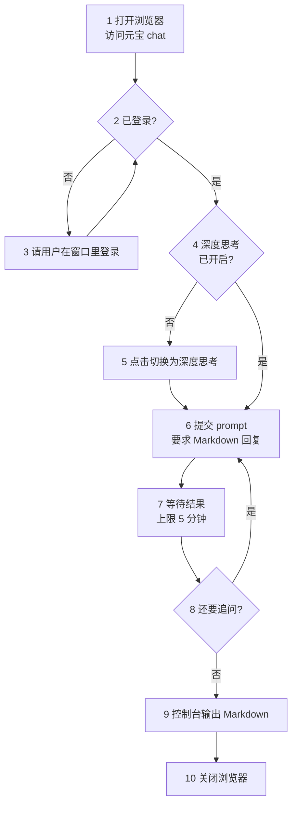

# yuanbao-picker

把问题打进腾讯元宝网页版，把回答捞回来，在控制台以 Markdown 展示。

## 概述

浏览器操作全部**委托给 `playwright-cli` 技能**（`/wubu:playwright-cli`）。本技能只管元宝这一侧：登录怎么过、深度思考模式怎么确认、流式输出怎么等、结果怎么呈现。浏览器命令的语法归那个技能所有，本文不重复——它改版时只改自己那一份。

## 上下文层级

调用链：用户请求 → **yuanbao-picker（本技能）** → `playwright-cli` 技能 → 浏览器。

- **本技能拥有**：元宝页面的交互知识——登录判断、深度思考模式、流式等待、输出格式
- **本技能不拥有**：浏览器命令语法。命令怎么写、有哪些选项，一律以 `playwright-cli` 技能为准，本文只引用不重述
- **输入**：一个或多个 prompt
- **输出**：Markdown 文本，直接在控制台展示，不写文件

## 使用时机

触发：

- 用户给出一个问题，要求「问元宝」「让元宝回答」
- 用户要求抓取 yuanbao.tencent.com 上的对话内容
- 用户要求把元宝的回答取出来（含连续追问的多轮问答）

不触发：用户问的是「元宝是什么」这类知识问题——直接回答即可，不用开浏览器。

## 流程



### 步骤 1 · 打开

分三步走：**先开浏览器，再把窗口最小化，最后才导航**。这样窗口不会在你工作时跳出来挡视线。

```bash
playwright-cli -s=yuanbao open --persistent --headed
```

窗口一开就最小化：

```bash
playwright-cli -s=yuanbao run-code "async page => { const cdp = await page.context().newCDPSession(page); const r = await cdp.send('Browser.getWindowForTarget'); await cdp.send('Browser.setWindowBounds', { windowId: r.windowId, bounds: { windowState: 'minimized' } }); return 'minimized'; }"
```

再导航到元宝：

```bash
playwright-cli -s=yuanbao goto https://yuanbao.tencent.com/chat
```

- `--headed`：显示窗口——登录、扫码要肉眼确认。窗口登录时会恢复出来，见步骤 3
- `--persistent`：持久化 profile——默认是内存模式，不持久化关掉就丢登录态
- `-s=yuanbao`：固定会话名——**后续每条命令都要带上**
- 最小化用 `run-code` 执行一段脚本：playwright-cli 没有 minimize 命令，只有 `resize`，改不了窗口状态
- 窗口最小化不影响后续任何命令——snapshot、eval、取值照常

### 步骤 2 · 判断登录状态

看侧栏底部：显示「未登录」= 没登录，走步骤 3；显示用户名（形如「用户80e4」）= 已登录，直接跳到步骤 4。

不要拿「输入框是否存在」当判据——元宝未登录时输入框区域照样渲染，只是占位文案从「发送消息」变成「请登录后输入内容」，页面上还会多出一个「登录」按钮。

### 步骤 3 · 用户登录

**先把窗口恢复出来**——步骤 1 把它最小化了，用户看不到登录页：

```bash
playwright-cli -s=yuanbao run-code "async page => { const cdp = await page.context().newCDPSession(page); const r = await cdp.send('Browser.getWindowForTarget'); await cdp.send('Browser.setWindowBounds', { windowId: r.windowId, bounds: { windowState: 'normal' } }); return 'restored'; }"
```

元宝会自动弹出登录浮层（微信扫码 / 手机 / QQ 三个标签页，默认停在微信），把这个窗口交给用户，让他自己走完登录流程，登完说一声再继续。

- **不要关掉浏览器重开**——登录态是在这个窗口里建立的
- **不要代填密码，也不要尝试绕过登录**

登完存一份登录态，profile 万一被清掉可以恢复，不用麻烦用户重登：

```bash
playwright-cli -s=yuanbao state-save ~/.yuanbao-picker-state.json
```

路径落在用户主目录，**别落在项目里**——那文件含 token。恢复时用 `state-load ~/.yuanbao-picker-state.json`。

登录完成后回到步骤 2 复核，确认进了聊天界面再往下走。

### 步骤 4 · 确认当前是深度思考模式

元宝把模型选择收在输入框左下角的「切换模型」按钮里，**按钮上的文字就是当前模型名**。页面上没有独立可见的「深度思考」开关——它藏在下拉菜单里，菜单默认收起，未展开时快照里不会出现「深度思考」这四个字，别去快照里找它。

```bash
playwright-cli -s=yuanbao snapshot
```

只看「切换模型」按钮上的文字：

- 显示「深度思考」= 已是深度思考模式 → 走步骤 6
- 显示别的（默认「快速回答」，也可能是「专家模式」）= 走步骤 5

### 步骤 5 · 切换为深度思考

两步点击：先展开菜单，再选中选项。

```bash
playwright-cli -s=yuanbao click <切换模型按钮的编号>    # 展开菜单
playwright-cli -s=yuanbao click <深度思考那一项的编号>   # 选中
```

菜单展开后有三项：`快速回答`（默认选中，带 `[checked]`）、`深度思考`、`专家模式`。点「深度思考」那一项。

点完**重新 snapshot 复核**，确认「切换模型」按钮的文字已变成「深度思考」再往下走。

- 元素编号每次快照都会重排，展开菜单后要用最新一次快照的编号，别沿用旧的
- 点两次仍不生效就停下来报告——大概率是页面改版了，别硬试

### 步骤 6 · 提交 prompt

先取 snapshot 定位输入框：

```bash
playwright-cli -s=yuanbao snapshot
```

元宝的输入区是两层，别填错层：

```text
generic [active] [ref=e116]     ← 卡片，[active] 标在它身上，内含占位文本「发送消息」
└─ paragraph [ref=e117]         ← 可填的是卡片内部这个 paragraph
```

`[active]` 标在**外层卡片**上，直接填卡片会失败。要填的是卡片内部的 paragraph。

```bash
playwright-cli -s=yuanbao fill <paragraph 的 ref> "<prompt>。请用 Markdown 格式回答。"
```

prompt 末尾加一句要求元宝用 Markdown 格式回答——显式要求是为了锁死格式，免得被压成纯文本。

**填完不等于发出**。元宝的回车不触发发送：`fill … --submit` 只会把文字留在输入框里，页面看不出任何异常。点「发送」按钮才行——重新 snapshot 拿它的 ref 再点：

```bash
playwright-cli -s=yuanbao snapshot
playwright-cli -s=yuanbao click <发送按钮的 ref>
```

- 输入框有内容时「发送」按钮才出现，快照里的形状是 `generic "发送" [ref=…]`
- 提交是否成功，看 **URL 变化**：提交前停在 `/chat/<会话ID>`，提交后变成 `/chat/<会话ID>/<消息ID>`。别拿「页面有没有反应」当判据——填了没发出去时，页面同样没反应

### 步骤 7 · 等待结果

元宝是流式输出，深度思考模式下会先吐一段思考过程再给正文。提交完立刻读只拿到半截。等到下面任一条成立再取值：

- 回答区文本长度，隔 3-5 秒读两次，两次一样——最可靠的信号
- 快照里「停止生成」按钮消失

**别拿 `hyc-content-md-done` 类当完成信号**。它看着像个现成的判据，实测却不可靠：生成过程中该类就已挂上，思考过程容器内也有一份（页面上带该类的元素共 2 个），此时正文仍在增长（实测 1158 → 1216）。信它会取到半截回答。

**5 分钟是等待上限**。到点还没结束就停下，把已拿到的部分标成「未生成完」交给用户，不要继续干等。

**取值要取 HTML，不要取渲染后的文本**。页面上的「文本」已经把 Markdown 语法吃掉了——`**加粗**` 的星号、代码块的围栏、公式的 `$` 定界符在渲染时就没了，直接展示会违反「原样保留 Markdown」的要求。

正文的选择器（已实测）：

```bash
playwright-cli -s=yuanbao --raw eval "() => [...document.querySelectorAll('.hyc-component-deepsearch-cot > .hyc-content-md')].map(e => e.outerHTML)"
```

两个坑，都实测踩过：

- **必须用直接子级选择器 `>`**。`.hyc-content-md` 这个类名在思考过程内部也有一份，用普通后代选择器会把整段思考过程一起捞出来（实测：全部匹配 2 个，直接子级只有 1 个是正文）
- 思考过程的容器是 `.hyc-component-deepsearch-cot__think`，要排除的就是它

HTML → Markdown 的还原走本技能的脚本：

```bash
uv run --project <插件根目录> python <本技能目录>/scripts/extract_markdown.py
```

- `--project` 指向插件根目录，也就是 `pyproject.toml` 所在那一层；带上它，不管当前在哪个目录都能跑
- 输出 JSON 数组，按对话顺序每轮一个元素，下标即轮次

**别改用 deepseek-picker 那一份**——实测它不适配元宝的页面结构：代码围栏的语言标签取不到，横幅上的语言名还会被当成代码正文（输出成 `pythondef bubble_sort`）；列表项的装饰圆点 `∙` 也会混进正文。元宝的代码块是 `pre.ybc-pre-component`、语言在 `.hyc-common-markdown__code__langComponent__text`，本技能脚本按这套结构取。

### 步骤 8 · 追问判断

每轮回答到手后判断一次：用户的原始目标达成了吗？

- 没达成，或回答里有需要澄清的点 → 带着新问题回到步骤 6，再来一轮
- 达成了 → 收尾输出

判断要保守：用户没要求的多轮追问别自己加。拿不准就用 `AskUserQuestion` 问一句。

### 步骤 9 · 输出

不写文件，把整段对话以 Markdown 直接输出到控制台：

```markdown
## 第 1 轮

**问**：<问题>

**答**：<回答>
```

- 回答原样保留 Markdown——代码块、公式、列表都不能抹平
- 需要留档时让用户自己从控制台复制，本技能不主动写文件

### 步骤 10 · 关闭浏览器

输出完就收工，把浏览器关掉：

```bash
playwright-cli -s=yuanbao close
```

- **登录态不会丢**——步骤 1 用了 `--persistent`，profile 落在磁盘上，下次 `open` 还在
- 这跟步骤 3 那句「不要关掉浏览器重开」不冲突：那条说的是**登录过程中**别关，这里是**全程走完**再关

## 验证清单

执行过程中逐项确认：

- [ ] 每条命令都带 `-s=yuanbao`，没有落到默认会话上
- [ ] 页面停在元宝聊天界面，不是登录页
- [ ] 「切换模型」按钮文字是「深度思考」（步骤 4 判断后、步骤 5 点击后各确认一次）
- [ ] prompt 末尾带了 Markdown 格式要求
- [ ] 提交后 URL 已从 `/chat/<会话ID>` 变成 `/chat/<会话ID>/<消息ID>`
- [ ] 取值前确认回答已停止增长，或已命中 5 分钟上限

## 危险信号

出现以下情况**停下来交给用户**，不要自行绕过：

- 页面出现验证码、滑块、人机验证 —— 交给用户手动完成
- 反复跳回登录页 —— 可能是风控，请用户手动登录，不要反复重试
- 快照里找不到「切换模型」按钮或输入框 —— 大概率页面改版，报告用户，不要盲试选择器
- 填完 prompt 后页面毫无变化 —— 大概率没点「发送」，URL 没变就是没发出去
- 回答区超过 5 分钟无变化 —— 按超时处理，输出已得部分并标注「未生成完」
- 「深度思考」选中后按钮文字仍不变 —— 停手报告，别继续点

## 理由辩解

这些走捷径的念头冒出来时，按下面的理由顶回去：

- 「深度思考模式不重要，直接问就行」——用户点名要的，跳过拿到的回答不符合预期
- 「headless 更快」——登录和验证码要人眼看，快没有意义
- 「这次不持久化，跑完就算」——默认内存模式，关掉浏览器登录态就丢，下次用户得重登
- 「看起来生成完了」——流式输出肉眼判断不可靠，按步骤 7 的两条判据来
- 「先把结果写文件更保险」——用户明确要求控制台输出，落盘流程后续再补

## 验证

本次执行算成功的判据：

- 控制台输出了完整对话，每轮有「问」「答」两段，Markdown 格式完好（代码块、公式没被压平）
- 回答内容与提问对得上，没有被截断（截断的已明确标注「未生成完」）
- 全程没有落盘任何文件
- 收尾时浏览器已按步骤 10 关闭

## 参考资料

### scripts/extract_markdown.py

从回答区取 HTML 并转成 Markdown，输出按轮次排列的 JSON 数组。

```bash
uv run --project <插件根目录> python <本技能目录>/scripts/extract_markdown.py
```

`--project` 指向插件根目录（`pyproject.toml` 所在那一层），带上它，不管当前在哪个目录都能跑。

### playwright-cli 技能

`/wubu:playwright-cli` —— 全部浏览器命令的语法出处（open / snapshot / click / fill / eval / state-save）。

### 元宝页面选择器速查（2026-10 实测）

- 回答容器：`.hyc-component-deepsearch-cot > .hyc-content-md`（必须用直接子级 `>`）
- 代码块：`pre.ybc-pre-component`，语言在 `.hyc-common-markdown__code__langComponent__text`
- 列表装饰点：`span.ybc-li-component_dot`（内容 `∙`，纯装饰，要跳过）
- 输入框：`[active]` 标在外层卡片上，可填的是卡片内的 `paragraph`
- 模型按钮：`button "切换模型"`，按钮文字即当前模型名

### 会话与登录态

- `skills/playwright-cli/references/session-management.md` —— 命名会话、`--persistent` 持久化、`--headed` 显示模式
- `skills/playwright-cli/references/storage-state.md` —— `state-save` / `state-load` 用法与安全注意
