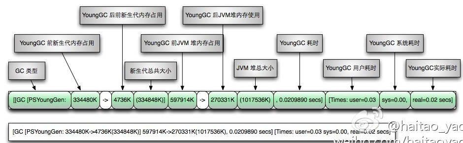

### java gc 日志的参数含义

**命令：jstat -gcutil 26171(进程号)**

-gcutil: 这是指定的操作选项，表示你想要查看与垃圾回收相关的统计信息。-gcutil选项特别提供了一个简明的报告，它以百分比的形式展示垃圾收集器的行为和内存使用情况。
输出包括但不限于各个代（如新生代、老年代）的使用比例、累计的GC次数和时间等。

**命令：jstat -snap 26171(进程号)**

具体来说，-snap选项会打印给定Java进程的堆及垃圾收集器的详细统计信息的快照。这包括但不限于：

堆和非堆内存使用情况：展示当前时刻JVM的内存池（如年轻代、老年代、元空间等）的使用情况。
垃圾收集统计：提供有关垃圾收集活动的信息，比如GC发生的次数和累积花费的时间。
其他JVM内部状态：根据不同的JVM实现，可能还会显示更多关于JVM内部工作状态的信息。
执行这条命令后，你将获得一个特定时间点上的数据快照，而不是像一些其他的jstat选项那样提供连续的监控数据。这对于一次性检查或故障排查时查看某一时刻的JVM状态非常有用。

* S0：Heap上的 Survivor space 0 段已使用空间的百分比
* S1：Heap上的 Survivor space 1 段已使用空间的百分比
* E： Heap上的 Eden space 段已使用空间的百分比
* O： Heap上的 Old space 段已使用空间的百分比
* P： Perm space 已使用空间的百分比
* YGC：从程序启动到采样时发生Young GC的次数
* YGCT：Young GC所用的时间(单位秒)
* FGC：从程序启动到采样时发生Full GC的次数
* FGCT：Full GC所用的时间(单位秒)
* GCT：用于垃圾回收的总时间(单位秒)

稍微说说垃圾收集GC的基本操作过程。  
      
首先，GC把内存大体分成4块，分别是old generation(年老代),eden(年轻代)，以及survivor space1(ss1),survivor space0(ss0).当声明变量的时候，首先是把变量声明在年轻代中，然后当年轻代被填满，则发生次要垃圾收集，将其中存活对象复制到SS1中，再将年轻代清空。
继续在eden中声明对象，当eden再次填满，则再次发生次要垃圾收集，这次是把ss1的内容计算存活期，如果很长就复制到年老代，其余的存活的复制到ss0，然后将ss1清空，并对eden进行前述的次要垃圾收集。

当年老代也被填满，则产生一次主要垃圾收集，非常耗费时间。

PermGen space的全称是Permanent Generation space,是指记忆体的永久保存区域OutOfMemoryError: PermGen space从表面上看就是记忆体益出，解決方法也一定是加大记忆体。说说为什么会益出：这一部分用于存放Class和Meta的资讯,Class在被 Load的时候被放入PermGen space区域，它和存放Instance的Heap区域不同,GC(Garbage Collection)不会在主程序运行期对PermGen space进行清理，所以如果你的APP会LOAD很多CLASS的話,就很可能出现PermGen space错误。这种错误常见在web伺服器对JSP进行pre compile时候。

### gc日志格式解析

