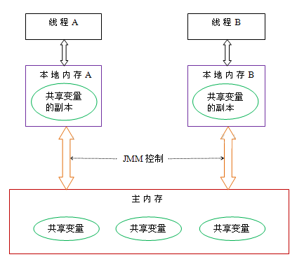
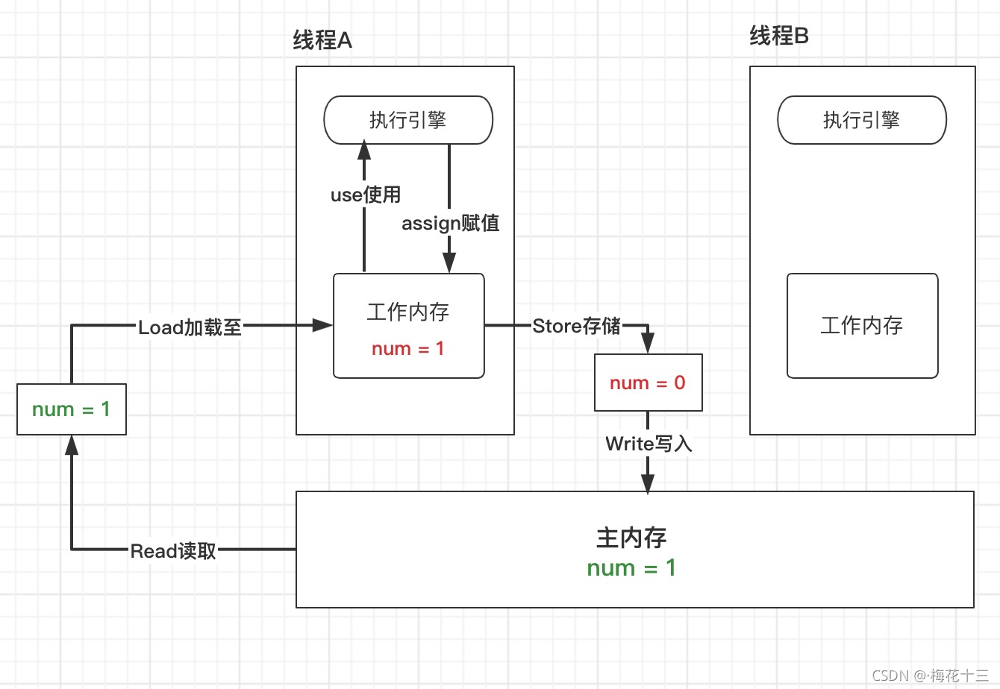
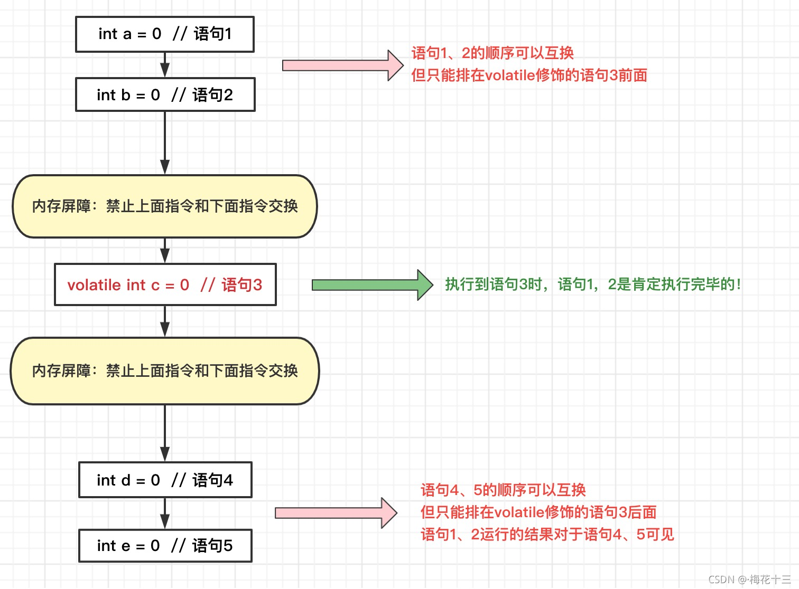

# Java内存模型（Java Memory Model，JMM）


### 一. 模型图

Java内存模型主要是为了规定线程和内存之间的一些关系。模型图如下



- 主内存（Main Memory）：所有线程创建的实例对象都存放在主内存中，不管该实例对象是成员变量，还是局部变量，类信息、常量、静态变量都是放在主内存中。
- 本地内存：每个线程都有一个私有的本地内存，本地内存存储了该线程以读 / 写共享变量的副本。每个线程只能操作自己本地内存中的变量，无法直接访问其他线程的本地内存。如果线程间需要通信，必须通过主内存来进行。本地内存是 JMM 抽象出来的一个概念，并不真实存在，它涵盖了缓存、写缓冲区、寄存器以及其他的硬件和编译器优化。

根据JMM的设计，系统存在一个主内存，Java中所有变量都储存在主存中，对于所有线程都是共享的。每条线程都有自己的工作内存（Working Memory），工作内存中保存的是主存中某些变量的拷贝，线程对所有变量的操作都是在工作内存中进行，线程之间无法相互直接访问，变量传递均需要通过主存完成。


### 二. 操作步骤

关于主内存与工作内存之间的具体交互协议，即一个变量如何从主内存拷贝到工作内存、如何从工作内存同步到主内存之间的实现细节，Java内存模型定义了以下八种操作来完成：

- 锁定（lock）: 作用于主内存中的变量，将他标记为一个线程独享变量。
- 解锁（unlock）: 作用于主内存中的变量，解除变量的锁定状态，被解除锁定状态的变量才能被其他线程锁定。
- read（读取）：作用于主内存的变量，它把一个变量的值从主内存传输到线程的工作内存中，以便随后的 load 动作使用。
- load(载入)：把 read 操作从主内存中得到的变量值放入工作内存的变量的副本中。
- use(使用)：把工作内存中的一个变量的值传给执行引擎，每当虚拟机遇到一个使用到变量的指令时都会使用该指令。
- assign（赋值）：作用于工作内存的变量，它把一个从执行引擎接收到的值赋给工作内存的变量，每当虚拟机遇到一个给变量赋值的字节码指令时执行这个操作。
- store（存储）：作用于工作内存的变量，它把工作内存中一个变量的值传送到主内存中，以便随后的 write 操作使用。
- write（写入）：作用于主内存的变量，它把 store 操作从工作内存中得到的变量的值放入主内存的变量中。




### 三. Java内存模型三个特征

整个Java内存模型实际上是围绕着三个特征建立起来的。分别是：原子性，可见性，有序性。这三个特征可谓是整个Java并发的基础。

##### 3.1. 原子性

原子性指的是一个操作是不可分割，不可中断的，一个线程在执行时不会被其他线程干扰。

```java
int i = 2;
int j = i;
i++;
i = i + 1;
```

* 第一句是基本类型赋值操作，必定是原子性操作。
* 第二句先读取i的值，再赋值到j，两步操作，不能保证原子性。
* 第三和第四句其实是等效的，先读取i的值，再+1，最后赋值到i，三步操作了，不能保证原子性。

##### 3.2. 可见性

可见性指当一个线程修改共享变量的值，其他线程能够立即知道被修改了。Java是利用volatile关键字来提供可见性的。 当变量被volatile修饰时，这个变量被修改后会立刻刷新到主内存，当其它线程需要读取该变量时，会去主内存中读取新值。而普通变量则不能保证这一点。

除了volatile关键字之外，final和synchronized也能实现可见性。
synchronized的原理是，在执行完，进入unlock之前，必须将共享变量同步到主内存中。
final修饰的字段，一旦初始化完成，如果没有对象逸出（指对象为初始化完成就可以被别的线程使用），那么对于其他线程都是可见的。

##### 3.3. 有序性
在Java中，可以使用synchronized或者volatile保证多线程之间操作的有序性。实现原理有些区别：

- volatile关键字是使用内存屏障达到禁止指令重排序，以保证有序性。
- synchronized的原理是，一个线程lock之后，必须unlock后，其他线程才可以重新lock，使得被synchronized包住的代码块在多线程之间是串行执行的。


### 四. volatile关键字


volatile是Java提供的轻量级的同步机制。

* 保证可见性
* 不保证原子性
* 禁止指令重排




