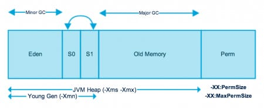
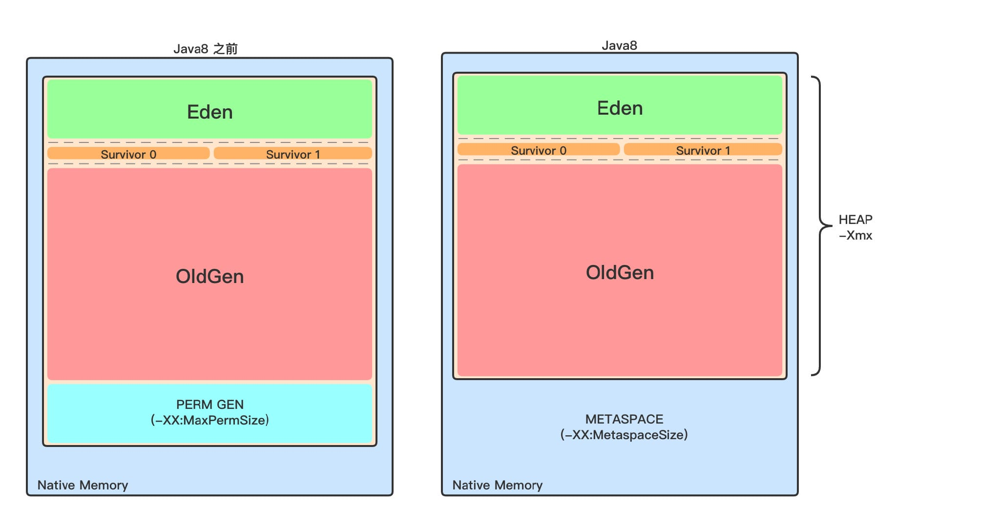

## 堆内存

#### 内存划分

对于大多数应用，Java 堆是 Java 虚拟机管理的内存中最大的一块，被所有线程共享。此内存区域的唯一目的就是存放对象实例，几乎所有的对象实例以及数据都在这里分配内存。

为了进行高效的垃圾回收，虚拟机把堆内存逻辑上划分成三块区域（分代的唯一理由就是优化GC性能）：

* 年轻代：新对象和没达到一定年龄的对象都在新生代
* 年老代：被长时间使用的对象，老年代的内存空间应该要比年轻代更大
* 元空间（JDK1.8 之前叫永久代）：像一些方法中的操作临时对象等，JDK1.8之前是占用JVM 内存，JDK1.8 之后直接使用物理内存



Java 虚拟机规范规定，Java 堆可以是处于物理上不连续的内存空间中，只要逻辑上是连续的即可，像磁盘空间一样。实现时，既可以是固定大小，也可以是可扩展的，主流虚拟机都是可扩展的（通过 -Xmx 和 -Xms 控制），如果堆中没有完成实例分配，并且堆无法再扩展时，就会抛出 OutOfMemoryError 异常。

###### 年轻代 (Young Generation)

年轻代是所有新对象创建的地方。当填充年轻代时，执行垃圾收集。这种垃圾收集称为 Minor GC。年轻一代被分为三个部分——伊甸园（Eden Memory）和两个幸存区（Survivor Memory，被称为from/to或s0/s1），默认比例是8:1:1

* 大多数新创建的对象都位于 Eden 内存空间中
* 当 Eden 空间被对象填充时，执行Minor GC，并将所有幸存者对象移动到一个幸存者空间中
* Minor GC 检查幸存者对象，并将它们移动到另一个幸存者空间。所以每次，一个幸存者空间总是空的
* 经过多次 GC 循环后存活下来的对象被移动到老年代。通常，这是通过设置年轻一代对象的年龄阈值来实现的，然后他们才有资格提升到老一代

###### 老年代(Old Generation)

旧的一代内存包含那些经过许多轮小型GC后仍然存活的对象。通常，垃圾收集是在老年代内存满时执行的。老年代垃圾收集称为 主GC（Major GC），通常需要更长的时间。

大对象直接进入老年代（大对象是指需要大量连续内存空间的对象）。这样做的目的是避免在 Eden 区和两个Survivor 区之间发生大量的内存拷贝



###### 元空间

不管是 JDK8 之前的永久代，还是 JDK8 及以后的元空间，都可以看作是 Java 虚拟机规范中方法区的实现。

虽然 Java 虚拟机规范把方法区描述为堆的一个逻辑部分，但是它却有一个别名叫 Non-Heap（非堆），目的应该是与 Java 堆区分开。

所以元空间放在后边的方法区再说。

#### 对象在堆中的生命周期

1. 在 JVM 内存模型的堆中，堆被划分为新生代和老年代 
  * 新生代又被进一步划分为 Eden区 和 Survivor区，Survivor 区由 From Survivor 和 To Survivor 组成
2. 当创建一个对象时，对象会被优先分配到新生代的 Eden 区 
  * 此时 JVM 会给对象定义一个对象年轻计数器（-XX:MaxTenuringThreshold）
3. 当 Eden 空间不足时，JVM 将执行新生代的垃圾回收（Minor GC） 
  * JVM 会把存活的对象转移到 Survivor 中，并且对象年龄 +1
  * 对象在 Survivor 中同样也会经历 Minor GC，每经历一次 Minor GC，对象年龄都会+1
4. 如果分配的对象超过了-XX:PetenureSizeThreshold，对象会直接被分配到老年代


#### 对象的分配过程

为对象分配内存是一件非常严谨和复杂的任务，JVM 的设计者们不仅需要考虑内存如何分配、在哪里分配等问题，并且由于内存分配算法和内存回收算法密切相关，所以还需要考虑 GC 执行完内存回收后是否会在内存空间中产生内存碎片。

1. new 的对象先放在伊甸园区，此区有大小限制
2. 当伊甸园的空间填满时，程序又需要创建对象，JVM的垃圾回收器将对伊甸园区进行垃圾回收（Minor GC），将伊甸园区中的不再被其他对象所引用的对象进行销毁。再加载新的对象放到伊甸园区
3. 然后将伊甸园中的剩余对象移动到幸存者0区
4. 如果再次触发垃圾回收，此时上次幸存下来的放到S0 区，如果没有回收，就会放到S1 区
5. 如果再次经历垃圾回收，此时会重新放回幸存者 0 区，接着再去幸存者 1 区
6. 什么时候才会去养老区呢？ 默认是 15 次回收标记
7. 在养老区，相对悠闲。当养老区内存不足时，再次触发 Major GC，进行养老区的内存清理
8. 若养老区执行了 Major GC 之后发现依然无法进行对象的保存，就会产生 OOM 异常


#### TLAB（Thread Local Allocation Buffer）

* 从内存模型而不是垃圾回收的角度，对Eden区域继续进行划分，JVM为每个线程分配了一个私有缓存区域，它包含在 Eden 空间内
* 多线程同时分配内存时，使用 TLAB 可以避免一系列的非线程安全问题，同时还能提升内存分配的吞吐量，因此我们可以将这种内存分配方式称为快速分配策略

**作用** 

* 堆区是线程共享的，任何线程都可以访问到堆区中的共享数据
* 由于对象实例的创建在 JVM 中非常频繁，因此在并发环境下从堆区中划分内存空间是线程不安全的
* 为避免多个线程操作同一地址，需要使用加锁等机制，进而影响分配速度

尽管不是所有的对象实例都能够在TLAB中成功分配内存，但 JVM 确实是将 TLAB 作为内存分配的首选。

在程序中，可以通过 -XX:UseTLAB 设置是否开启 TLAB 空间。

默认情况下，TLAB 空间的内存非常小，仅占有整个 Eden 空间的 1%，我们可以通过 -XX:TLABWasteTargetPercent 设置 TLAB 空间所占用 Eden 空间的百分比大小。

一旦对象在 TLAB 空间分配内存失败时，JVM 就会尝试着通过使用加锁机制确保数据操作的原子性，从而直接在 Eden 空间中分配内存。

#### 堆是分配对象存储的唯一选择吗

> 随着JIT编译期的发展和逃逸分析技术的逐渐成熟，栈上分配、标量替换优化技术将会导致一些微妙的变化，所有的对象都分配到堆上也渐渐变得不那么“绝对”了。 ——《深入理解 Java 虚拟机》

**逃逸分析**

逃逸分析(Escape Analysis)是目前 Java 虚拟机中比较前沿的优化技术。这是一种可以有效减少 Java 程序中同步负载和内存堆分配压力的跨函数全局数据流分析算法。通过逃逸分析，Java Hotspot 编译器能够分析出一个新的对象的引用的使用范围从而决定是否要将这个对象分配到堆上。

逃逸分析的基本行为就是分析对象动态作用域：

* 当一个对象在方法中被定义后，对象只在方法内部使用，则认为没有发生逃逸。
* 当一个对象在方法中被定义后，它被外部方法所引用，则认为发生逃逸。例如作为调用参数传递到其他地方中，称为方法逃逸。

例如：

```java
public static StringBuffer craeteStringBuffer(String s1, String s2) {
   StringBuffer sb = new StringBuffer();
   sb.append(s1);
   sb.append(s2);
   return sb;
}
```
StringBuffer sb是一个方法内部变量，上述代码中直接将sb返回，这样这个 StringBuffer 有可能被其他方法所改变，这样它的作用域就不只是在方法内部，虽然它是一个局部变量，但是其逃逸到了方法外部。甚至还有可能被外部线程访问到，譬如赋值给类变量或可以在其他线程中访问的实例变量，称为线程逃逸。

上述代码如果想要 StringBuffer sb不逃出方法，可以这样写：

```java
public static String createStringBuffer(String s1, String s2) {
   StringBuffer sb = new StringBuffer();
   sb.append(s1);
   sb.append(s2);
   return sb.toString();
}
```
不直接返回 StringBuffer，那么 StringBuffer 将不会逃逸出方法。


//继续研究


