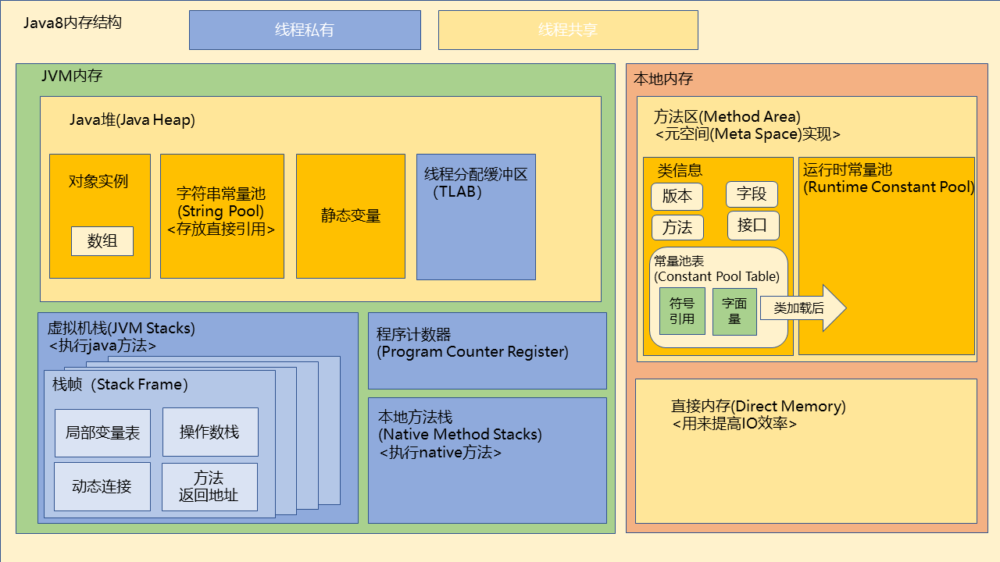

## 内存结构图 

#### Java8内存结构图 

#### 一、JVM内存

###### 1、堆 (Heap)

- 堆是java虚拟机所管理的内存中最大的一块内存区域，通过-Xmx和-Xms控制，在JVM启动时创建。
- 堆是存放对象实例、TLAB、字符串常量池、静态变量
  - TLAB：线程私有的分配缓冲区（Thread Local Allocation Buffer）
- 堆是垃圾收集管理的主要区域，几乎所有的对象实例都在这里分配内存。超出则抛出OutOfMemoryError异常。
- 堆分为新生代(Young Generation)和老年代(Old Generation)。再细致划分则新生代又可以细分为Eden空间、From Survivor空间和To Survivor空间。GC管理的主要区域(新生代、老年代)。
	
- 从内存分配的角度看，线程共享的Java堆中可能划分出多个线程私有的TLAB。TLAB是虚拟机在堆内存的eden划分出来的一块专用空间，是线程专属的。
	- TLAB在内存读取上，是线程共享的。
	- TLAB在内存分配上，是线程独享的。
- 堆是垃圾收集器管理内存的重点区域，不同的垃圾收集器有不同的堆内存分配策略。
- Java 堆可以处于物理上不连续的内存空间中，只要逻辑上是连续的即可，就像我们的磁盘空间一样。

###### 2、程序计数器（Program Counter Register）

- 每个线程都有一个独立的程序计数器，用于记录当前线程所执行的字节码指令的位置。
- 如果线程正在执行的是一个Java方法，这个计数器记录的是正在执行的虚拟机字节码指令的地址；如果是在执行Native方法，这个计数器值则为空（Undefined）。
- 这是唯一一个在Java虚拟机规范中没有规定任何OutOfMemoryError情况的区域。

是最小的一块内存区域，它的作用是当前线程所执行的字节码的行号指示器。在虚拟机的概念模型里，字节码解释器工作时就是通过改变这个计数器的值来选取下一条需要执行的字节码指令，分支、循环、跳转、异常处理、线程恢复等基础功能都需要依赖这个计数器来完成。

由于Java虚拟机的多线程是通过线程轮流切换并分配处理器执行时间的方式来实现的，在任何一个确定的时刻，一个处理器都只会执行一条线程中的指令。因此，为了线程切换后能恢复到正确的执行位置，每条线程都需要有一个独立的程序计数器，各条线程之间计数器互不影响，独立存储，我们称这类内存区域为“线程私有”的内存。

###### 3、Java 虚拟机栈（Java Virtual Machine Stacks）

- 每个线程创建时都会创建一个虚拟机栈。
- 是当前线程所执行的Java字节码的行号指示器，保存了每个方法执行过程中的局部变量表、操作数栈、动态链接和方法出口等信息。
- 局部变量表存放了编译期可知的各种基本数据类型（boolean、byte、char、short、int、float、long、double）、对象引用（reference类型，它并不等同于对象本身，可能是一个指向对象起始地址的指针，也可能是指向一个代表对象的句柄或其他与此对象相关的位置）和returnAddress类型（指向了一条字节码指令的地址）。
- 虚拟机栈可能出现StackOverflowError和OutOfMemoryError异常。
- 参数设置：-Xss 设置每个线程的栈大小，默认值：1M
- 栈帧（Stack Frame）
  - 每当一个方法被调用时，JVM 就会为该方法创建一个新的栈帧（Stack Frame），并将该栈帧压入当前线程的栈中
  - 当方法执行完毕后，对应的栈帧会被弹出并丢弃。

###### 4、本地方法栈

- 与虚拟机栈类似，只不过服务的对象变成了Native方法。
- 在某些JVM实现中，直接把本地方法栈和虚拟机栈合二为一，如：HotSpot虚拟机。

###### 5、jvm相关参数

- -Xms 设置堆的最小空间大小；通常为操作系统可用内存的1/64大小即可。
- -Xmx 设置堆的最大空间大小；通常为操作系统可用内存的1/4大小。
- -XX：NewSize 设置新生代最小空间大小；
- -XX：MaxNewSize 设置新生代最大空间大小；
- -Xmn 设置新生代大小，是对-XX：newSize、-XX：MaxnewSize两个参数的同时配置，通常为Xmx的1/3或1/4。新生代 = Eden + 2个Survivor空间。实际可用空间 = Eden + 1个Survivor，即90%。
- -XX：NewRatio 新生代与老年代的比例，如-XX：NewRatio=2，则新生代占整个堆空间的1/3，老年代占2/3。
- -XX：SurvivorRatio 新生代中 Eden 与 Survivor的比值。默认值为8。即Eden占新生代空间的8/10，另外两个Survivor各占1/10。
- -Xss 设置每个线程的 Java 虚拟机栈的大小。

#### 二、本地内存

###### 1、方法区 (Method Area)

- 从Java 8开始，这个区域称为：元空间(Metaspace)。在HotSpot虚拟机中，方法区也被称为“永久代”。
- 元空间并不是在虚拟机的内存中，而是直接使用物理内存，因此理论上只受物理内存限制。
- 各个线程共享的内存区域。

* 1.1、类信息

- 空间存储已被虚拟机加载的class文件的基本信息、常量、静态变量、即时编译器编译后的代码缓存等数据。
- 记录了版本、字段、方法、接口等描述信息。
- 信息常量池（Constant Pool Table）用于存放编译期生成的各种字面量和符号引用。

* 1.2、运行时常量池 (Runtime Constant Pool）

- 是方法区的一部分，用于线程加载类的时候存放编译期生成的各种字面量和符号引用。
- 每个被加载的类都会有一个自己的运行时常量池。
- 并非预置入Class文件中常量池的内容才能进入方法区运行时常量池，运行期间也可能将新的常量放入池中，这种特性被开发人员利用得比较多的便是String类的intern()方法。
- 常量池无法再申请到内存时会抛出OutOfMemoryError异常。

###### 2、直接内存（Direct Memory）

- 是Java虚拟机的堆以外的内存，直接受操作系统管理，并不是虚拟机内存的一部分，也不是Java虚拟机规范中定义的内存区域。
- 参数设置：可以通过 -XX：MaxDirectMemorySize参数来设置最大可用直接内存。
- 使用堆外内存有两个优势，一是减少了垃圾回收，二是提升复制速度。
- 可能导致OutOfMemoryError异常出现。

示例： NIO（New Input/Output）类，引入了一种基于通道（Channel）与缓冲区（Buffer）的I/O方式，它可以使用Native函数库直接分配堆外内存，然后通过一个存储在Java堆中的DirectByteBuffer对象作为这块内存的引用进行操作。这样能在一些场景中显著提高性能，因为避免了在Java堆和Native堆中来回复制数据。

##### 三、jdk8与旧技术对比

###### 1、MetaSpace相比PermGen的优势

- 字符串常量存在永久代中，容易出现性能问题和内存溢出，永久代会为 GC 带来不必要的复杂度，并且回收效率偏低。
- 类和方法的信息大小难以确定，给永久代的大小指定带来困难。
- 移除永久代是为融合 HotSpot JVM 与 JRockit VM 而做出的努力，JRockit从来没有所谓的永久代，也不需要开发运维人员设置永久代的大小，但是运行良好。