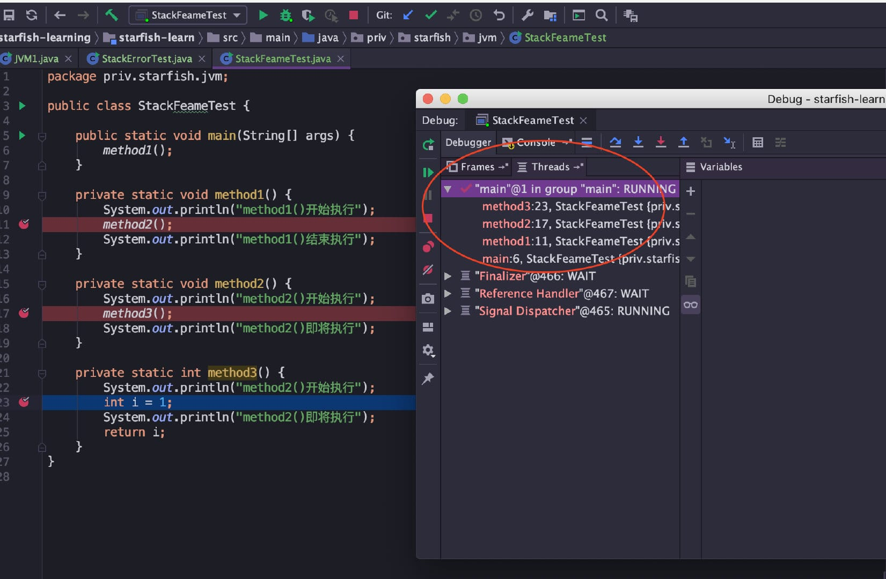
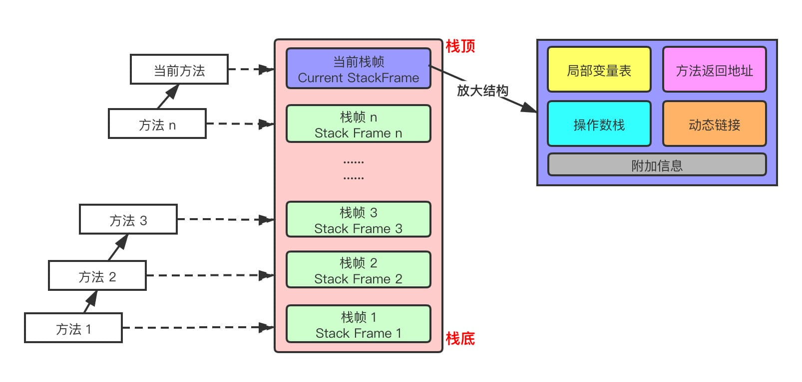
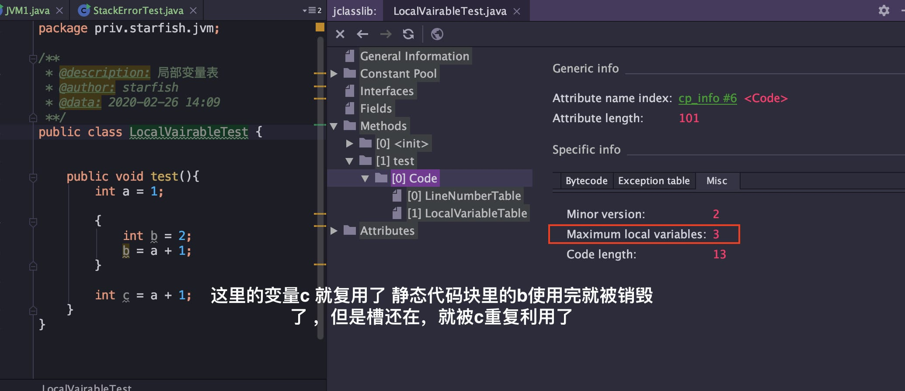
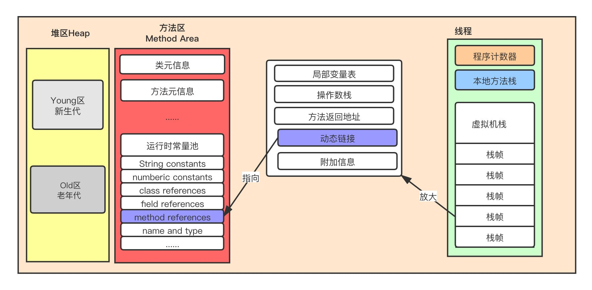

## 虚拟栈

#### 概述

Java 虚拟机栈(Java Virtual Machine Stacks)，早期也叫 Java 栈。每个线程在创建的时候都会创建一个虚拟机栈，其内部保存一个个的栈帧(Stack Frame），对应着一次次 Java 方法调用，是线程私有的，生命周期和线程一致。

>作用：主管 Java 程序的运行，它保存方法的局部变量、部分结果，并参与方法的调用和返回。

**特点：**

* 栈是一种快速有效的分配存储方式，访问速度仅次于程序计数器
* JVM 直接对虚拟机栈的操作只有两个：每个方法执行，伴随着入栈（进栈/压栈），方法执行结束出栈
* 栈不存在垃圾回收问题

**栈中可能出现的异常：**

Java 虚拟机规范允许 Java虚拟机栈的大小是动态的或者是固定不变的如果采用固定大小的 Java 虚拟机栈，那每个线程的 Java 虚拟机栈容量可以在线程创建的时候独立选定。

* 如果线程请求分配的栈容量超过 Java 虚拟机栈允许的最大容量，Java 虚拟机将会抛出一个 StackOverflowError 异常
* 如果 Java 虚拟机栈可以动态扩展，并且在尝试扩展的时候无法申请到足够的内存，或者在创建新的线程时没有足够的内存去创建对应的虚拟机栈，那 Java 虚拟机将会抛出一个OutOfMemoryError异常

> 可以通过参数-Xss来设置线程的最大栈空间，栈的大小直接决定了函数调用的最大可达深度。

#### 栈的存储单位

栈中存储什么？

* 每个线程都有自己的栈，栈中的数据都是以栈帧（Stack Frame）的格式存在
* 在这个线程上正在执行的每个方法都各自有对应的一个栈帧
* 栈帧是一个内存区块，是一个数据集，维系着方法执行过程中的各种数据信息

#### 栈运行原理

* JVM 直接对 Java 栈的操作只有两个，对栈帧的压栈和出栈，遵循“先进后出/后进先出”原则
* 在一条活动线程中，一个时间点上，只会有一个活动的栈帧。即只有当前正在执行的方法的栈帧（栈顶栈帧）是有效的，这个栈帧被称为当前栈帧（Current Frame），与当前栈帧对应的方法就是当前方法（Current Method），定义这个方法的类就是当前类（Current Class）
* 执行引擎运行的所有字节码指令只针对当前栈帧进行操作
* 如果在该方法中调用了其他方法，对应的新的栈帧会被创建出来，放在栈的顶端，称为新的当前栈帧
* 不同线程中所包含的栈帧是不允许存在相互引用的，即不可能在一个栈帧中引用另外一个线程的栈帧
* 如果当前方法调用了其他方法，方法返回之际，当前栈帧会传回此方法的执行结果给前一个栈帧，接着，虚拟机会丢弃当前栈帧，使得前一个栈帧重新成为当前栈帧
* Java 方法有两种返回函数的方式，一种是正常的函数返回，使用return指令，另一种是抛出异常，不管用哪种方式，都会导致栈帧被弹出

**IDEA 在 debug 时候，可以在 debug 窗口看到 Frames 中各种方法的压栈和出栈情况**

#### 栈帧的内部结构

每个栈帧（Stack Frame）中存储着：

* 局部变量表（Local Variables）
* 操作数栈（Operand Stack）(或称为表达式栈)
* 动态链接（Dynamic Linking）：指向运行时常量池的方法引用方法返回地址（
* Return Address）：方法正常退出或异常退出的地址
* 一些附加信息

###### 局部变量表

* 局部变量表也被称为局部变量数组或者本地变量表
* 是一组变量值存储空间，主要用于存储方法参数和定义在方法体内的局部变量，包括编译器可知的各种 Java 虚拟机基本数据类型（boolean、byte、char、short、int、float、long、double）、对象引用（reference类型，它并不等同于对象本身，可能是一个指向对象起始地址的引用指针，也可能是指向一个代表对象的句柄或其他与此相关的位置）和 returnAddress 类型（指向了一条字节码指令的地址，已被异常表取代）
* 由于局部变量表是建立在线程的栈上，是线程的私有数据，因此不存在数据安全问题
* 局部变量表所需要的容量大小是编译期确定下来的，并保存在方法的 Code 属性的 maximum local variables 数据项中。在方法运行期间是不会改变局部变量表的大小的
* 方法嵌套调用的次数由栈的大小决定。一般来说，栈越大，方法嵌套调用次数越多。对一个函数而言，它的参数和局部变量越多，使得局部变量表膨胀，它的栈帧就越大，以满足方法调用所需传递的信息增大的需求。进而函数调用就会占用更多的栈空间，导致其嵌套调用次数就会减少。
* 局部变量表中的变量只在当前方法调用中有效。在方法执行时，虚拟机通过使用局部变量表完成参数值到参数变量列表的传递过程。当方法调用结束后，随着方法栈帧的销毁，局部变量表也会随之销毁。
* 参数值的存放总是在局部变量数组的 index0 开始，到数组长度 -1 的索引结束

###### 槽Slot

* 局部变量表最基本的存储单元是 Slot（变量槽）
* 在局部变量表中，32 位以内的类型只占用一个 Slot(包括returnAddress类型)，64 位的类型（long和double）占用两个连续的 Slot
	* byte、short、char 在存储前被转换为int，boolean也被转换为int，0 表示 false，非 0 表示 true
	* long 和 double 则占据两个 Slot
* JVM 会为局部变量表中的每一个Slot都分配一个访问索引，通过这个索引即可成功访问到局部变量表中指定的局部变量值，索引值的范围从 0 开始到局部变量表最大的 Slot 数量
* 当一个实例方法被调用的时候，它的方法参数和方法体内部定义的局部变量将会按照顺序被复制到局部变量表中的每一个 Slot上
* 如果需要访问局部变量表中一个 64bit 的局部变量值时，只需要使用前一个索引即可。（比如：访问 long 或 double 类型变量，不允许采用任何方式单独访问其中的某一个 Slot）
* 如果当前帧是由构造方法或实例方法创建的，那么该对象引用 this 将会存放在 index 为 0 的 Slot 处，其余的参数按照参数表顺序继续排列（这里就引出一个问题：静态方法中为什么不可以引用 this，就是因为this 变量不存在于当前方法的局部变量表中）
* 栈帧中的局部变量表中的槽位是可以重用的，如果一个局部变量过了其作用域，那么在其作用域之后申明的新的局部变量就很有可能会复用过期局部变量的槽位，从而达到节省资源的目的。（下图中，this、a、b、c 理论上应该有 4 个变量，c 复用了 b 的槽）

* 在栈帧中，与性能调优关系最为密切的就是局部变量表。在方法执行时，虚拟机使用局部变量表完成方法的传递
* 局部变量表中的变量也是重要的垃圾回收根节点，只要被局部变量表中直接或间接引用的对象都不会被回收

###### 操作数栈

* 每个独立的栈帧中除了包含局部变量表之外，还包含一个后进先出（Last-In-First-Out）的操作数栈，也可以称为表达式栈（Expression Stack）
* 操作数栈，在方法执行过程中，根据字节码指令，往操作数栈中写入数据或提取数据，即入栈（push）、出栈（pop）
* 某些字节码指令将值压入操作数栈，其余的字节码指令将操作数取出栈。使用它们后再把结果压入栈。比如，执行复制、交换、求和等操作

**概述**

* 操作数栈，主要用于保存计算过程的中间结果，同时作为计算过程中变量临时的存储空间
* 操作数栈就是 JVM 执行引擎的一个工作区，当一个方法刚开始执行的时候，一个新的栈帧也会随之被创建出来，此时这个方法的操作数栈是空的
* 每一个操作数栈都会拥有一个明确的栈深度用于存储数值，其所需的最大深度在编译期就定义好了，保存在方法的 Code 属性的 max_stack 数据项中
* 栈中的任何一个元素都可以是任意的 Java 数据类型
	* 32bit 的类型占用一个栈单位深度
	* 64bit 的类型占用两个栈单位深度
* 操作数栈并非采用访问索引的方式来进行数据访问的，而是只能通过标准的入栈和出栈操作来完成一次数据访问
* 如果被调用的方法带有返回值的话，其返回值将会被压入当前栈帧的操作数栈中，并更新 PC 寄存器中下一条需要执行的字节码指令
* 操作数栈中元素的数据类型必须与字节码指令的序列严格匹配，这由编译器在编译期间进行验证，同时在类加载过程中的类检验阶段的数据流分析阶段要再次验证
* 另外，我们说Java虚拟机的解释引擎是基于栈的执行引擎，其中的栈指的就是操作数栈

###### 栈顶缓存（Top-of-stack-Cashing）

HotSpot 的执行引擎采用的并非是基于寄存器的架构，但这并不代表 HotSpot VM的实现并没有间接利用到寄存器资源。寄存器是物理CPU中的组成部分之一，它同时也是CPU中非常重要的高速存储资源。一般来说，寄存器的读/写速度非常迅速，甚至可以比内存的读/写速度快上几十倍不止，不过寄存器资源却非常有限，不同平台下的CPU寄存器数量是不同和不规律的。寄存器主要用于缓存本地机器指令、数值和下一条需要被执行的指令地址等数据。

基于栈式架构的虚拟机所使用的零地址指令更加紧凑，但完成一项操作的时候必然需要使用更多的入栈和出栈指令，这同时也就意味着将需要更多的指令分派（instruction dispatch）次数和内存读/写次数。由于操作数是存储在内存中的，因此频繁的执行内存读/写操作必然会影响执行速度。为了解决这个问题，HotSpot JVM设计者们提出了栈顶缓存技术，将栈顶元素全部缓存在物理CPU的寄存器中，以此降低对内存的读/写次数，提升执行引擎的执行效率

####  动态链接（指向运行时常量池的方法引用）

* 每一个栈帧内部都包含一个指向运行时常量池中该栈帧所属方法的引用。包含这个引用的目的就是为了支持当前方法的代码能够实现动态链接(Dynamic Linking)。
* 在 Java 源文件被编译到字节码文件中时，所有的变量和方法引用都作为符号引用（Symbolic Reference）保存在 Class 文件的常量池中。比如：描述一个方法调用了另外的其他方法时，就是通过常量池中指向方法的符号引用来表示的，那么动态链接的作用就是为了将这些符号引用转换为调用方法的直接引用

**JVM 是如何执行方法调用的**

方法调用不同于方法执行，方法调用阶段的唯一任务就是确定被调用方法的版本（即调用哪一个方法），暂时还不涉及方法内部的具体运行过程。Class 文件的编译过程中不包括传统编译器中的连接步骤，一切方法调用在 Class文件里面存储的都是符号引用，而不是方法在实际运行时内存布局中的入口地址（直接引用）。也就是需要在类加载阶段，甚至到运行期才能确定目标方法的直接引用。

>【这一块内容，除了方法调用，还包括解析、分派（静态分派、动态分派、单分派与多分派），这里先不介绍，后续再挖】

在 JVM 中，将符号引用转换为调用方法的直接引用与方法的绑定机制有关

* 静态链接：当一个字节码文件被装载进 JVM 内部时，如果被调用的目标方法在编译期可知，且运行期保持不变时。这种情况下将调用方法的符号引用转换为直接引用的过程称之为静态链接
* 动态链接：如果被调用的方法在编译期无法被确定下来，也就是说，只能在程序运行期将调用方法的符号引用转换为直接引用，由于这种引用转换过程具备动态性，因此也就被称之为动态链接

对应的方法的绑定机制为：早期绑定（Early Binding）和晚期绑定（Late Binding）。绑定是一个字段、方法或者类在符号引用被替换为直接引用的过程，这仅仅发生一次。

* 早期绑定：早期绑定就是指被调用的目标方法如果在编译期可知，且运行期保持不变时，即可将这个方法与所属的类型进行绑定，这样一来，由于明确了被调用的目标方法究竟是哪一个，因此也就可以使用静态链接的方式将符号引用转换为直接引用。
* 晚期绑定：如果被调用的方法在编译器无法被确定下来，只能够在程序运行期根据实际的类型绑定相关的方法，这种绑定方式就被称为晚期绑定。

**虚方法和非虚方法**

* 如果方法在编译器就确定了具体的调用版本，这个版本在运行时是不可变的。这样的方法称为非虚方法，比如静态方法、私有方法、final 方法、实例构造器、父类方法都是非虚方法
* 其他方法称为虚方法

**虚方法表**

在面向对象编程中，会频繁的使用到动态分派，如果每次动态分派都要重新在类的方法元数据中搜索合适的目标有可能会影响到执行效率。为了提高性能，JVM 采用在类的方法区建立一个虚方法表（virtual method table），使用索引表来代替查找。非虚方法不会出现在表中。

每个类中都有一个虚方法表，表中存放着各个方法的实际入口。

虚方法表会在类加载的连接阶段被创建并开始初始化，类的变量初始值准备完成之后，JVM 会把该类的方法表也初始化完毕。

###### 方法返回地址（return address）

用来存放调用该方法的 PC 寄存器的值。

一个方法的结束，有两种方式

* 正常执行完成
* 出现未处理的异常，非正常退出

无论通过哪种方式退出，在方法退出后都返回到该方法被调用的位置。方法正常退出时，调用者的 PC 计数器的值作为返回地址，即调用该方法的指令的下一条指令的地址。而通过异常退出的，返回地址是要通过异常表来确定的，栈帧中一般不会保存这部分信息。

当一个方法开始执行后，只有两种方式可以退出这个方法：

1. 执行引擎遇到任意一个方法返回的字节码指令，会有返回值传递给上层的方法调用者，简称正常完成出口一个方法的正常调用完成之后究竟需要使用哪一个返回指令还需要根据方法返回值的实际数据类型而定在字节码指令中，返回指令包含 ireturn(当返回值是 boolean、byte、char、short 和 int 类型时使用)、lreturn、freturn、dreturn 以及 areturn，另外还有一个 return 指令供声明为 void 的方法、实例初始化方法、类和接口的初始化方法使用。

2. 在方法执行的过程中遇到了异常，并且这个异常没有在方法内进行处理，也就是只要在本方法的异常表中没有搜索到匹配的异常处理器，就会导致方法退出。简称异常完成出口方法执行过程中抛出异常时的异常处理，存储在一个异常处理表，方便在发生异常的时候找到处理异常的代码。

本质上，方法的退出就是当前栈帧出栈的过程。此时，需要恢复上层方法的局部变量表、操作数栈、将返回值压入调用者栈帧的操作数栈、设置PC寄存器值等，让调用者方法继续执行下去。

正常完成出口和异常完成出口的区别在于：通过异常完成出口退出的不会给他的上层调用者产生任何的返回值

##### 附加信息

栈帧中还允许携带与Java虚拟机实现相关的一些附加信息。例如，对程序调试提供支持的信息，但这些信息取决于具体的虚拟机实现。

