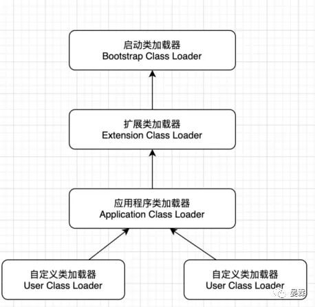
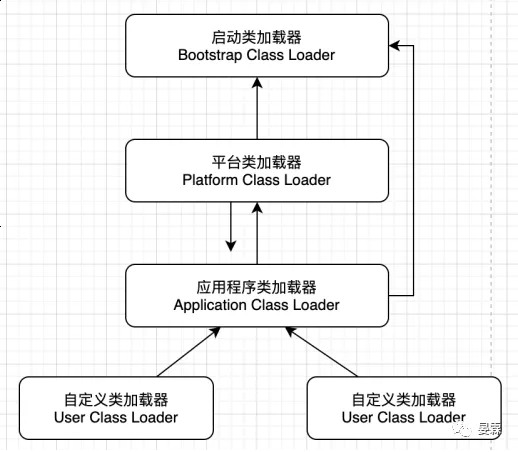

# JVM的类加载3种机制

- 全盘负责：所谓全盘负责，就是当一个类加载器负责加载某个Class时，该Class所依赖和引用其他Class也将由该类加载器负责载入，除非显示使用另一个类加载器来载入。

- 双亲委派：所谓的双亲委派，则是先让父类加载器试图加载该Class，只有在父类加载器无法加载该类时才尝试从自己的类路径中加载该类。通俗的讲，就是某个特定的类加载器在接到加载类的请求时，首先将加载任务委托给父加载器，依次递归，如果父加载器可以完成类加载任务，就成功返回；只有父加载器无法完成此加载任务时，才自己去加载。

- 缓存机制：缓存机制将会保证所有加载过的Class都会被缓存，当程序中需要使用某个Class时，类加载器先从缓存区中搜寻该Class，只有当缓存区中不存在该Class对象时，系统才会读取该类对应的二进制数据，并将其转换成Class对象，存入缓冲区中。这就是为什么修改了Class后，必须重新启动JVM，程序所做的修改才会生效的原因。

### 双亲委派模型

##### 工作原理

如果一个类收到了加载请求时，它并不会自己先做加载操作，而是把请求委托给父类加载器执行加载任务，如果父类加载器还存在其父类加载器，则进一步向上依次递归委托，最终所有请求都会到启动类加载器中。如果父类加载器可以完成类加载任务，就成功返回，倘若父加载器无法完成此加载任务，子加载器才会尝试自己去加载，如果所有加载器均加载失败，就会抛出ClassNotFoundException异常。

双亲委派优点：

- 1）安全

可避免用户自己编写的类动态替换Java的核心类，如java.lang.String。java核心api中定义类型不会被随意替换，假设通过网络传递一个名为java.lang.Integer的类，通过双亲委托模式传递到启动类加载器，而启动类加载器在核心Java API发现这个名字的类，发现该类已被加载，并不会重新加载网络传递的过来的java.lang.Integer，而直接返回已加载过的Integer.class，这样便可以防止核心API库被随意篡改。

- 2）避免全限定命名的类重复加载

使用了findLoadClass()判断当前类是否已加载。Java类随着它的类加载器一起具备了一种带有优先级的层次关系，通过这种层级关可以避免类的重复加载，当父亲已经加载了该类时，就没有必要子ClassLoader再加载一次。

##### JDK9之前的模型

在Java中加载器不只一个。从虚拟机的角度看，类加载器分为两大类，一类是启动类加载器（Bootstrap ClassLoader），他是C++实现的，另一类是其他类加载器，这类加载器都是由Java语言实现的，虚拟机认为所有非自身实现的加载器都归属这类。从我们程序员角度看，Java语言实现这部分要分的更细一些，大致分为三类，加上启动类加载器，Java中的所有类加载器共分为四类。

- 启动类加载器（BootstrapClassLoader）

	C++编写，加载java核心库 加载java.lang.*,构造ExtClassLoader和AppClassLoader。由于引导类加载器涉及到虚拟机本地实现细节，开发者无法直接获取到启动类加载器的引用，所以不允许直接通过引用进行操作。

- 标准扩展类加载器（ExtensionClassLoader）

	Java编写，加载扩展库，加载jre/lib/ext目录下，如classpath中的jre，javax.*或者java.ext.dirs 指定位置中的类，开发者可以直接使用标准扩展类加载器。

- 应用类程序类加载器（AppliactionClassLoader）

	Java编写，加载程序所在的目录，如user.dir所在的位置的class，也称系统类加载器，如果没有指定类加载器，一般情况下就是这个程序默认的类加载器。

- 用户自定义类加载器（UserClassLoader）

	Java编写,用户自定义的类加载器,可加载指定路径的class文件

##### JDK9之后的双亲委派模型

JDK9中，取消了扩展类加载器，取代他的是平台类加载器。加载过程：在平台类加载器及应用程序类加载器收到加载请求时，在委派给父类加载器之前，会先判断该类能否归属到一个系统模块中，如果能，就需要优先委派给负责那个模块的加载器完成加载。

双亲委派模型的好处：

1、防止重复加载同一个class。通过委托去向上面问一问，加载过了，就不用再加载一遍。保证数据安全。

2、保证核心class不能被篡改。通过委托方式，不会去篡改核心class，即使篡改也不会去加载，即使加载也不会是同一个class对象了。不同的加载器加载同一个class也不是同一个Class对象。这样保证了Class执行安全。

#### 破坏双亲委派模型

上面讲解的双亲委派模型看起来可以加载大部分的类，我们也提到了双亲委派模型并不是强一致模型，就说明有些类的加载并不是按照这个模型实现的，在Java实际开发中我们会用到数据库，虽然所有数据库都遵循JDBC规范，但是Java并不知道你使用的是什么数据库，因此Java提供了一个Driver接口来帮助我们加载不同数据库服务商的驱动和连接。比如mysql的就写了MySQL Connector，那么问题就来了，DriverManager（也由jdk提供）要加载各个实现了Driver接口的实现类，然后进行管理，但是DriverManager由启动类加载器加载，只能记载JAVA_HOME的lib下文件，而其实现是由服务商提供的，由系统类加载器加载，这个时候就需要启动类加载器来委托子类来加载Driver实现，从而破坏了双亲委派，只是举了破坏双亲委派的其中一个情况。类在这种破坏双亲委派的的服务接口还有JNDI（Java Naming and Directory Interface ，Java 命名与目录接口）、JCE（ Java Cryptography Extension，Java 密码学扩展）、JAXB（Java Architecture for XML Binding ， Java开发者在Java应用程序中能方便地结合XML数据和处理函数)、JBI（Java Business Integration，Java业务集成，Java业务整合）等。