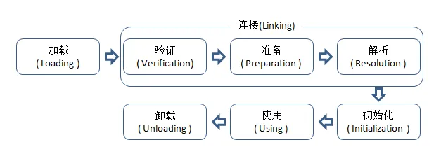
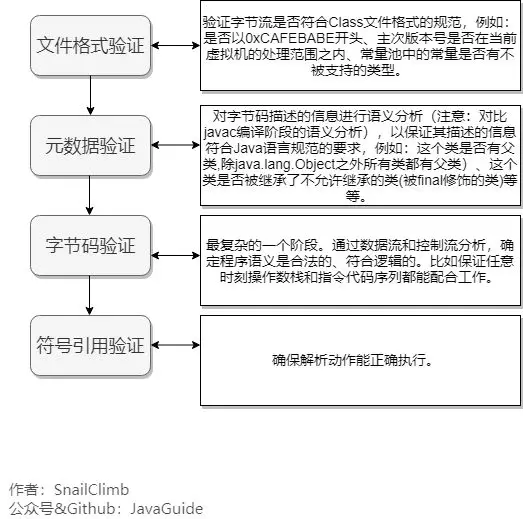

## Java虚拟机类加载机制

#### 一. 生命周期

类从被加载到虚拟机内存中开始，到卸载出内存为止，它的整个生命周期包括：加载（Loading）、验证（Verification）、准备(Preparation)、解析(Resolution)、初始化(Initialization)、使用(Using)和卸载(Unloading)7个阶段。其中准备、验证、解析3个部分统称为连接（Linking）。

下面陈述的内容都已HotSpot为基准。如图：



###### 1.1. 加载

在加载阶段（可以参考java.lang.ClassLoader的loadClass()方法），虚拟机需要完成以下3件事情：

* 通过全类名获取定义此类的二进制字节流。
* 将字节流所代表的静态存储结构转换为方法区的运行时数据结构。
* 在内存中生成一个代表该类的java.lang.Class对象,作为方法区这些数据的访问入口。

一个非数组类的加载阶段（加载阶段获取类的二进制字节流的动作）是可控性最强的阶段，这一步我们可以去完成还可以自定义类加载器去控制字节流的获取方式（重写一个类加载器的loadClass()方法）。数组类型不通过类加载器创建，它由Java虚拟机直接创建。

加载阶段和连接阶段（Linking）的部分内容（如一部分字节码文件格式验证动作）是交叉进行的，加载阶段尚未完成，连接阶段可能已经开始，但这些夹在加载阶段之中进行的动作，仍然属于连接阶段的内容，这两个阶段的开始时间仍然保持着固定的先后顺序。

###### 1.2. 验证

验证是连接阶段的第一步，这一阶段的目的是为了确保Class文件的字节流中包含的信息符合当前虚拟机的要求，并且不会危害虚拟机自身的安全。
验证阶段大致会完成4个阶段的检验动作：



验证阶段是非常重要的，但不是必须的，它对程序运行期没有影响，如果所引用的类经过反复验证，那么可以考虑采用-Xverifynone参数来关闭大部分的类验证措施，以缩短虚拟机类加载的时间。

###### 1.3. 准备

准备阶段是正式为类变量分配内存并设置类变量初始值的阶段，这些变量所使用的内存都将在方法区中进行分配。这时候进行内存分配的仅包括类变量（被static修饰的变量），而不包括实例变量，实例变量将会在对象实例化时随着对象一起分配在堆中。对于该阶段有以下几点需要注意：

这时候进行内存分配的仅包括类变量（static），而不包括实例变量，实例变量会在对象实例化时随着对象一块分配在 Java 堆中。
这里所设置的初始值"通常情况"下是数据类型默认的零值（如0、0L、null、false等）。

比如代码：

```java
public static int value=111 
```
那么 value 变量在准备阶段的初始值就是 0 而不是111（初始化阶段才会复制）。

特殊情况：比如给 value 变量加上了 fianl 关键字
```java
public static final int value=111 
```
那么准备阶段 value 的值就被复制为 111。

基本数据类型的零值：

数据类型|零值|数据类型|零值
---|---|---|---
int|0|boolean|false
long|0l|float|0.0f
short|(short)0|double|0.0d
char|'\u0000'|reference|null
byte|(byte)0||

###### 1.4. 解析

解析阶段是虚拟机将常量池内的符号引用替换为直接引用的过程。

解析动作主要针对类或接口、字段、类方法、接口方法、方法类型、方法句柄和调用点限定符7类符号引用进行。

符号引用：以一组符号来描述所引用的目标，可以是任何形式的字面量。

直接引用：直接引用是可以指向目标的指针、相对偏移量或者是一个能直接或间接定位到目标的句柄。和虚拟机实现的内存有关，不同的虚拟机直接引用一般不同。

Java 虚拟机为每个类都准备了一张方法表来存放类中所有的方法。当需要调用一个类的方法的时候，只要知道这个方法在方发表中的偏移量就可以直接调用该方法了。通过解析操作符号引用就可以直接转变为目标方法在类中方法表的位置，从而使得方法可以被调用。

综上，解析阶段是虚拟机将常量池内的符号引用替换为直接引用的过程，也就是得到类或者字段、方法在内存中的指针或者偏移量。

###### 1.5. 初始化

类初始化阶段是类加载过程的最后一步，才真正开始执行类中定义的java程序代码，初始化阶段是执行类构造器&lt;clinit&gt;()方法的过程。

在准备极端，变量已经付过一次系统要求的初始值，而在初始化阶段，则根据程序制定的主管计划去初始化类变量和其他资源。

&lt;clinit&gt;()方法是由编译器自动收集类中的所有类变量的赋值动作和静态语句块static{}中的语句合并产生的，编译器收集的顺序是由语句在源文件中出现的顺序所决定的，静态语句块只能访问到定义在静态语句块之前的变量，定义在它之后的变量，在前面的静态语句块可以赋值，但是不能访问。如下：

```java
public class A {
	static {
		i = 4;
		System.out.println(i)// 编译器报错，初始化时候无法访问i
	}
	private static int i = 0;
}
```

&lt;clinit&gt;()方法与实例构造器&lt;init&gt;()方法不同，它不需要显示地调用父类构造器，虚拟机会保证在子类&lt;init&gt;()方法执行之前，父类的&lt;clinit&gt;()方法方法已经执行完毕。
由于父类的&lt;clinit&gt;()方法先执行，也就意味着父类中定义的静态语句块要优先于子类的变量赋值操作。

&lt;clinit&gt;()方法对于类或者接口来说并不是必需的，如果一个类中没有静态语句块，也没有对变量的赋值操作，那么编译器可以不为这个类生产&lt;clinit&gt;()方法。

接口中不能使用静态语句块，但仍然有变量初始化的赋值操作，因此接口与类一样都会生成&lt;clinit&gt;()方法。但接口与类不同的是，执行接口的&lt;clinit&gt;()方法不需要先执行父接口的&lt;clinit&gt;()方法。只有当父接口中定义的变量使用时，父接口才会初始化。另外，接口的实现类在初始化时也一样不会执行接口的&lt;clinit&gt;()方法。

虚拟机会保证一个类的&lt;clinit&gt;()方法在多线程环境中被正确的加锁、同步，如果多个线程同时去初始化一个类，那么只会有一个线程去执行这个类的&lt;clinit&gt;()方法，其他线程都需要阻塞等待，直到活动线程执行&lt;clinit&gt;()方法完毕。如果在一个类的&lt;clinit&gt;()方法中有好事很长的操作，就可能造成多个线程阻塞，在实际应用中这种阻塞往往是隐藏的。

```java
public class A {
	static {
		//执行很长时间的一块代码，或者死锁
	}
	private static int i = 0;
}
```
虚拟机规范严格规定了有且只有5中情况必须对类进行“初始化”：

- 当遇到 new 、 getstatic、putstatic或invokestatic 这4条直接码指令时。生成这4条指令的最常见的Java代码场景是：使用new关键字实例化对象的时候、读取或设置一个类的静态字段（被final修饰、已在编译器把结果放入常量池的静态字段除外）的时候，以及调用一个类的静态方法的时候。。

- 使用 java.lang.reflect 包的方法对类进行反射调用时 ，如果类没初始化，需要触发其初始化。

- 初始化一个类，如果其父类还未初始化，则先触发该父类的初始化。

- 当虚拟机启动时，用户需要定义一个要执行的主类 (包含 main 方法的那个类)，虚拟机会先初始化这个类。

- 当使用 JDK1.7 的动态动态语言时，如果一个 MethodHandle 实例的最后解析结构为 REF_getStatic、REF_putStatic、REF_invokeStatic、的方法句柄，并且这个句柄没有初始化，则需要先触发器初始化。

- JDK1.8后，如果接口定义了默认方法，接口的实现类发生了初始化，那么接口要在其前被初始化。

###### 使用

类访问方法区内的数据结构的接口， 对象是Heap区的数据。

###### 卸载 

Java虚拟机将结束生命周期的几种情况

* 执行了System.exit()方法
* 程序正常执行结束
* 程序在执行过程中遇到了异常或错误而异常终止
* 由于操作系统出现错误而导致Java虚拟机进程终止


## 二. 类装载方式

java中的所有类，都需要由类加载器装载到JVM中才能运行。类加载器本身也是一个类，而它的工作就是把class文件从硬盘读取到内存中。在写程序的时候，我们几乎不需要关心类的加载，因为这些都是隐式装载的，除非我们有特殊的用法，像是反射，就需要显示的加载所需要的类。


类装载方式：

* 2.1. 隐式装载，程序在运行过程中当碰到通过new等方式生成对象时，隐式调用类装载器加载对应的类到jvm中。

* 2.2. 显式装载，通过class.forName()等方法，显式加载需要的类。

java类的加载是动态的，它并不会一次性将所有类全部加载后再运行，而是保证程序运行的基础类完全加载到JVM中，至于其他类，则在需要的时候才加载。节省内存开销。

