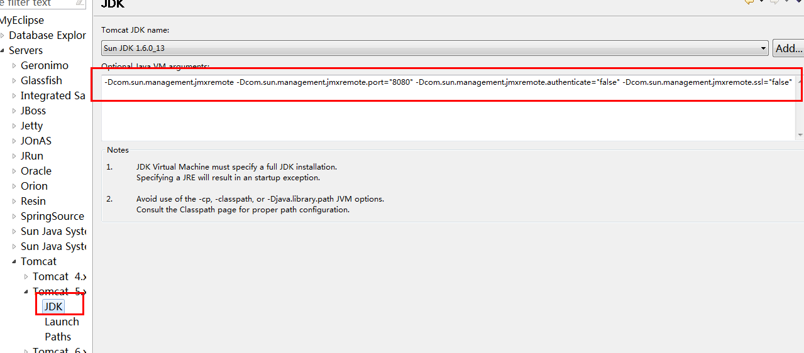

### jconsole

通过 jconsole查看tomcat运行情况的配置方法
——基于JDK1.5、Linux（Redhat5.5）、Tomcat6
由于项目的原因，需要使用jconsole对tomcat进行远程监控，结合网上的资料对配置方法进行了总结。

**第一步、配置tomcat**

打开%TOMCAT_HOME%/bin下的文件catalina.sh，搜索“JAVA_OPTS”找到下面这行：
```shell
if [ -z "$LOGGING_MANAGER" ]; then
  JAVA_OPTS="$JAVA_OPTS -Djava.util.logging.manager=org.apache.juli.ClassLoaderLogManager"
else
  JAVA_OPTS="$JAVA_OPTS $LOGGING_MANAGER"
fi
```
在每个“JAVA_OPTS”后边都添加以下标黄代码段，且在一行显示：
```shell
if [ -z "$LOGGING_MANAGER" ]; then
     JAVA_OPTS="$JAVA_OPTS 
     -Djava.util.logging.manager=org.apache.juli.ClassLoaderLogManager 
     -Djava.rmi.server.hostname=192.9.100.48  
     -Dcom.sun.management.jmxremote
      -Dcom.sun.management.jmxremote.port="9004" 
     -Dcom.sun.management.jmxremote.authenticate="false" 
     -Dcom.sun.management.jmxremote.ssl="false""
else
     JAVA_OPTS="$JAVA_OPTS $LOGGING_MANAGER 
     -Djava.rmi.server.hostname=192.9.100.48  
     -Dcom.sun.management.jmxremote 
     -Dcom.sun.management.jmxremote.port="9004" 
     -Dcom.sun.management.jmxremote.authenticate="false" 
     -Dcom.sun.management.jmxremote.ssl="false""
fi
```
其中-Djava.rmi.server.hostname项必须设置，否则远程连接会因为解析到127.0.0.1失败，该项的值就是你在windows客户端连接linux时的ip地址
-Dcom.sun.management.jmxremote.port="9004"项设置远程连接端口，不要与其他应用冲突
ssl和authenticate设置为false，如果需要安全，请不要false

**第二步、重启tomcat**

使用root身份登录系统，进入%TOMCAT_HOME%/bin目录下：
[root@test ~]#ps –ef |grep tomcat –-输入命令查看是否存在tomcat进程
[root@test ~]#./shutdown.sh--停止tomcat服务，如果无效使用kill命令杀掉进程
[root@test ~]#./startup.sh  --启动tomcat服务

**第三步、运行jconsole**

进入JDK安装目录%JDK_HOME%/bin下，找到“jconsole.exe”，点击运行并选择【远程】选项卡：
在【主机名或ip】输入要远程监控的tomcat服务器地址
在【端口】输入上文设置的端口号：9004
【用户名、口令】为空，点击【连接】进入监控界面。


