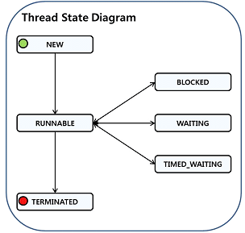

Thread Dump是非常有用的诊断Java应用问题的工具，每一个Java虚拟机都有及时生成显示所有线程在某一点状态的thread-dump的能力。虽然各个 Java虚拟机thread dump打印输出格式上略微有一些不同，但是Thread dumps出来的信息包含线程；线程的运行状态、标识和调用的堆栈；调用的堆栈包含完整的类名，所执行的方法，如果可能的话还有源代码的行数。

Thread Dump特点：

     能在各种操作系统下使用；能在各种Java应用服务器下使用 ；可以在生产环境下使用而不影响系统的性能；可以将问题直接定位到应用程序的代码行上 。
     Thread Dump能诊断的问题包括：
     查找内存泄露，常见的是程序里load大量的数据到缓存；发现死锁线程 。

产生ThreadDump堆栈信息的方法：
     1. UNIX/Linux
Kill -3 PID

PID通过下面方法获取

ps -efHl | grep 'java' \*\*. \*\*

Java线程的背景

**1、线程同步**

多条线程之间可以同时执行，为了确保多线程在使用共享资源上面的通用性，使用线程同步保证在同一时间只能有一条线程可以访问共享资源。线程同步在Java中可以使用监视器。每个Java对象都有一个监视器，这个监视器只能被一个线程拥有。当一个线程要获得另外线程拥有的监视器时，需要进入等待队列直到线程释放监视器。

**2、线程的状态**

为了分析Thread Dump ，需要先了解线程的状态。线程的状态是在java.lang.Thread.State中，Sun JVM的常见线程状态：
对于thread dump信息，主要关注的是线程的状态和其执行堆栈，线程的状态一般为三类

* NEW:线程被创建但是还没有被执行
* RUNNABLE:线程正在占用cpu并且在执行任务
* BLOCKED（Waiting for monitor entry（MW））:线程为了获得监视器需要等待其他线程释放锁
* WAITING:调用了wait，join，park方法使线程等待-无限期等待
* TIMED_WAITING（Waiting on monitor（CW））:调用了sleep，wait，join，park方法使线程等待--有限期等待

一般关注的都是RUNNABLE和BLOCKED状态的线程，Cpu很忙则关注runnable的线程，Cpu闲则关注waiting for monitor entry的线程。
