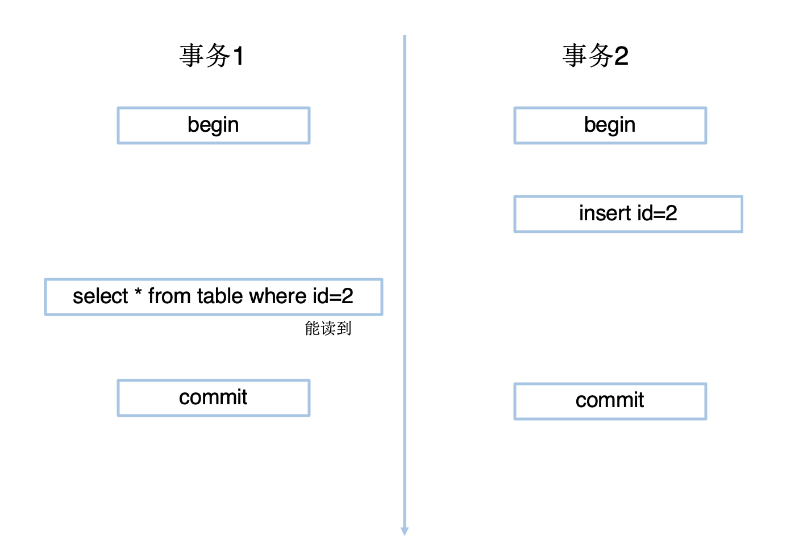
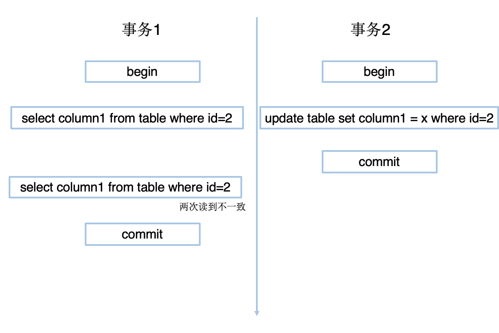
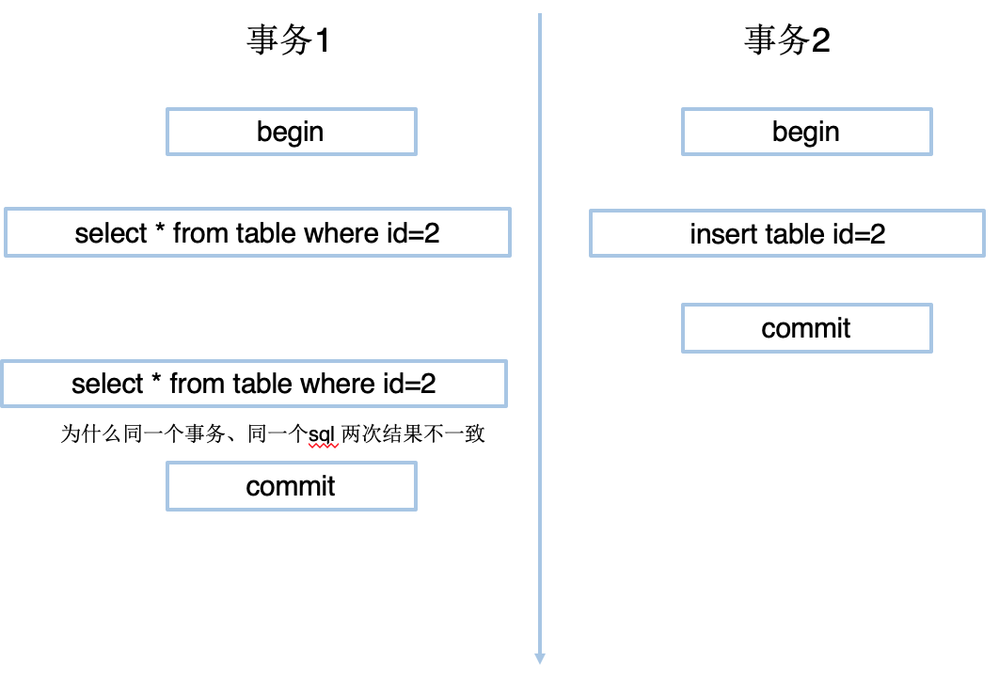

## 事务

事务有四大特性，简称ACID：原子性、一致性、隔离性、持久性。

* 脏读

	一个事务读取了另一个事务未提交的数据。

* 不可重复读

	一个事务读取同一行数据，多次读取结果不同。

* 幻读

	一个事务读取到了别的事务插入的数据。

* 事务四种不同的隔离级别
	* Read uncommitted(未提交读)
	* Read Committed(已提交读，简称RC)
	* Repeatable Reads(可重复读，简称RR)
	* Serializable(串行化)

隔离级别|脏读|不可重复读|幻读
---|---|---|---
Read uncommitted|是|是|是
Read Committed||是|是
Repeatable Reads|||是
Serializable|||