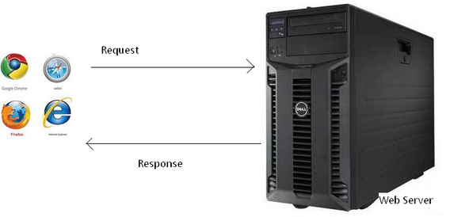
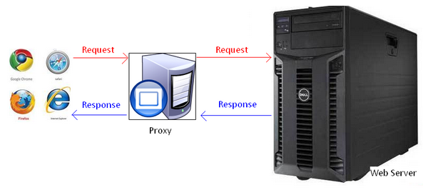
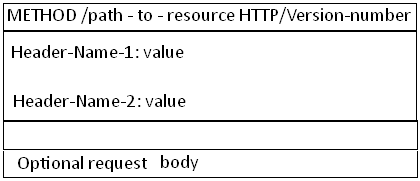
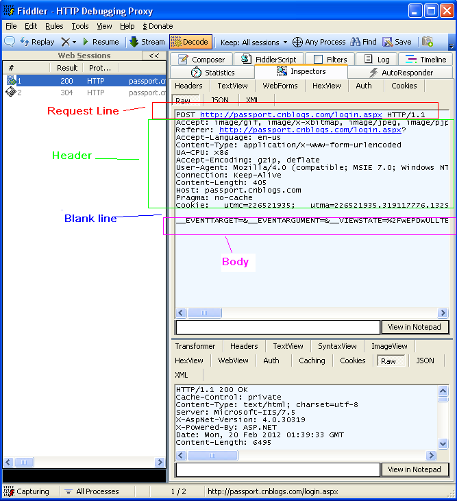

### HTTP协议详解

**什么是HTTP协议**

协议是指计算机通信网络中两台计算机之间进行通信所必须共同遵守的规定或规则，超文本传输协议(HTTP)是一种通信协议，它允许将超文本标记语言(HTML)文档从Web服务器传送到客户端的浏览器

目前我们使用的是HTTP/1.1 版本

Web服务器，浏览器,代理服务器

当我们打开浏览器，在地址栏中输入URL，然后我们就看到了网页。 原理是怎样的呢？

实际上我们输入URL后，我们的浏览器给Web服务器发送了一个Request,Web服务器接到Request后进行处理，生成相应的Response，然后发送给浏览器， 浏览器解析Response中的HTML,这样我们就看到了网页，过程如下图所示

我们的Request 有可能是经过了代理服务器，最后才到达Web服务器的。

过程如下图所示

代理服务器就是网络信息的中转站，有什么功能呢？

1. 提高访问速度， 大多数的代理服务器都有缓存功能。
2. 突破限制， 也就是翻墙了
3. 隐藏身份。

URL详解

URL(Uniform Resource Locator) 地址用于描述一个网络上的资源,  基本格式如下

schema://host[:port#]/path/.../[?query-string][#anchor]
scheme               指定低层使用的协议(例如：http, https, ftp)

host                   HTTP服务器的IP地址或者域名

port#                 HTTP服务器的默认端口是80，这种情况下端口号可以省略。如果使用了别的端口，必须指明，例如 http://www.cnblogs.com:8080/

path                   访问资源的路径

query-string       发送给http服务器的数据

anchor-             锚

URL 的一个例子

http://www.mywebsite.com/sj/test/test.aspx?name=sviergn&x=true#stuff

Schema:                 http
host:                   www.mywebsite.com
path:                   /sj/test/test.aspx
Query String:           name=sviergn&x=true
Anchor:                 stuff

HTTP协议是无状态的

http协议是无状态的，同一个客户端的这次请求和上次请求是没有对应关系，对http服务器来说，它并不知道这两个请求来自同一个客户端。 为了解决这个问题， Web程序引入了Cookie机制来维护状态.

打开一个网页需要浏览器发送很多次Request

1. 当你在浏览器输入URL http://www.cnblogs.com 的时候，浏览器发送一个Request去获取 http://www.cnblogs.com 的html.  服务器把Response发送回给浏览器.
2. 浏览器分析Response中的 HTML，发现其中引用了很多其他文件，比如图片，CSS文件，JS文件。
3. 浏览器会自动再次发送Request去获取图片，CSS文件，或者JS文件。
4. 等所有的文件都下载成功后。 网页就被显示出来了。

HTTP消息的结构

先看Request 消息的结构,   Request 消息分为3部分，第一部分叫Request line, 第二部分叫Request header, 第三部分是body. header和body之间有个空行， 结构如下图

第一行中的Method表示请求方法,比如"POST","GET",  Path-to-resoure表示请求的资源， Http/version-number 表示HTTP协议的版本号

当使用的是"GET" 方法的时候， body是为空的
比如我们打开博客园首页的request 如下
      GET http://www.cnblogs.com/ HTTP/1.1
      Host: www.cnblogs.com
抽象的东西，难以理解，老感觉是虚的， 所谓眼见为实, 实际见到的东西，我们才能理解和记忆。 我们今天用Fiddler，实际的看看Request和Response.
下面我们打开Fiddler 捕捉一个博客园登录的Request 然后分析下它的结构, 在Inspectors tab下以Raw的方式可以看到完整的Request的消息，   如下图

