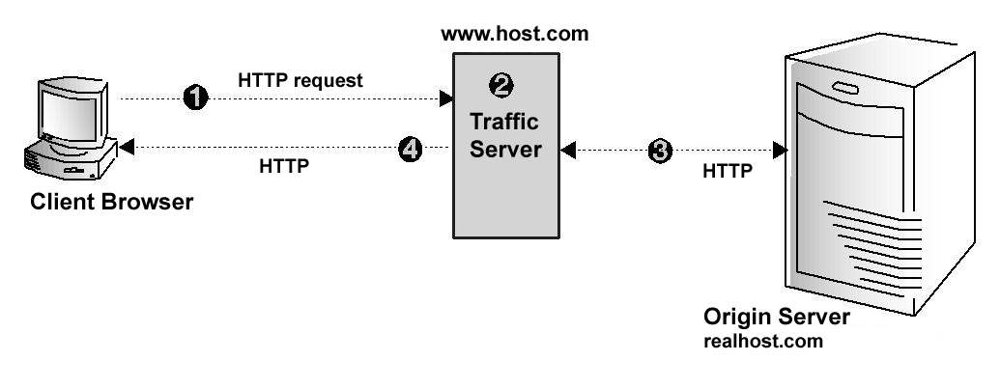

### http反向代理

在反向代理模式中，Traffic Server为Web服务器处理HTTP请求。反向代理模式的Traffic Server服务从客户端浏览器HTTP请求的方式如下图所示。

1.      客户端浏览器在80端口向名为www.host.com 的host发送一个HTTP请求。Traffic Server以源服务器的角色接收这个请求（源服务器的广告主机名被解析到Traffic Server）。

2.      Traffic Server在remap.config文件中定位映射规则并重新映射这个请求到一个指定的源服务器（realhost.com）。

3.      Traffic Server建立一个和源服务器的HTTP连接。

4.      如果请求在缓存中命中而且内容是有效的，Traffic Server直接从缓存中想客户端发送被请求的对象。否则，Traffic Server从源服务器获取被请求的对象，发送给客户端，同时在缓存中保存一份该对象的拷贝。

要配置HTTP反向代理，必须完成如下工作：

在remap.config文件中创建映射规则（见Creating Mapping Rules for HTTP Requests）。
开启反向代理选项（见Enabling HTTP Reverse Proxy）。
除了上面的工作，也可以Set Optional HTTP Reverse Proxy Options。

为HTTP请求创建映射规则
在前向代理缓存中，Traffic Server作为代理服务器并接收代理请求。在反向代理缓存中，Traffic Server必须作为源服务器而不是代理服务器，这意味着它接收服务器请求而非代理请求。因此 ，为了满足代理请求，Traffic Server必须从服务器请求构造一个代理请求。

在HTTP中，代理请求指定这个URL而服务器请求之指定路径。一个服务器请求大致格式如下：

GET /index.html HTTP/1.0 Host: real.dianes_books.com

然而，对应的代理请求格式如下：

GET http://real.dianes_books.com/index.html HTTP/1.0 Host: real.dianes_books.com

Traffic Server可以通过host头部中的服务器信息从一个服务器请求构造一个代理请求。然而，正确的代理请求必须包含源服务器的主机名，而不是域名服务器解析到Traffic Server的广告主机名。广告主机名是出现在host头部的主机名；对源服务器real.dianes_books.com而言，服务器请求的请求和host头部应该是：

GET /index.html HTTP/1.0 Host: www.dianes_books.com

而正确的代理请求应该是：

GET http://real.dianes_books.com/index.html HTTP/1.0 Host: real.dianes_books.com

要将www.dianes_books.com替代为real.dianes_books.com，Traffic Server需要一系列URL重新的规则（映射规则）。映射规则在Using Mapping Rules for HTTP Requests中描述。

通常，使用代理模式可以支持多个源服务器。在这种情况下，所有的广告主机名都被解析为Traffic Server的IP地址或虚拟IP地址。使用host头部，Traffic Server可以为任意数量的服务器将服务器请求转换为代理请求。如果Traffic Server收到来自老版本浏览器发送的不支持host头部的请求，Traffic Server可以将这些请求直接路由给指定的服务器，或者向浏览器发送一个包含错误信息的URL（见Setting Optional HTTP Reverse Proxy Options）。

处理源服务器重定向响应
源服务器经常给浏览器返回重定向到不同页面的响应。比如，如果源服务器超载，它会重定向浏览器到一个低负载的服务器。源服务器也重定向已经被移到不同位置下的web页面。当Traffic Server被配置成一个反向代理，它必须通过改写来自源服务器的重定向来使浏览器重定向到Traffic Server而不是其他的源服务器。

Traffic Server使用反向映射规则来改写重定向。通常，需要为每个映射规则设置一个反向映射规则。要创建反向映射规则，见Using Mapping Rules for HTTP Requests。

为HTTP请求使用映射规则
Traffic Server为HTTP反向代理使用两种类型的映射规则：

一个映射规则是将一个客户端的请求URL转换为定位内容的URL。当Traffic Server使用反向代理模式并接收客户端的HTTP请求，它必须从相关的URL和头部来构造一个完整的URL。Traffic Server接下来使用这个完整的URL在remap.config文件中查找其匹配的目标URL。要使请求URL匹配目标URL，下面的条件必须满足：
两个URL必须是一个组合
两个URL的host必须相同。如果请求URL中包含一个不合格的主机名，它不可能匹配到一个具有合格的主机名的目标URL。
两个URL的端口号必须相同。如果指定的URL中没有端口号，URL的组合将使用默认的端口号。
目标URL的路径部分必须可以和请求URL的前缀匹配。
如果Traffic Server找到一个匹配，它将请求URL转换为映射规则中的替换URL：它设置请求URL的host和路径去匹配替换URL。如果URL包含path前缀，Traffic Server去掉path的和目标URL匹配的前缀，同时用替换URL中path来替换该path。如果一个请求URL有两个对应的匹配，Traffic Server接受remap.config文件中的第一个匹配。

一个反向映射规则是将源服务器重定向响应中的URL转换为指向Traffic Server，这样客户端会再次重定向到Traffic Server而不是直接访问一个源服务器。比如，在源服务器www.molasses.com 上有一个/pub目录，一个客户端向该源服务器发送一个/pub的请求，源服务器可能回复一个http://www.test.com/pub/的重定向来告诉客户端它请求的是一个目录，而不是文档（重定向通常的应用是标准化URL，这样客户端可以正确地标记文档）。
Traffic Server使用反向代理规则来阻止客户端（从源服务器收到重定向）绕过Traffic Server直接访问源服务器。

映射和反向映射规则都由一个目标（源）URL和一个替换（目的）URL组成。在一个映射规则中，目标URL指向Traffic Server而替换URL指定源服务器内容的位置。在一个反向映射规则中，目标URL指定源服务器内容的位置而替换URL指向Traffic Server。Traffic Server在位于Traffic Server的config目录下的ramap.config文件中存储映射规则。

创建映射规则：

1. 在文本编辑器中打开位于Traffic Server的config目录下的remap.config文件。

2. 输入映射和反向映射规则（见remap.config）。

3. 保存并关闭remap.config文件

4. 定位到Traffic Server的bin目录

5. 运行traffic_line –x命令来应用配置文件的变更。

开启HTTP反向代理
开启HTTP反向代理需要以下步骤。

1.  在文本编辑器中打开位于Traffic Server的config目录下的records.config文件。

2. 编辑下面的变量：

变量	描述
proxy.config.reverse_proxy.enabled	设置这个变量为1来开启HTTP反向代理模式。
3. 保存并关闭records.config文件

4. 定位到Traffic Server的bin目录

5. 运行traffic_line –x命令来应用配置文件的变更。

设置可选的HTTP反向代理选项
Traffic Server提供了下面几个可配置的反向代理选项：

配置Traffic Server在转换的时候保存客户端的host头部信息
配置Traffic Server只服务发向映射规则中的源服务器的请求。因此，发向不在映射规则中源服务器的请求将不会被服务。
为来自老版本客户端的请求指定一个替换的URL（比如，没有提供Host头部的客户端）。
设置可选的HTTP反向代理选项：

1.        在文本编辑器中打开位于Traffic Server的config目录下的records.config文件。

2.        编辑下面的变量：

变量	描述
proxy.config.url_remap.pristine_host_hdr	设置这个变量为1来保存客户端请求的host头部。

如果想要Traffic Server转换客户端请求的host头部，设置这个变量为0。

proxy.config.url_remap.remap_required	如果想让Traffic Server只为在remap.config文件的映射规则中的源服务器的请求服务，设置这个变量为1。

如果想让Traffic Server服务所有源服务器的请求，设置这个变量为0。

proxy.config.header.parse.no_host_url_redirect	输入为没有host头部的请求重定向的URL。
3.        保存并关闭records.config文件

4.        定位到Traffic Server的bin目录

5.        运行traffic_line –x命令来应用配置文件的变更。

重定向HTTP请求
可以配置Traffic Server不联系任何源服务器就可以重定向HTTP请求。比如，如果想重定向所有去http://www.ultraseek.com 的请求到http://www.server1.com/products/portal/search/ ，则所有去www.ultraseek.com 的请求将直接去www.server1.com/products/portal/search 。

可以配置Traffic Server完成永久或临时重定向。永久重定向通知浏览器URL的变更（通过返回HTTP状态码301），这样浏览器就可以更新标签。临时重定向通知浏览器只是当前请求的URL变更（通过返回HTTP状态码307）。

设置重定向规则：

1.        在文本编辑器中打开位于Traffic Server的config目录下的remap.config文件。

2.        为每个重定向设置一条映射规则。每条映射规则必须一个分开的行并且必须由三个确定位置的区域：type、target和replacement组成。下面的表描述了每个区域的格式。

变量	|描述
---|---
type|输入其中的一个：redirect – 不联系源服务器而永久重定向HTTP请求。redirect_temporary  — 不联系源服务器而临时重定向HTTP请求。
target|输入源URL。可以由四部分组成：scheme://host:port/path_prefix
replacement	|输入目标URL。可以由四部分组成：scheme://host:port/path_prefix

下面的规则将所有www.server1.com 请求永久重定向到www.server2.com ：

redirect http://www.server1.com http://www.server2.com

3.        保存并关闭remap.config文件

4.        定位到Traffic Server的bin目录

5.        运行traffic_line –x命令来应用配置文件的变更。