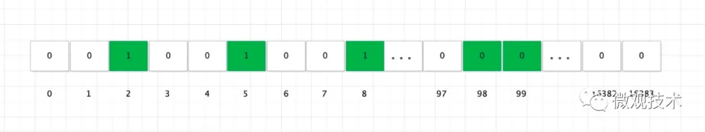
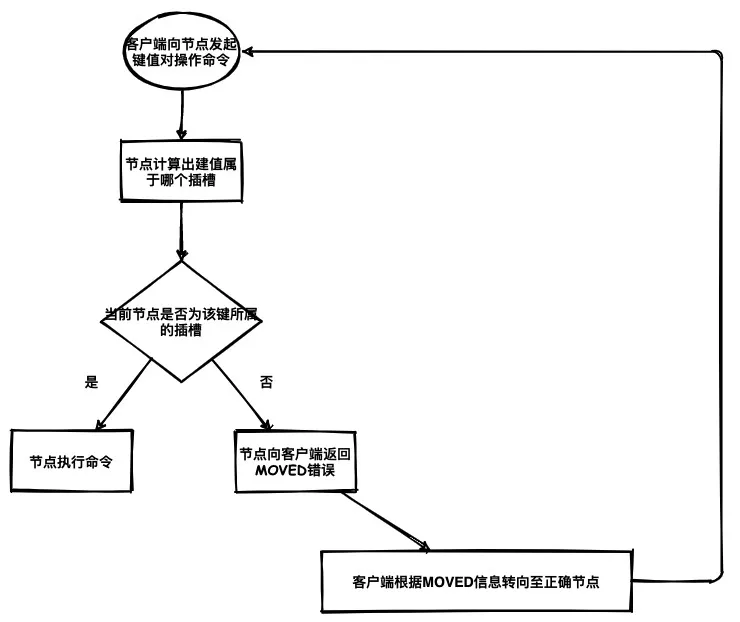
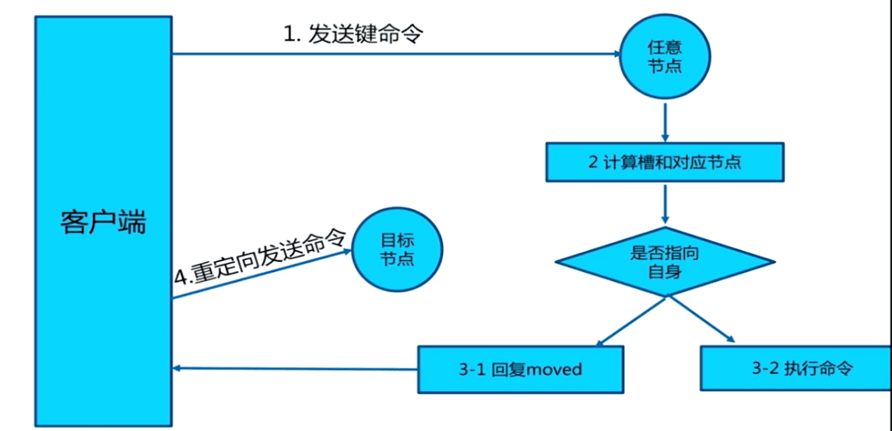
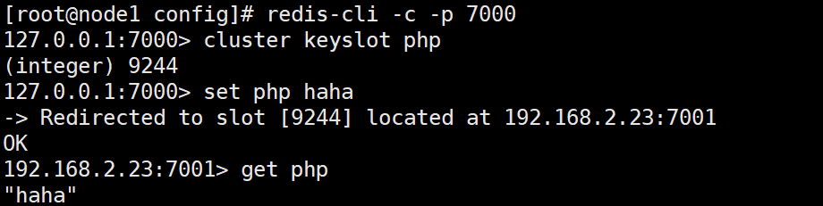
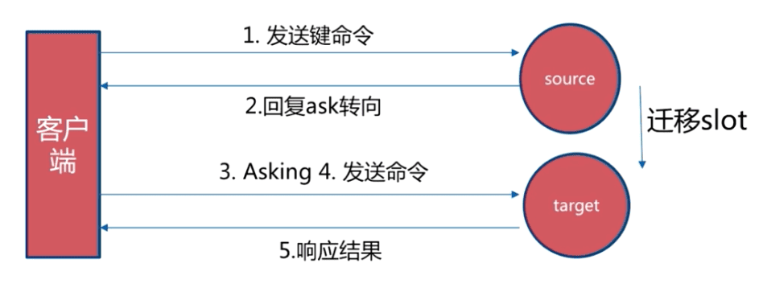
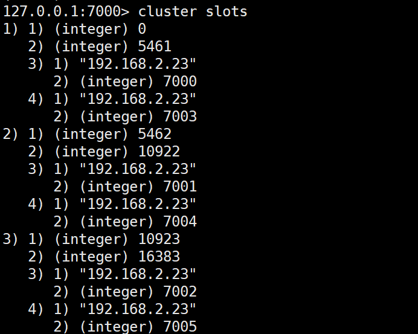
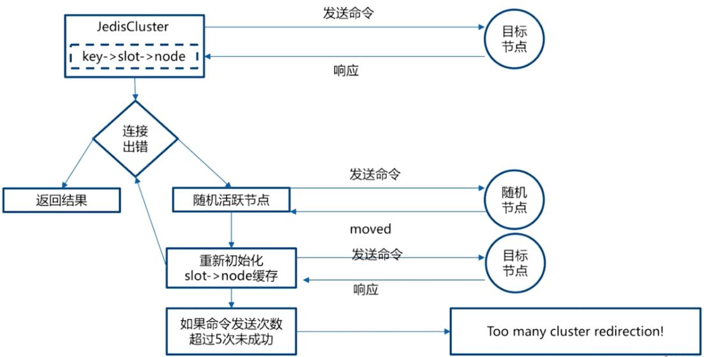

## redis Sharding机制

Redis Cluster是一种服务器Sharding技术，3.0版本开始正式提供。

#### slot 机制

Redis-cluster没有使用一致性hash，而是引入了**哈希槽** 的概念。Redis-cluster的整个数据库将会被分为 16384个哈希槽（即2^14，受心跳包带宽限制），数据库中的每个键都会被分配到这16384个槽中的其中一个，集群中的每个节点负责一部分hash槽（hash slot），可以处0个或者最多16384个槽。

> 在redis节点发送心跳包时需要把所有的槽放到这个心跳包里，以便让节点知道当前集群信息，在发送心跳包时使用char进行bitmap（`2 * 8(8 bit) * 1024(1k)= 16KB`），压缩后是2kB(一个字节8位)，也就是说使用2k的空间创建了16k的槽数。

Redis主节点的哈希槽配置信息是通过 bitmap 来保存的。



#### 设置slot指派

通过命令 CLUSTER ADDSLOTS <slot> [slot...] 命令我们可以将一个或多个槽指派给某个节点。

如 127.0.0.1:6380> CLUSTER ADDSLOTS 1 2 3 4 5 命令就是将 1，2，3，4，5 号插槽指派给本地端口号为 6380 的节点负责。

设置后节点将会将槽指派的信息发送给其他集群，让其他集群更新信息。

**计算键属于哪个槽**

```
def slot_number(key):
    return CRC16(key) & 16383
```

计算哈希槽位置其实使用的是 CRC16 算法对键值进行计算后再对 16383 取模得到最终所属插槽。

也可以使用 ` CLUSTER KEYSLOT <key> `进行查看。

#### Keys hash tags

Hash tags提供了一种途径，**用来将多个(相关的)key分配到相同的hash slot中** 。这时Redis Cluster中实现multi-
key操作的基础。

hash tag规则如下，如果满足如下规则，{和}之间的字符将用来计算HASH_SLOT，以保证这样的key保存在同一个slot中。

  * key包含一个{字符
  * 并且 如果在这个{的右面有一个}字符
  * 并且 如果在{和}之间存在至少一个字符

例如：

  * {user1000}.following和{user1000}.followers这两个key会被hash到相同的hash slot中，因为只有user1000会被用来计算hash slot值。
  * foo{}{bar}这个key不会启用hash tag因为第一个{和}之间没有字符。
  * foozap这个key中的{bar部分会被用来计算hash slot
  * foo{bar}{zap}这个key中的bar会被用来计算计算hash slot，而zap不会

#### Sharding 流程

> Redis cluster采用去中心化的架构，集群的主节点各自负责一部分槽，客户端如何确定key到底会映射到哪个节点上呢？这就是我们要讲的请求重定向。

在cluster模式下，**节点对请求的处理过程** 如下：

  * 检查当前key是否存在当前NODE？ 
    * 通过crc16（key）/16384计算出slot
    * 查询负责该slot负责的节点，得到节点指针
    * 该指针与自身节点比较
  * 若slot不是由自身负责，则返回MOVED重定向
  * 若slot由自身负责，且key在slot中，则返回该key对应结果
  * 若key不存在此slot中，检查该slot是否正在迁出（MIGRATING）？
  * 若key正在迁出，返回ASK错误重定向客户端到迁移的目的服务器上
  * 若Slot未迁出，检查Slot是否导入中？
  * 若Slot导入中且有ASKING标记，则直接操作
  * 否则返回MOVED重定向

这个过程中有两点需要具体理解下： **MOVED重定向** 和 **ASK重定向** 。

<!--  -->

### # Moved 重定向



  * 槽命中：直接返回结果
  * 槽不命中：即当前键命令所请求的键不在当前请求的节点中，则当前节点会向客户端发送一个Moved 重定向，客户端根据Moved 重定向所包含的内容找到目标节点，再一次发送命令。

从下面可以看出 php 的槽位9244不在当前节点中，所以会重定向到节点 192.168.2.23:7001中。redis-
cli会帮你自动重定向（如果没有集群方式启动，即没加参数 -c，redis-
cli不会自动重定向），并且编写程序时，寻找目标节点的逻辑需要交予程序员手动完成。

    
    cluster keyslot keyName # 得到keyName的槽
    



### # ASK 重定向

Ask重定向发生于集群伸缩时，集群伸缩会导致槽迁移，当我们去源节点访问时，此时数据已经可能已经迁移到了目标节点，使用Ask重定向来解决此种情况。



### # smart客户端

上述两种重定向的机制使得客户端的实现更加复杂，提供了smart客户端（JedisCluster）来**减低复杂性，追求更好的性能**
。客户端内部负责计算/维护键-> 槽 -> 节点映射，用于快速定位目标节点。

实现原理：

  * 从集群中选取一个可运行节点，使用 cluster slots得到槽和节点的映射关系



  * 将上述映射关系存到本地，通过映射关系就可以直接对目标节点进行操作（CRC16(key) -> slot -> node），很好地避免了Moved重定向，并为每个节点创建JedisPool

  * 至此就可以用来进行命令操作


