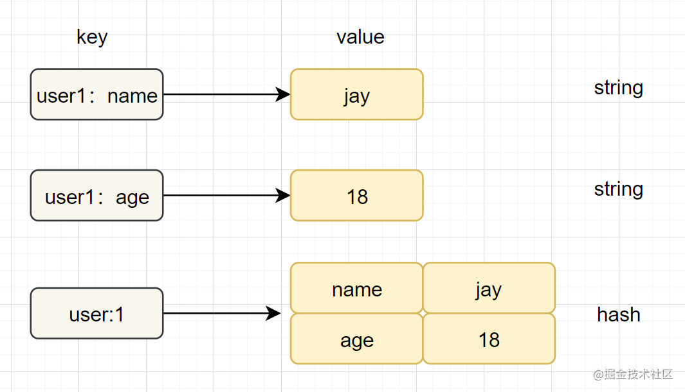

## Redis Hash（哈希）

> Hash（哈希散列）是Redis基本数据类型，值value中存储的是一个string类型的 field（字段）和value（值）的映射表。Hash特别适合用于存储对象。

* 哈希类型是指v（值）本身又是一个键值对（k-v）结构
* 内部编码：ziplist（压缩列表） 、hashtable（哈希表）

#### 数据结构

**字符串和哈希类型对比如下图**：

#### 命令使用

命令| 简述| 使用  
---|---|---  
HSET| 添加键值对| HSET hash-key field value 
HGET| 获取指定散列键的值| HGET hash-key field  
HGETALL| 获取散列中包含的所有键值对| HGETALL hash-key  
HDEL| 如果给定键存在于散列中，那么就移除这个键| HDEL hash-key field
HEXISTS | 用于判断哈希表中字段是否存在 | HEXISTS hash-key field
HINCRBY | 为存储在 key 中的哈希表指定字段做整数增量运算 | HINCRBY key field increment
HKEYS | 获取存储在 key 中的哈希表的所有字段 | HKEYS hash-key 
HLEN | 获取存储在 key 中的哈希表的字段数量 | HLEN hash-key 
HVALS | 用于获取哈希表中的所有值 | HVALS hash-key 

> **注意点**：如果开发使用hgetall，哈希元素比较多的话，可能导致Redis阻塞，可以使用hscan。而如果只是获取部分field，建议使用hmget。

#### 实战场景

* 应用场景：缓存实体对象等，如用户信息，视频信息等