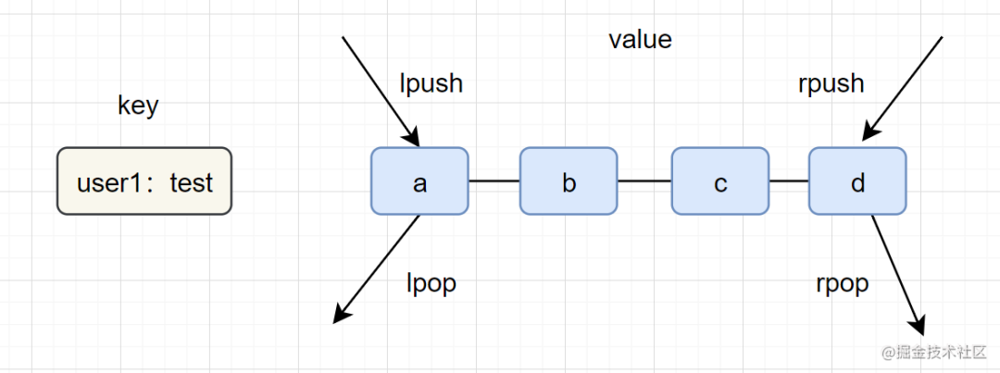

## Redis List（列表）

> Redis中的List其实就是链表（Redis用双端链表实现List）。

* 列表（list）类型是用来存储多个有序的字符串，一个列表最多可以存储2^32-1个元素。
* 内部编码：ziplist（压缩列表）、linkedlist（链表）
* 应用场景：消息队列，文章列表,

#### **命令使用**

命令| 简述| 使用  
---|---|---  
RPUSH| 将给定值推入到列表右端| RPUSH key value  
LPUSH| 将给定值推入到列表左端| LPUSH key value  
RPOP| 从列表的右端弹出一个值，并返回被弹出的值| RPOP key  
LPOP| 从列表的左端弹出一个值，并返回被弹出的值| LPOP key  
LRANGE| 获取列表在给定范围上的所有值| LRANGE key 0 -1  
LINDEX| 通过索引获取列表中的元素。你也可以使用负数下标，以 -1 表示列表的最后一个元素， -2 表示列表的倒数第二个元素，以此类推。|LINDEX key index  
BLPOP| 移出并获取列表的第一个元素 | BLPOP key [key ...] timeout
BRPOP| 移出并获取列表的最后一个元素 | BRPOP key [key ...] timeout
BRPOPLPUSH| 从列表中弹出一个值，并将该值插入到另外一个列表中并返回它 |BRPOPLPUSH source destination timeout
LINSERT| 在列表的元素前或者后插入元素 | LINSERT key BEFORE(AFTER) pivot element
LLEN| 获取列表长度 | LLEN key
LPUSHX| 将一个值插入到已存在的列表头部 | LPUSHX key element [element ...]
LREM| 移除列表元素 |LREM key count element
LSET| 通过索引设置列表元素的值 |LSET key index element
LTRIM| 对一个列表进行修剪(trim) | LTRIM key start stop
RPOPLPUSH| 移除列表的最后一个元素，并将该元素添加到另一个列表并返回 |RPOPLPUSH source destination
RPUSHX| 为已存在的列表添加值 |RPUSHX key element [element ...]

#### **list应用场景参考以下**：

* lpush+lpop=Stack（栈）
* lpush+rpop=Queue（队列）
* lpush+ltrim=Capped Collection（有限集合）
* lpush+brpop=Message Queue（消息队列）

**结构图如下：**

#### **实战场景**

* **微博TimeLine** : 有人发布微博，用lpush加入时间轴，展示新的列表信息。
* **消息队列**

