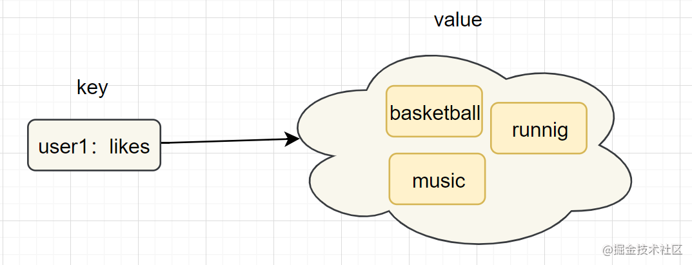

## Redis Set（集合）

> Redis 的 Set 是String 类型的无序集合。集合成员是唯一的，这就意味着集合中不能出现重复的数据。

Redis 中集合是通过哈希表实现的，所以添加，删除，查找的复杂度都是 O(1)。

* 集合（set）类型也是用来保存多个的字符串元素，但是不允许重复元素
* 内部编码：intset（整数集合）、hashtable（哈希表）

#### **数据结构**

结构图如下：

#### **命令使用**

命令| 简述| 使用  
---|---|---  
SADD| 向集合添加一个或多个成员| SADD key value  
SCARD| 获取集合的成员数| SCARD key  
SMEMBERS| 返回集合中的所有成员| SMEMBERS key member  
SISMEMBER| 判断 member 元素是否是集合 key 的成员| SISMEMBER key member
SDIFF| 返回给定所有集合的差集 | SDIFF key [key ...]
SDIFFSTORE| 返回给定所有集合的差集并存储在 destination 中 | SDIFFSTORE destination key [key ...]
SINTER| 返回给定所有集合的交集 | SINTER key [key ...]
SINTERSTORE| 返回给定所有集合的交集并存储在 destination 中 | SINTERSTORE destination key [key ...]
SMOVE| 将 member 元素从 source 集合移动到 destination 集合 | SMOVE source destination member
SPOP| 移除并返回集合中的一个随机元素 | SPOP key [count]
SRANDMEMBER| 返回集合中一个或多个随机数 | SRANDMEMBER key [count]
SREM| 移除集合中一个或多个成员 | SREM key member [member ...]
SUNION| 返回所有给定集合的并集 | SUNION key [key ...]
SUNIONSTORE| 所有给定集合的并集存储在 destination 集合中 | SUNIONSTORE destination key [key ...]
SSCAN| 迭代集合中的元素 |SSCAN key cursor [MATCH pattern] [COUNT count]

> **注意点**：smembers和lrange、hgetall都属于比较重的命令，如果元素过多存在阻塞Redis的可能性，可以使用sscan来完成。

* 应用场景：用户标签,生成随机数抽奖、社交需求。

####  **实战场景**

* **标签** （tag）,给用户添加标签，或者用户给消息添加标签，这样有同一标签或者类似标签的可以给推荐关注的事或者关注的人。
* **社交需求** 
* **生成随机数抽奖**
* **点赞，或点踩，收藏等** ，可以放到set中实现
