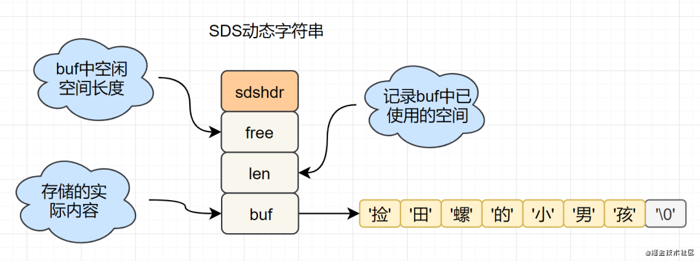

## redis String（字符串）

> String是redis中最基本的数据类型，一个key对应一个value。


* String是Redis最基础的数据结构类型，它是二进制安全的，可以存储图片或者序列化的对象，值最大存储为512M
* 应用场景：共享session、分布式锁，计数器、限流。
* 内部编码有3种，int（8字节长整型）/embstr（小于等于39字节字符串）/raw（大于39个字节字符串）


#### **命令使用**

命令| 简述| 使用  
---|---|---  
GET| 获取存储在给定键中的值| GET key  
SET| 设置存储在给定键中的值| SET key value  
DEL| 删除存储在给定键中的值| DEL key  
INCR| 将键存储的值加1| INCR key  
DECR| 将键存储的值减1| DECR key  
INCRBY| 将键存储的值加上整数| INCRBY key amount  
DECRBY| 将键存储的值减去整数| DECRBY key amount 
GETRANGE| 返回 key 中字符串值的子字符 | GETRANGE key start end
GETSET| 将给定 key 的值设为 value ，并返回 key 的旧值 ( old value ) |GETSET key value 
GETBIT| 对 key 所储存的字符串值，获取指定偏移量上的位 ( bit ) |GETBIT key offset
MGET| 获取所有(一个或多个)给定 key 的值 |MGET key [key ...]
SETBIT| 对 key 所储存的字符串值，设置或清除指定偏移量上的位(bit) |SETBIT key offset
SETEX| 设置 key 的值为 value 同时将过期时间设为 seconds |SETEX key seconds value
SETNX| 只有在 key 不存在时设置 key 的值 |SETNX key value
SETRANGE| 从偏移量 offset 开始用 value 覆写给定 key 所储存的字符串值 |SETRANGE key offset value
STRLEN| 返回 key 所储存的字符串值的长度 |STRLEN key
MSET| 同时设置一个或多个 key-value 对 |MSET key value [key value ...]
MSETNX| 同时设置一个或多个 key-value 对 |MSETNX key value [key value ...]
PSETEX| 以毫秒为单位设置 key 的生存时间 |PSETEX key milliseconds value
APPEND| 将 value 追加到 key 原来的值的末尾 |APPEND key value

#### **数据结构**
```C
struct sdshdr {
  unsigned int len; // 标记buf的长度
  unsigned int free; //标记buf中未使用的元素个数
  char buf[]; // 存放元素的坑
}
```
**结构图如下：**



*动态字符串操作方法*

* 字符串长度处理：Redis获取字符串长度，时间复杂度为O(1)，而C语言中，需要从头开始遍历，复杂度为O（n）;
* 空间预分配：字符串修改越频繁的话，内存分配越频繁，就会消耗性能，而SDS修改和空间扩充，会额外分配未使用的空间，减少性能损耗。
* 惰性空间释放：SDS 缩短时，不是回收多余的内存空间，而是free记录下多余的空间，后续有变更，直接使用free中记录的空间，减少分配。
* 二进制安全：Redis可以存储一些二进制数据，在C语言中字符串遇到'\0'会结束，而 SDS中标志字符串结束的是len属性。


#### **实战场景**

* **缓存** ： 

经典使用场景，把常用信息，字符串，图片或者视频等信息放到redis中，redis作为缓存层，mysql做持久化层，降低mysql的读写压力。

* **计数器** ：

redis是单线程模型，一个命令执行完才会执行下一个，同时数据可以一步落地到其他的数据源。

* **session** ：

常见方案spring session + redis实现session共享，


