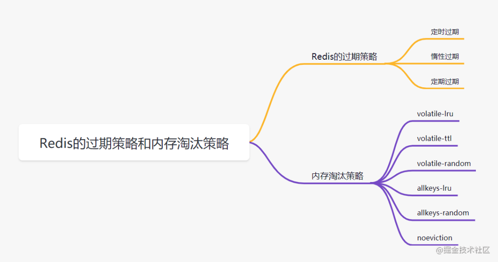

### Redis的过期策略

##### 一、定时过期

	每个设置过期时间的key都需要创建一个定时器，到过期时间就会立即对key进行清除。
	该策略可以立即清除过期的数据，对内存很友好；但是会占用大量的CPU资源去处理过期的数据，
	从而影响缓存的响应时间和吞吐量。

##### 二、惰性过期

	只有当访问一个key时，才会判断该key是否已过期，过期则清除。
	该策略可以最大化地节省CPU资源，却对内存非常不友好。
	极端情况可能出现大量的过期key没有再次被访问，从而不会被清除，占用大量内存。

##### 三、定期过期

	每隔一定的时间，会扫描一定数量的数据库的expires字典中一定数量的key，并清除其中已过期的key。
	该策略是前两者的一个折中方案。通过调整定时扫描的时间间隔和每次扫描的限定耗时，
	可以在不同情况下使得CPU和内存资源达到最优的平衡效果。

	expires字典会保存所有设置了过期时间的key的过期时间数据，
	其中，key是指向键空间中的某个键的指针，value是该键的毫秒精度的UNIX时间戳表示的过期时间。
	键空间是指该Redis集群中保存的所有键。

***Redis中同时使用了惰性过期和定期过期两种过期策略。***

假设Redis当前存放30万个key，并且都设置了过期时间，如果你每隔100ms就去检查这全部的key，CPU负载会特别高，最后可能会挂掉。
因此，redis采取的是定期过期，每隔100ms就随机抽取一定数量的key来检查和删除的。
但是呢，最后可能会有很多已经过期的key没被删除。这时候，redis采用惰性删除。在你获取某个key的时候，redis会检查一下，这个key如果设置了过期时间并且已经过期了，此时就会删除。

* voltile-lru 当内存不足以容纳新写入数据时，从设置了过期时间的key中使用LRU（最近最少使用）算法进行淘汰；
* voltile-ttl 当内存不足以容纳新写入数据时，在设置了过期时间的key中，根据过期时间进行淘汰，越早过期的优先被淘汰；
* voltile-random 当内存不足以容纳新写入数据时，从设置了过期时间的key中，随机淘汰数据；。
* allkeys-lru 当内存不足以容纳新写入数据时，从所有key中使用LRU（最近最少使用）算法进行淘汰。
* allkeys-random 当内存不足以容纳新写入数据时，从所有key中随机淘汰数据。
* no-eviction 默认策略，当内存不足以容纳新写入数据时，新写入操作会报错。
* volatile-lfu：4.0版本新增，当内存不足以容纳新写入数据时，在过期的key中，使用LFU算法进行删除key。
* allkeys-lfu：4.0版本新增，当内存不足以容纳新写入数据时，从所有key中使用LFU算法进行淘汰；

