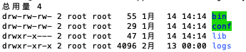

# 内网服务器部署规范

## 一、业务服务部署

名称|路径|规范
:-:|:-:|:-:
项目名|/neworiental/app/${项目名}-${环境}|

目录结构

```java
${项目名}
--------/bin      # 目录：linux 脚本，通常包括:start.sh、stop.sh、restart.sh
--------/lib      # 目录：程序运行需要的jar包
--------/conf     # 目录：配置文件
--------/logs     # 目录：日志
--------/VERSION  # 文件：记录本次版本信息
```

如图所示



## 二、开源工具部署

名称|路径|规范
:-:|:-:|:-:
软件|/neworiental/app/${软件名称}|不带版本号

```java
${软件项目名}
--------/bin      # 目录：linux 脚本，通常包括:start.sh、stop.sh、restart.sh
```
## 三、新服务器初始化软

### 基础软件

基础软件：是指环境运行需要的依赖工具，部署过程不需要启动进程。

名称|路径|规范
:-:|:-:|:-:
java|/usr/java/${jdk版本}|默认jdk 1.8
nodejs|/usr/node/${node版本}|
maven|/usr/maven/${maven版本}|
gradle|/usr/gradle/${gradle版本}|


