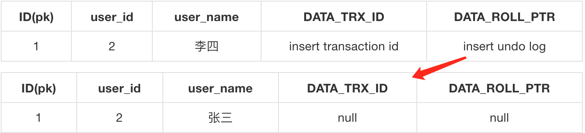
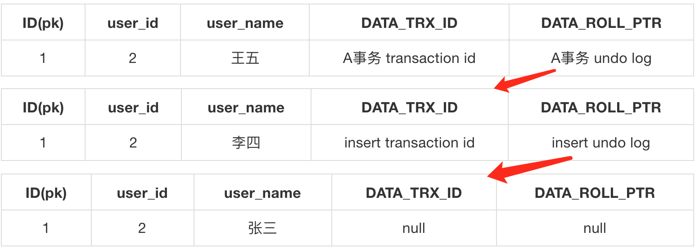
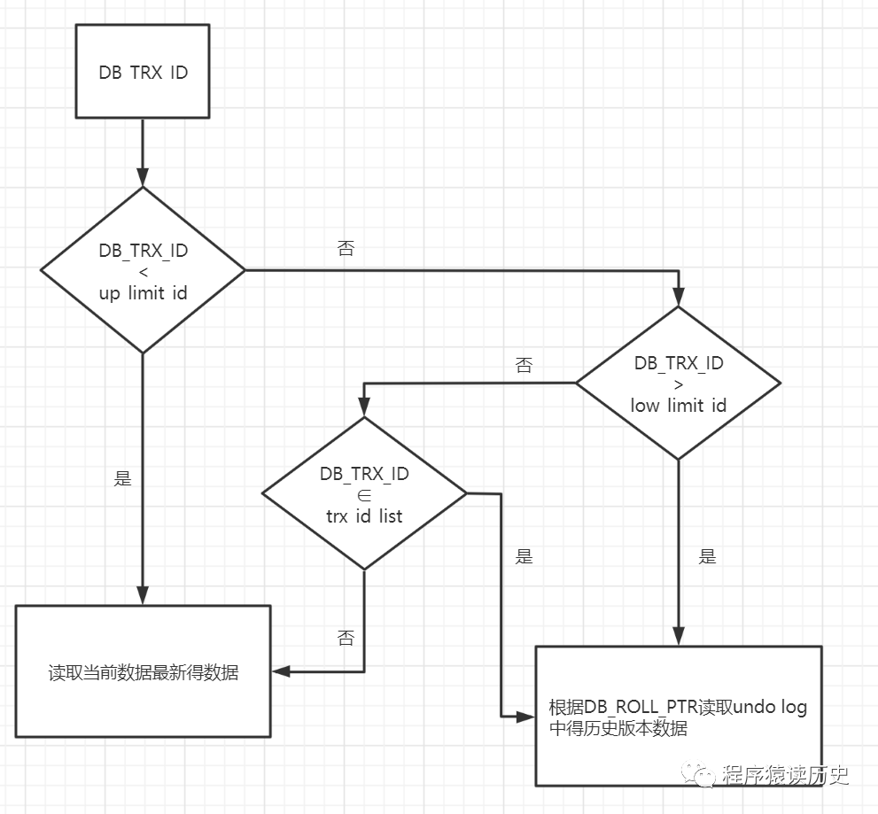

### MVCC实现原理

	MVCC的是通过行记录的三个隐藏列、undo log和read view实现的，首先介绍inndod引擎的行数据存储的三个隐藏列。

##### 三个隐藏列

	inndodb的每一行记录除了用户创建的列外，会有三个隐藏列：DATA_TRX_ID、DATA_ROLL_PTR和DB_ROW_ID。

	* DATA_TRX_ID：记录最近更新这条记录的事务ID(6字节)，如果这行数据第一次事务操作，则该列为空（比如这行数据首次insert）。
	* DATA_ROLL_PTR：指向该行undo log的指针，通过指针找到之前版本，通过链表形式组织(7字节)
	* DB_ROW_ID：行标识，没有主键时主动生成(6字节)。如果有主键，则不会有该隐藏列。


<font color="red">表有主键MySQL不会增加一个DB_ROW_ID隐式主键</font>。DB_TRX_ID是最后一次操作该记录的事务ID，而DB_ROLL_PTR是指向这行记录上一个版本的指针值，由于改记录上一个版本的数据存储在undo log中，故该值是指向undo log一个指针值。

注意：如果这行数据是第一次被写入，不存在上一个事务的操作，所以DATA_TRX_ID和DATA_ROLL_PTR两列为空。


##### Undo log链路

&nbsp;&nbsp;&nbsp;&nbsp;undo log主要分为两种：

* insert undo log 代表事务在insert新记录时产生的undo log, 只在事务回滚时需要，并且在事务提交后可以被立即丢弃
* update undo log 事务在进行update或delete时产生的undo log， 不仅在事务回滚时需要，在快照读时也需要。所以不能随便删除，只有在快速读或事务回滚不涉及该日志时，对应的日志才会被purge线程统一清除

**对MVCC有帮助的其实是update undo log**


**第一步：先insert数据**

插入user_id、name、主键ID三列数据。由于已经有了主键，此时引擎只会再对这一行记录增加两列，分别是最近更新这条记录的事务ID，即DATA_TRX_ID。和该行上一个事务状态下数据的undo指针值，即DATA_ROLL_PTR。由于这行数据是第一次被写入，不存在上一个事务的操作，所以DATA_TRX_ID和DATA_ROLL_PTR两列为空。

ID(pk)|user_id|user_name|DATA_TRX_ID|DATA_ROLL_PTR
:-:|:-:|:-:|:-:|:-:
1|2|张三|null|null


**第二步：A事务更新name，将张三改为李四**

* 事务A将会获得ID=1行数据的X锁，这样其他所有读写锁都需要等待其释放X锁。
* 将该行数据(update前的数据)拷贝到undo log，作为旧的记录保存下来。
* 在将【张三】改为【李四】，同时在DATA_TRX_ID列记录insert事务的ID，并且DATA_ROLL_PTR列则指向上一步的undo log地址。
* 事务提交，释放锁。





**第二步：B事务再更新name，将李四改为王五**

* 事务B在改行数据上，加排他锁，其他事务等待。
* 再将目前数据拷贝到undo log，作为旧的记录保存下来。
* 在将【李四】改为【王五】，同时在DATA_TRX_ID列记录当前B事务的ID，并且DATA_ROLL_PTR列则指向上一步的undo log地址。
* 事务提交，释放锁。





##### Read view


当一个快照读语句发生时，数据库会产生一个Read View，该视图是保存事务ID的list列表，记录的是本事务执行时，MySQL还有哪些进行中且未提交的事务，即当前系统中还有哪些活跃的读写事务ID列表。每个事务开启时，都会被分配一个ID, 这个ID是递增的，所以最新的事务ID值越大。

Read View主要是用来做判断的, 即当我们某个事务执行快照读的时候，对该记录创建一个Read View读视图，把它比作条件用来判断当前事务能够看到哪个版本的数据，可能是当前最新的数据，也有可能是该行记录的undo log里面的某个版本的数据。

**Read View几个属性**

* trx_id_list: 当前系统活跃(未提交)事务版本号集合。
* low_limit_id: 创建当前read view 时“当前系统最大事务版本号+1”。
* up_limit_id: 创建当前read view 时“系统正处于活跃事务最小版本号”
* creator_trx_id: 创建当前read view的事务版本号；

注意，网上有很多文章说low_limit_id是最小版本号，up_limit_id是最大版本号，但是根据 源码的注释来看意思恰好是相反，节选源码如下：

```c

struct read_view_struct{
  ulint    type;  /*!< VIEW_NORMAL, VIEW_HIGH_GRANULARITY */
  undo_no_t  undo_no;/*!< 0 or if type is
        VIEW_HIGH_GRANULARITY
        transaction undo_no when this high-granularity
        consistent read view was created */
  trx_id_t  low_limit_no;
        /*!< The view does not need to see the undo
        logs for transactions whose transaction number
        is strictly smaller (<) than this value: they
        can be removed in purge if not needed by other
        views */
  trx_id_t  low_limit_id;
        /*!< The read should not see any transaction
        with trx id >= this value. In other words,
        this is the "high water mark". */
  trx_id_t  up_limit_id;
        /*!< The read should see all trx ids which
        are strictly smaller (<) than this value.
        In other words,
        this is the "low water mark". */
  ulint    n_trx_ids;
        /*!< Number of cells in the trx_ids array */
  trx_id_t*  trx_ids;/*!< Additional trx ids which the read should
        not see: typically, these are the active
        transactions at the time when the read is
        serialized, except the reading transaction
        itself; the trx ids in this array are in a
        descending order. These trx_ids should be
        between the "low" and "high" water marks,
        that is, up_limit_id and low_limit_id. */
  trx_id_t  creator_trx_id;
        /*!< trx id of creating transaction, or
        0 used in purge */
  UT_LIST_NODE_T(read_view_t) view_list;
        /*!< List of read views in trx_sys */
};

```


快照读操作返回结果的判断是由以下规则决定的：

	DB_TRX_ID < up_limit_id
	此记录的最后一次修改在read_view创建之前，可见
 

	DB_TRX_ID > low_limit_id
	此记录的最后一次修改在read_view创建之后，不可见。需要用DB_ROLL_PTR查找undo log(此记录的上一次修改)，然后根据undo log的DB_TRX_ID再计算一次可见性。
 

	up_limit_id <= DB_TRX_ID <= low_limit_id
	需要进一步检查read_view中是否含有DB_TRX_ID
 

	DB_TRX_ID ∉ trx_id_list
	此记录的最后一次修改在read_view创建之前，可见。
 

	DB_TRX_ID ∈ trx_id_list
	此记录的最后一次修改在read_view创建时尚未保存，不可见。需要用DB_ROLL_PTR查找undo log(此记录的上一次修改)，然后根据undo log的DB_TRX_ID再从头计算一次可见性。

&nbsp;&nbsp;&nbsp;&nbsp;根据上面描述一句话总结，当这个事务的ID小于read view中最小的事务ID，或者这个事务的ID值在read view范围内又不在这个列表中，则可以读取最新数据，其他情况读取的都是历史版本数据。
根据上述总结，可以画出以下流程途：



经过上述规则的判断，我们得到了这条记录相对read_view来说，可见的结果。此时，如果这条记录的delete_flag为true，说明这条记录已被删除，不返回。如果delete_flag为false，说明此记录可以安全返回给客户端

另外，对于Read view的生成时间不同，确定了事务是属于RR还是RC隔离级别。
RR是执行事务中的第一条查询语句的瞬间产生一个read view，后续所有的查询语句都是复用这个read view，所以能保证每次读取的一致性（可重复读的语义。而RC则每次读取，都会创建一个新的read view。这样就能读取到其他事务已经COMMIT的内容。所以对于InnoDB来说，RR虽然比RC隔离级别高，但是开销反而相对少。

