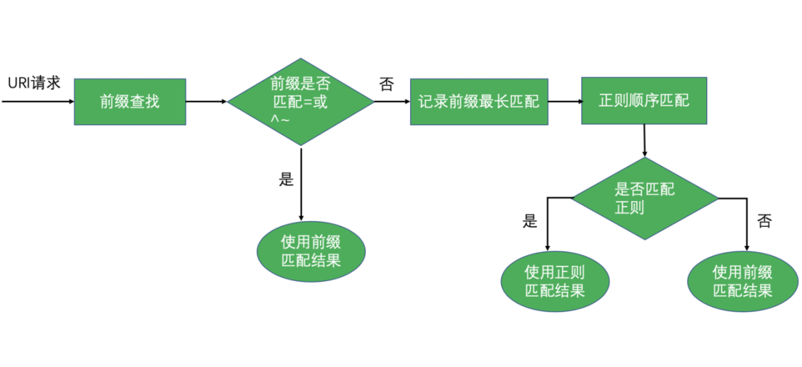

##### 一、跨域配置

```shell
location /{
    if ($request_method = OPTIONS){
        add_header                 Access-Control-Allow-Origin $http_Origin;
        add_header                 Access-Control-Allow-Credentials 'true';
        add_header                 Access-Control-Allow-Methods  'POST, GET, OPTIONS';
        add_header                 Access-Control-Allow-Headers 'x-requested-with,Authorization,${可以添加};
        return 200 '';
    }
    if ($http_Origin ~ .*\.(${一级域名})) {
        add_header                 Access-Control-Allow-Origin $http_Origin;
        add_header                 Access-Control-Allow-Credentials 'true';
        add_header                 Access-Control-Allow-Methods  'POST, GET, OPTIONS';
        add_header                 Access-Control-Allow-Headers   x-requested-with,Authorization;
    }
    proxy_set_header   Host             $host;
    proxy_next_upstream http_500 http_502 http_503 http_504 error timeout invalid_header;
    proxy_pass          http://{http_upstream};
}
```


#### 二、Location规则

语法规则： 
```shell
location [=|~|~*|^~] /uri/ {… }
```


匹配命令

符号|描述
---|---
= | 表示精确匹配。只有请求的url路径与后面的字符串完全相等时，才会命中。<br>使用 = 精确匹配可以加快查找的顺序
^~ |表示如果该符号后面的字符是最佳匹配（前缀匹配），采用该规则，不再进行后续的查找。一般用来匹配目录
~|表示该规则是使用正则定义的，区分大小写。
~* |表示该规则是使用正则定义的，不区分大小写。
!~|表示正则区分大小写不匹配。
!~*|表示正则不区分大小写不匹配。
|没有修饰符表示前缀匹配。


(精确匹配) > ^~(普通字符匹配) > ~*(正则匹配) > 完全路径

#### 三、nginx location 匹配过程




#### 四、proxy_pass规则

* URL 参数原则：
	* URL 必须以 http 或 https 开头。
	* URL 中可以携带变量。
	* URL 中是否带 URI ，会直接影响发往上游请求的 URL。

* 这两种用法的区别就是带 / 和不带 / ，在配置代理时它们的区别可大了：

	* 不带 / 意味着 Nginx 不会修改用户 URL ，而是直接透传给上游的应用服务器。
	* 带 / 意味着 Nginx 会修改用户 URL ，修改方法是将 location 后的 URL 从用户 URL 中删除。
